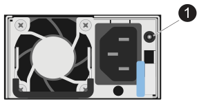

= 드라이브 쉘프 LED - NS224 쉘프 모니터링
:allow-uri-read: 
:icons: font
:imagesdir: ../media/

[role="lead"]
드라이브 쉘프 구성 요소의 상태 및 위치를 이해하면 드라이브 쉘프 상태를 모니터링할 수 있습니다.

* 선반 ODP(operator display panel)와 두 NSM 모듈의 위치(blue) LED는 서비스가 필요한 셸프를 물리적으로 찾을 수 있도록 활성화할 수 있습니다. `storage shelf location-led modify -shelf-name _shelf_name_ -led-status on`
+
해당 셸프의 '_shelf_name_'을 모르는 경우 'storage shelf show' 명령어를 실행한다.

+
위치 LED가 30분 동안 켜져 있습니다. 동일한 명령을 입력해도 을 사용하여 해제할 수 있습니다 `off` 옵션을 선택합니다.

* LED 상태는 다음과 같습니다.
+
** "켜짐": LED 조명이 계속 켜져 있습니다
** "꺼짐": LED가 켜지지 않습니다
** "깜박임": FRU 상태에 따라 다양한 간격으로 LED가 켜지거나 꺼집니다
** "모든 상태": LED는 "켜짐", "꺼짐" 또는 "깜박임"일 수 있습니다.

== 오퍼레이터 디스플레이 패널 LED

드라이브 쉘프 전면 운영자 디스플레이 패널(ODP)의 LED는 드라이브 쉘프가 정상 작동 중인지 또는 하드웨어에 문제가 있는지 여부를 나타냅니다.

다음 그림과 표는 ODP의 세 가지 LED를 설명합니다.

image::../media/drw_ns224_odp_leds_IEOPS-1262.svg[drw ns224 odp LED IEOPS 1262]

[cols="1,2,1,5"]
|===
| LED 아이콘 | LED 이름 및 색상 | 상태 | 설명 

 a| 
image::../media/drw_sas_power_icon.svg[drw SAS 전원 아이콘]
 a| 
전원(녹색)
 a| 
켜짐
 a| 
하나 이상의 전원 공급 장치가 드라이브 쉘프에 전원을 공급하고 있습니다.

 a| 
image::../media/drw_sas_fault_icon.svg[DRW SAS 오류 아이콘]
 a| 
주의(황색)
 a| 
켜짐
 a| 
* 하나 이상의 쉘프 FRU의 기능에 오류가 발생했습니다.
+
이벤트 메시지를 확인하여 필요한 수정 조치를 결정합니다.

* 두 자릿수 쉘프 ID도 깜박이는 경우 쉘프 ID는 보류 중입니다.
+
쉘프 ID가 영향을 받을 수 있도록 드라이브 쉘프의 전원을 껐다가 켭니다.

 a| 
image::../media/drw_sas3_location_icon.svg[drw sas3 위치 아이콘]
 a| 
위치(파란색)
 a| 
켜짐
 a| 
시스템 관리자가 이 LED 기능을 활성화했습니다.

|===

== NSM 모듈 상태 표시등

NSM 모듈의 LED는 모듈이 정상적으로 작동하는지 여부, 입출력 트래픽에 대한 준비가 되었는지 여부, 하드웨어에 문제가 있는지 여부를 나타냅니다.

다음 그림 및 표에서는 모듈의 기능과 관련된 NSM 모듈 상태 표시등 및 모듈의 각 NVMe 포트의 기능에 대해 설명합니다.

image::../media/drw_ns224_nsm_leds_IEOPS-1270.svg[drw ns224 NSM LED IEOPS 1270]

[cols="1,1,2,4"]
|===
| 전화하십시오 | LED 아이콘 | 색상 | 설명 

 a| 
image:../media/legend_icon_01.png["설명선 번호 1"]
 a| 
image::../media/drw_sas3_location_icon.svg[drw sas3 위치 아이콘]
 a| 
파란색
 a| 
NSM 모듈:위치

 a| 
image:../media/legend_icon_02.png["설명선 번호 2"]
 a| 
image::../media/drw_sas_fault_icon.svg[DRW SAS 오류 아이콘]
 a| 
주황색
 a| 
NSM 모듈: 주의

 a| 
image:../media/legend_icon_03.png["설명선 번호 3"]
 a| 
LNK
 a| 
녹색
 a| 
NVMe 포트/링크: 상태

 a| 
image:../media/legend_icon_04.png["설명선 번호 4"]
 a| 
image::../media/drw_sas_fault_icon.svg[DRW SAS 오류 아이콘]
 a| 
주황색
 a| 
NVMe 포트/링크: 주의

|===
[cols="2,1,1,1"]
|===
| 상태 | NSM 주의(황색) | 포트 LNK(녹색) | 포트 주의(황색) 

 a| 
NSM 정상
 a| 
꺼짐
 a| 
모든 시/도
 a| 
꺼짐

 a| 
NSM 오류입니다
 a| 
켜짐
 a| 
모든 시/도
 a| 
모든 시/도

 a| 
NSM VPD 오류입니다
 a| 
켜짐
 a| 
모든 시/도
 a| 
모든 시/도

 a| 
호스트 포트 연결이 없습니다
 a| 
모든 시/도
 a| 
꺼짐
 a| 
꺼짐

 a| 
호스트 포트 연결 링크가 활성화되었습니다
 a| 
모든 시/도
 a| 
작동 시 켜짐/깜박임
 a| 
모든 시/도

 a| 
호스트 포트 접속에 장애가 발생했습니다
 a| 
켜짐
 a| 
모든 레인에 장애가 발생한 경우 켜기/끄기
 a| 
켜짐

 a| 
전원을 켠 후 BIOS 이미지에서 BIOS를 부팅합니다
 a| 
깜박임
 a| 
모든 시/도
 a| 
모든 시/도

|===

== 전원 공급 장치 LED

AC 또는 DC 전원 공급 장치(PSU)의 LED는 PSU가 정상적으로 작동하는지 또는 하드웨어 문제가 있는지 여부를 나타냅니다.

다음 그림 및 표에서는 PSU의 LED에 대해 설명합니다. (그림은 AC PSU입니다. 하지만 DC PSU의 LED 위치는 동일합니다.)

[cols="1,4"]
|===
| 전화하십시오 | 설명 

 a| 
image:../media/legend_icon_01.png["설명선 번호 1"]
 a| 
2색 LED는 녹색이 되면 전원/작동을 나타내고 주황색이 되면 장애를 나타냅니다.

|===
[cols="2,1,1"]
|===
| 상태 | 전원/작동(녹색) | 주의(황색) 

 a| 
케이스에 AC/DC 전원이 공급되지 않습니다
 a| 
꺼짐
 a| 
꺼짐

 a| 
PSU에 AC/DC 전원이 공급되지 않습니다
 a| 
꺼짐
 a| 
켜짐

 a| 
AC/DC 전원이 켜져 있지만 PSU는 인클로저에 없습니다
 a| 
깜박임
 a| 
꺼짐

 a| 
PSU가 올바르게 작동하고 있습니다
 a| 
켜짐
 a| 
꺼짐

 a| 
PSU 오류입니다
 a| 
꺼짐
 a| 
켜짐

 a| 
팬 오류입니다
 a| 
꺼짐
 a| 
켜짐

 a| 
펌웨어 업데이트 모드입니다
 a| 
깜박임
 a| 
꺼짐

|===

== 드라이브 LED

NVMe 드라이브의 LED는 정상 작동 중인지 또는 하드웨어에 문제가 있는지 여부를 나타냅니다.

다음 그림 및 표에서는 NVMe 드라이브의 두 LED를 설명합니다.

image::../media/drw_ns224_drive_leds_IEOPS-1263.svg[drw ns224 드라이브 LED IEOPS 1263]

[cols="1,2,2"]
|===
| 전화하십시오 | LED 이름입니다 | 색상 

 a| 
image:../media/legend_icon_01.png["설명선 번호 1"]
 a| 
주의
 a| 
주황색

 a| 
image:../media/legend_icon_02.png["설명선 번호 2"]
 a| 
전원/작동
 a| 
녹색

|===
[cols="2,1,1,1"]
|===
| 상태 | 전원/작동(녹색) | 주의(황색) | 관련 ODP LED 

 a| 
드라이브가 설치되어 작동 중입니다
 a| 
작동 시 켜짐/깜박임
 a| 
모든 시/도
 a| 
해당 없음

 a| 
드라이브 장애
 a| 
작동 시 켜짐/깜박임
 a| 
켜짐
 a| 
주의(황색)

 a| 
SES 장치 식별 세트입니다
 a| 
작동 시 켜짐/깜박임
 a| 
깜박입니다
 a| 
주의(황색)가 꺼져 있습니다

 a| 
SES 장치 오류 비트가 설정되었습니다
 a| 
작동 시 켜짐/깜박임
 a| 
켜짐
 a| 
주의(황색)

 a| 
전원 컨트롤 회로 고장
 a| 
꺼짐
 a| 
모든 시/도
 a| 
주의(황색)

|===