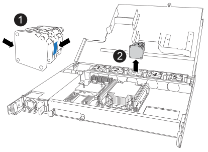

= 팬 모듈 교체 - NS224 쉘프
:allow-uri-read: 
:icons: font
:imagesdir: ../media/

[role="lead"]
팬 모듈의 팬 중 하나 또는 둘 다에 장애가 발생하면 팬 모듈을 교체할 수 있습니다. 이 절차는 I/O가 진행 중인 상태에서 전원이 켜진 NS224 드라이브 쉘프에서 중단 없이 완료할 수 있습니다.

.시작하기 전에
쉘프의 파트너 NSM이 가동 및 실행 중이며 케이블을 올바르게 연결해야 합니다. 이렇게 하면 장애가 발생한 FRU(타겟 NSM)에서 NSM을 제거할 때 쉘프가 연결을 유지할 수 있습니다.

+ https://mysupport.netapp.com/site/tools/tool-eula/activeiq-configadvisor["NetApp 다운로드: Config Advisor"^]

.이 작업에 대해
* NSM(NVMe 쉘프 모듈)을 제거하고 설치하는 데 최소 70초가 소요됩니다.
+
그러면 ONTAP에서 NSM 제거 이벤트를 처리할 수 있는 충분한 시간이 허용됩니다.

* * 모범 사례: * FRU 구성 요소를 교체하기 전에 시스템에 최신 버전의 NVMe 쉘프 모듈(NSM) 펌웨어 및 드라이브 펌웨어를 사용하는 것이 가장 좋습니다.
+
** 를 업데이트합니다 https://mysupport.netapp.com/site/downloads/firmware/disk-shelf-firmware["NetApp 다운로드: 디스크 쉘프 펌웨어"^]
+
https://mysupport.netapp.com/site/downloads/firmware/disk-drive-firmware["NetApp 다운로드: 디스크 드라이브 펌웨어"^]

+
[NOTE]
====
펌웨어를 쉘프와 해당 구성요소를 지원하지 않는 버전으로 되돌리지 마십시오.

====

* 필요한 경우 셸프의 위치(파란색) LED를 켜서 해당 셸프를 물리적으로 찾을 수 있습니다. 'Storage shelf location-led modify-shelf-name_shelf_name_-led-status on'
+
해당 셸프의 '_shelf_name_'을 모르는 경우 'storage shelf show' 명령어를 실행한다.

+
셸프에는 세 개의 위치 LED가 있습니다. 하나는 오퍼레이터 디스플레이 패널에 있고 다른 하나는 NSM에 있습니다. 위치 LED가 30분 동안 켜져 있습니다. 같은 명령을 입력하고 옵션을 사용하면 이러한 기능을 해제할 수 있습니다 `off`.

* 교체용 팬의 포장을 풀 때 고장난 팬을 반환할 때 사용할 수 있도록 포장재를 모두 보관하십시오.
+
교체 절차에 대한 RMA 번호 또는 추가 도움이 필요한 경우, 에서 기술 지원 팀에 문의하십시오 https://mysupport.netapp.com/site/global/dashboard["NetApp 지원"^], 888-463-8277 (북미), 00-800-44-638277 (유럽) 또는 +800-800-80-800 (아시아/태평양).

[role="tabbed-block"]
====
.NSM100 모듈
--
다음 애니메이션을 사용하여 NS224의 팬을 NSM100 모듈로 교체할 수 있습니다.

.NS224 쉘프의 팬을 교체합니다
video::29635ff8-ae86-4a48-ab2a-aa86002f3b66[panopto]
.단계
. 적절하게 접지합니다.
. 교체할 FRU가 포함된 NSM에서 케이블을 뽑습니다.
+
.. AC 전원 공급 장치인 경우 전원 코드 고정 장치를 열어 전원 공급 장치에서 전원 코드를 분리하거나, DC 전원 공급 장치인 경우 두 개의 나비 나사를 푼 다음 전원 공급 장치에서 전원 코드를 뽑습니다.
+
전원 공급 장치에는 전원 스위치가 없습니다.

.. NSM 포트에서 스토리지 케이블을 분리합니다.
+
각 케이블이 연결된 NSM 포트를 기록합니다. 이 절차의 뒷부분에서 NSM을 다시 삽입할 때 케이블을 동일한 포트에 다시 연결합니다.

. 선반에서 NSM을 분리합니다.
+
.. NSM의 양쪽에 있는 잠금 장치의 손가락 구멍에 집게손가락을 감습니다.
+

NOTE: 하단 NSM을 제거하는 경우 하단 레일이 잠금 장치에 접근하는 것을 방해한다면 집게 손가락을 안쪽의 손가락 구멍에 넣습니다(팔을 가로지르는 것).

.. 엄지 손가락으로 래칭 장치 위에 있는 주황색 탭을 누르고 있습니다.
+
래칭 메커니즘이 올라와 선반에 있는 래치 핀을 지웁니다.

.. NSM이 선반에서 약 3분의 1이 될 때까지 부드럽게 당기고 양손으로 NSM 측면을 잡고 무게를 지탱한 다음 평평하고 안정적인 표면에 놓습니다.
+
당기기 시작하면 래치 메커니즘 암이 NSM에서 확장되어 완전히 확장된 위치에 고정됩니다.

. NSM 덮개 나비 나사를 풀고 덮개를 엽니다.
+

NOTE: NSM 덮개의 FRU 레이블은 NSM 후면 벽을 따라 5개의 팬 위치를 나타냅니다.

. 장애가 발생한 팬을 물리적으로 식별합니다.
+
팬에 장애가 발생하면 시스템 콘솔에 어떤 팬이 고장났는지 나타내는 경고 메시지가 기록됩니다.

. 장애가 발생한 팬을 교체합니다.
+
.. 파란색 터치 포인트가 있는 측면을 단단히 잡고 수직으로 들어올려 소켓에서 분리한 후 결함이 있는 팬을 분리합니다.
.. 교체용 팬을 가이드 안에 맞춘 다음 팬 모듈 커넥터가 소켓에 완전히 장착될 때까지 아래로 누릅니다.

. NSM 덮개를 닫고 나비 나사를 조입니다.
. NSM을 선반에 다시 삽입합니다.
+
.. 래칭 메커니즘 암이 완전히 확장된 위치에 잠겨 있는지 확인하십시오.
.. NSM의 무게가 선반에 의해 완전히 지지될 때까지 양손으로 NSM을 선반에 부드럽게 밀어 넣습니다.
.. NSM이 멈출 때까지 선반 안으로 밀어 넣습니다(선반 뒤쪽에서 약 2.5cm).
+
각 손가락 루프(래치 장치 암)의 전면에 있는 주황색 탭에 엄지 손가락을 올려 NSM을 밀어 넣을 수 있습니다.

.. NSM의 양쪽에 있는 잠금 장치의 손가락 구멍에 집게손가락을 감습니다.
+

NOTE: 하단 NSM을 삽입할 때 하단 레일이 래치 메커니즘에 접근하지 못하게 하는 경우 집게 손가락을 안쪽의 손가락 구멍에 넣습니다(팔을 가로질러).

.. 엄지 손가락으로 래칭 장치 위에 있는 주황색 탭을 누르고 있습니다.
.. 걸쇠가 정지 상태에서 걸리도록 앞으로 부드럽게 밉니다.
.. 래칭 메커니즘의 상단과 엄지 손가락을 분리한 다음 래칭 메커니즘이 제자리에 고정될 때까지 계속 밉니다.
+
NSM은 선반에 완전히 삽입해야 하며 선반의 가장자리와 같은 높이가 되어야 합니다.

. NSM에 케이블을 다시 연결합니다.
+
.. 스토리지 케이블을 동일한 2개의 NSM 포트에 다시 연결합니다.
+
케이블은 커넥터 당김 탭이 위를 향하도록 삽입됩니다. 케이블이 올바르게 삽입되면 딸깍 소리가 나면서 제자리에 고정됩니다.

.. 전원 코드를 전원 공급 장치에 다시 연결한 다음, AC 전원 공급 장치인 경우 전원 코드 고정 장치로 전원 코드를 고정하거나 DC 전원 공급 장치인 경우 두 개의 나비 나사를 조인 다음 전원 공급 장치에서 전원 코드를 뽑습니다.
+
올바르게 작동하면 전원 공급 장치의 이중 LED가 녹색으로 켜집니다.

+
또한 두 NSM 포트 LNK(녹색) LED가 모두 켜집니다. LNK LED가 켜지지 않으면 케이블을 다시 연결합니다.

. 고장난 팬과 선반 운영자 디스플레이 패널이 포함된 NSM의 주의(황색) LED가 더 이상 켜지지 않는지 확인합니다.
+
NSM이 재부팅되면 NSM 주의 LED가 꺼지고 더 이상 팬 문제가 감지되지 않습니다. 이 작업은 3~5분 정도 걸릴 수 있습니다.

. Active IQ Config Advisor를 실행하여 NSM의 케이블이 올바르게 연결되었는지 확인합니다.
+
케이블 연결 오류가 발생하면 제공된 수정 조치를 따르십시오.

+
https://mysupport.netapp.com/site/tools/tool-eula/activeiq-configadvisor["NetApp 다운로드: Config Advisor"^]

--
.NSM100B 모듈
--
.단계
. 적절하게 접지합니다.
. 교체할 FRU가 포함된 NSM에서 케이블을 뽑습니다.
+
.. AC 전원 공급 장치인 경우 전원 코드 고정 장치를 열어 전원 공급 장치에서 전원 코드를 분리하거나, DC 전원 공급 장치인 경우 두 개의 나비 나사를 푼 다음 전원 공급 장치에서 전원 코드를 뽑습니다.
+
전원 공급 장치에는 전원 스위치가 없습니다.

.. NSM 포트에서 스토리지 케이블을 분리합니다.
+
각 케이블이 연결된 NSM 포트를 기록합니다. 이 절차의 뒷부분에서 NSM을 다시 삽입할 때 케이블을 동일한 포트에 다시 연결합니다.

. NSM를 분리합니다.
+
image::../media/drw_g_and_t_handles_remove_ieops-1837.svg[NSM을 탈거하십시오.]

+
[cols="1,4"]
|===

 a| 
image::../media/icon_round_1.png[설명선 번호 1]
 a| 
NSM 양쪽 끝에서 수직 잠금 탭을 바깥쪽으로 눌러 핸들을 해제합니다.

 a| 
image::../media/icon_round_2.png[설명선 번호 2]
 a| 
** 핸들을 사용자 쪽으로 당겨 중앙판에서 NSM을 분리합니다.
+
핸들을 당기면 쉘프에서 핸들이 펼쳐집니다. 저항이 느껴지면 계속 잡아당깁니다.

** 선반에서 NSM을 밀어 꺼낸 다음 평평하고 안정적인 곳에 놓습니다.
+
선반에서 NSM 하단을 밀어낼 때 NSM 하단을 지지해야 합니다.

 a| 
image::../media/icon_round_3.png[설명선 번호 3]
 a| 
탭 옆에 있는 손잡이를 똑바로 돌려 옆으로 치웁니다.

|===
. 나비나사를 시계 반대 방향으로 돌려 NSM 덮개를 연 다음 덮개를 엽니다.
+

NOTE: NSM 덮개의 FRU 레이블은 NSM 후면 벽을 따라 5개의 팬 위치를 나타냅니다.

. 장애가 발생한 팬을 물리적으로 식별합니다.
+
팬에 장애가 발생하면 시스템 콘솔에 어떤 팬이 고장났는지 나타내는 경고 메시지가 기록됩니다.

. 장애가 발생한 팬을 교체합니다.
+

+
[cols="1,4"]
|===

 a| 
image::../media/icon_round_1.png[설명선 번호 1]
 a| 
파란색 터치 포인트가 있는 측면을 단단히 잡고 결함이 있는 팬을 소켓에서 똑바로 잡아당겨 분리합니다.

 a| 
image::../media/icon_round_1.png[설명선 번호 2]
 a| 
교체용 팬을 가이드에 맞춰 삽입한 다음 팬 커넥터가 소켓에 완전히 장착될 때까지 아래로 누릅니다.

|===
. NSM 덮개를 닫고 나비 나사를 조입니다.
. NSM을 선반에 삽입합니다.
+
image::../media/drw_g_and_t_handles_reinstall_ieops-1838.svg[NSM를 교체합니다.]

+
[cols="1,4"]
|===

 a| 
image::../media/icon_round_1.png[설명선 번호 1]
 a| 
NSM을 수리하는 동안 NSM 핸들을 똑바로(탭 옆) 돌린 경우 수평 위치로 아래로 돌립니다.

 a| 
image::../media/icon_round_2.png[설명선 번호 2]
 a| 
NSM의 후면을 선반의 입구에 맞춘 다음 핸들을 사용하여 NSM이 완전히 장착될 때까지 부드럽게 누릅니다.

 a| 
image::../media/icon_round_3.png[설명선 번호 3]
 a| 
핸들을 똑바로 세운 위치로 돌린 다음 탭으로 제자리에 고정합니다.

|===
. NSM에 케이블을 다시 연결합니다.
+
.. 스토리지 케이블을 동일한 2개의 NSM 포트에 다시 연결합니다.
+
케이블은 커넥터 당김 탭이 위를 향하도록 삽입됩니다. 케이블이 올바르게 삽입되면 딸깍 소리가 나면서 제자리에 고정됩니다.

.. 전원 코드를 전원 공급 장치에 다시 연결한 다음, AC 전원 공급 장치인 경우 전원 코드 고정 장치로 전원 코드를 고정하거나 DC 전원 공급 장치인 경우 두 개의 나비 나사를 조인 다음 전원 공급 장치에서 전원 코드를 뽑습니다.
+
올바르게 작동하면 전원 공급 장치의 이중 LED가 녹색으로 켜집니다.

+
또한 두 NSM 포트 LNK(녹색) LED가 모두 켜집니다. LNK LED가 켜지지 않으면 케이블을 다시 연결합니다.

. 고장난 팬과 선반 운영자 디스플레이 패널이 포함된 NSM의 주의(황색) LED가 더 이상 켜지지 않는지 확인합니다.
+
NSM이 재부팅되면 NSM 주의 LED가 꺼지고 더 이상 팬 문제가 감지되지 않습니다. 이 작업은 3~5분 정도 걸릴 수 있습니다.

. Active IQ Config Advisor를 실행하여 NSM의 케이블이 올바르게 연결되었는지 확인합니다.
+
케이블 연결 오류가 발생하면 제공된 수정 조치를 따르십시오.

+
https://mysupport.netapp.com/site/tools/tool-eula/activeiq-configadvisor["NetApp 다운로드: Config Advisor"^]

--
====