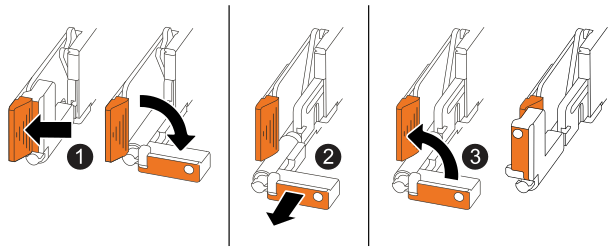

= NSM-NS224 쉘프를 교체합니다
:allow-uri-read: 
:icons: font
:imagesdir: ../media/

[role="lead"]
NS224 드라이브 쉘프의 장애가 발생한 NVMe 쉘프 모듈(NSM)을 전원이 켜져 있고 I/O가 진행 중인 동안 중단 없이 교체할 수 있습니다.

.시작하기 전에
* 쉘프의 파트너 NSM이 가동되어 실행 중이며 케이블을 올바르게 연결해야 오류가 발생한 NSM을 제거할 때 쉘프가 연결을 유지할 수 있습니다.
+
https://mysupport.netapp.com/site/tools/tool-eula/activeiq-configadvisor["NetApp 다운로드: Config Advisor"^]

* 시스템의 다른 모든 구성 요소가 제대로 작동해야 합니다.

.이 작업에 대해
* NSM을 교체하려면 다음을 이동해야 합니다.
+
** * NSM100 모듈 *: 손상된 NSM에서 교체용 NSM까지 DIMM, 팬 및 전원 공급 장치.
** * NSM100B 모듈 *: DIMM, 팬, 부팅 미디어, I/O 모듈, 장애가 있는 NSM에서 교체용 NSM으로의 전원 공급 장치.
+
실시간 클럭(RTC) 배터리는 움직이지 않습니다. 교체용 NSM에 사전 설치되어 있습니다.

* NSM(NVMe 쉘프 모듈)을 제거하고 설치하는 데 최소 70초가 소요됩니다.
+
그러면 ONTAP에서 NSM 제거 이벤트를 처리할 수 있는 충분한 시간이 허용됩니다.

* * 모범 사례: * FRU 구성 요소를 교체하기 전에 시스템에 최신 버전의 NVMe 쉘프 모듈(NSM) 펌웨어 및 드라이브 펌웨어를 사용하는 것이 가장 좋습니다.
+
https://mysupport.netapp.com/site/downloads/firmware/disk-shelf-firmware["NetApp 다운로드: 디스크 쉘프 펌웨어"^]

+
https://mysupport.netapp.com/site/downloads/firmware/disk-drive-firmware["NetApp 다운로드: 디스크 드라이브 펌웨어"^]

+
[NOTE]
====
펌웨어를 쉘프와 해당 구성요소를 지원하지 않는 버전으로 되돌리지 마십시오.

====
* 쉘프(NSM) 펌웨어는 최신 펌웨어 버전이 아닌 새로운 NSM에서 중단 없이 자동으로 업데이트됩니다.
+
NSM 펌웨어 점검은 10분마다 수행됩니다. NSM 펌웨어 업데이트는 최대 30분이 걸릴 수 있습니다.

* 필요한 경우 셸프의 위치(파란색) LED를 켜서 해당 셸프를 물리적으로 찾을 수 있습니다. 'Storage shelf location-led modify-shelf-name_shelf_name_-led-status on'
+
해당 셸프의 'helf_name'을 모르는 경우 'storage shelf show' 명령어를 실행한다.

+
셸프에는 세 개의 위치 LED가 있습니다. 하나는 오퍼레이터 디스플레이 패널에 있고 다른 하나는 NSM에 있습니다. 위치 LED가 30분 동안 켜져 있습니다. 같은 명령을 입력하고 옵션을 사용하면 이러한 기능을 해제할 수 있습니다 `off`.

* 교체 NSM의 포장을 풀 때 결함이 있는 NSM을 반환할 때 사용할 수 있도록 포장재를 모두 보관하십시오.
+
교체 절차에 대한 RMA 번호 또는 추가 도움이 필요한 경우, 에서 기술 지원 팀에 문의하십시오 https://mysupport.netapp.com/site/global/dashboard["NetApp 지원"^], 888-463-8277 (북미), 00-800-44-638277 (유럽) 또는 +800-800-80-800 (아시아/태평양).

[role="tabbed-block"]
====
.NSM100 모듈
--
다음 애니메이션 또는 작성된 단계를 사용하여 NSM을 대체할 수 있습니다.

.NS224 쉘프의 NSM을 교체합니다
video::f57693b3-b164-4014-a827-aa86002f4b34[panopto]
.단계
. 적절하게 접지합니다.
. 손상된 NSM을 물리적으로 식별합니다.
+
시스템이 시스템 콘솔에 어떤 모듈이 손상되었는지 나타내는 경고 메시지를 기록합니다. 또한 드라이브 쉘프 오퍼레이터 디스플레이 패널과 손상된 모듈의 주의(황색) LED가 켜집니다.

. 손상된 NSM에서 케이블을 분리합니다.
+
.. AC 전원 공급 장치인 경우 전원 코드 고정 장치를 열어 전원 공급 장치에서 전원 코드를 분리하거나, DC 전원 공급 장치인 경우 두 엄지 나사를 푼 다음 전원 공급 장치에서 전원 코드를 뽑습니다.
+
전원 공급 장치에는 전원 스위치가 없습니다.

.. NSM 포트에서 스토리지 케이블을 분리합니다.
+
각 케이블이 연결된 NSM 포트를 기록합니다. 이 절차의 뒷부분에서 교체용 NSM의 동일한 포트에 케이블을 다시 연결합니다.

. 선반에서 NSM을 분리합니다.
+
.. NSM의 양쪽에 있는 잠금 장치의 손가락 구멍에 집게손가락을 감습니다.
+

NOTE: 하단 NSM을 제거하는 경우 하단 레일이 잠금 장치에 접근하는 것을 방해한다면 집게 손가락을 안쪽의 손가락 구멍에 넣습니다(팔을 가로지르는 것).

.. 엄지 손가락으로 래칭 장치 위에 있는 주황색 탭을 누르고 있습니다.
+
래칭 메커니즘이 올라와 선반에 있는 래치 핀을 지웁니다.

.. NSM이 선반에서 약 3분의 1이 될 때까지 부드럽게 당기고 양손으로 NSM 측면을 잡고 무게를 지탱한 다음 평평하고 안정적인 표면에 놓습니다.
+
당기기 시작하면 래치 메커니즘 암이 NSM에서 확장되어 완전히 확장된 위치에 고정됩니다.

. 교체용 NSM의 포장을 풀고 손상된 NSM 근처의 평평한 표면에 놓습니다.
. 각 덮개의 손잡이 나사를 풀어 손상된 NSM의 덮개와 교체용 NSM의 덮개를 엽니다.
+

NOTE: NSM 덮개의 FRU 레이블에는 DIMM 및 팬의 위치가 표시됩니다.

. 손상된 NSM에서 교체용 NSM으로 DIMM을 이동합니다.
+
.. 동일한 방향으로 교체용 NSM에 DIMM을 삽입할 수 있도록 슬롯에 있는 DIMM의 방향을 기록해 두십시오.
.. DIMM 슬롯의 양 끝에 있는 이젝터 탭을 천천히 밀어 슬롯에서 DIMM을 꺼낸 다음 슬롯에서 DIMM을 들어 꺼냅니다.
+

NOTE: DIMM 회로 보드 구성 요소에 압력이 가해질 수 있으므로 모서리 또는 가장자리로 DIMM을 조심스럽게 잡습니다. 이젝터 탭이 열린 위치에 있습니다.

.. DIMM의 모서리를 잡은 다음 교체용 NSM의 슬롯에 DIMM을 똑바로 삽입합니다.
+
DIMM 하단의 노치가 핀에서 슬롯의 탭과 정렬되어야 합니다.

+
올바르게 삽입되면 DIMM은 쉽게 장착되지만 슬롯에 단단히 고정되어야 합니다. 그렇지 않은 경우 DIMM을 재장착합니다.

.. 이젝터 탭이 DIMM 양쪽 끝의 노치 위에 걸릴 때까지 DIMM의 상단 가장자리를 조심스럽게 누르십시오.
.. 나머지 DIMM에 대해 단계 7a - 7d를 반복합니다.

. 손상된 NSM에서 교체용 NSM으로 팬을 이동합니다.
+
.. 파란색 터치 포인트가 있는 측면에서 팬을 단단히 잡고 수직으로 들어올려 소켓에서 분리합니다.
+
팬을 들어올리기 전에 팬을 앞뒤로 부드럽게 흔들어서 분리해야 할 수 있습니다.

.. 팬을 교체용 NSM의 가이드에 맞춘 다음 팬 모듈 커넥터가 소켓에 완전히 장착될 때까지 아래로 누릅니다.
.. 나머지 팬에 대해 하위 단계 8a 및 8b를 반복합니다.

. 각 NSM의 덮개를 닫고 각 나비나사를 조입니다.
. 손상된 NSM에서 교체용 NSM으로 전원 공급 장치를 이동합니다.
+
.. 핸들을 위로 돌려 수평 위치로 이동한 다음 잡습니다.
.. 엄지 손가락으로 파란색 탭을 눌러 잠금 장치를 해제합니다.
.. 다른 손으로 무게를 지탱하면서 전원 공급 장치를 NSM에서 당겨 빼냅니다.
.. 양손으로 전원 공급 장치의 모서리를 지지하고 교체용 NSM의 입구에 맞춥니다.
.. 잠금 장치가 딸깍 소리를 내며 제자리에 고정될 때까지 전원 공급 장치를 NSM에 부드럽게 밀어 넣습니다.
+

NOTE: 과도한 힘을 가하지 마십시오. 또는 내부 커넥터가 손상될 수 있습니다.

.. 핸들을 아래로 돌려 정상적인 작동 방식이 되지 않도록 합니다.

. 교체용 NSM을 선반에 삽입합니다.
+
.. 래칭 메커니즘 암이 완전히 확장된 위치에 잠겨 있는지 확인하십시오.
.. NSM의 무게가 선반에 의해 완전히 지지될 때까지 양손으로 NSM을 선반에 부드럽게 밀어 넣습니다.
.. NSM이 멈출 때까지 선반 안으로 밀어 넣습니다(선반 뒤쪽에서 약 2.5cm).
+
각 손가락 루프(래치 장치 암)의 전면에 있는 주황색 탭에 엄지 손가락을 올려 NSM을 밀어 넣을 수 있습니다.

.. NSM의 양쪽에 있는 잠금 장치의 손가락 구멍에 집게손가락을 감습니다.
+

NOTE: 하단 NSM을 삽입할 때 하단 레일이 래치 메커니즘에 접근하지 못하게 하는 경우 집게 손가락을 안쪽의 손가락 구멍에 넣습니다(팔을 가로질러).

.. 엄지 손가락으로 래칭 장치 위에 있는 주황색 탭을 누르고 있습니다.
.. 걸쇠가 정지 상태에서 걸리도록 앞으로 부드럽게 밉니다.
.. 래칭 메커니즘의 상단과 엄지 손가락을 분리한 다음 래칭 메커니즘이 제자리에 고정될 때까지 계속 밉니다.
+
NSM은 선반에 완전히 삽입해야 하며 선반의 가장자리와 같은 높이가 되어야 합니다.

. NSM에 케이블을 다시 연결합니다.
+
.. 스토리지 케이블을 동일한 2개의 NSM 포트에 다시 연결합니다.
+
케이블은 커넥터 당김 탭이 위를 향하도록 삽입됩니다. 케이블이 올바르게 삽입되면 딸깍 소리가 나면서 제자리에 고정됩니다.

.. 전원 코드를 전원 공급 장치에 다시 연결한 다음, AC 전원 공급 장치인 경우 전원 코드 고정 장치로 전원 코드를 고정하거나 DC 전원 공급 장치인 경우 두 개의 나비 나사를 조입니다.
+
올바르게 작동하면 전원 공급 장치의 이중 LED가 녹색으로 켜집니다.

+
또한 두 NSM 포트 LNK(녹색) LED가 모두 켜집니다. LNK LED가 켜지지 않으면 케이블을 다시 연결합니다.

. 선반 작동 디스플레이 패널의 주의(황색) LED가 더 이상 켜지지 않는지 확인합니다.
+
NSM이 재부팅되면 운영자 디스플레이 패널 주의 LED가 꺼집니다. 이 작업은 3~5분 정도 걸릴 수 있습니다.

. Active IQ Config Advisor를 실행하여 NSM의 케이블이 올바르게 연결되었는지 확인합니다.
+
케이블 연결 오류가 발생하면 제공된 수정 조치를 따르십시오.

+
https://mysupport.netapp.com/site/tools/tool-eula/activeiq-configadvisor["NetApp 다운로드: Config Advisor"^]

. 쉘프의 두 NSM에서 버전 0200 이상의 동일한 버전의 펌웨어를 실행하고 있는지 확인합니다.

--
.NSM100B 모듈
--
.단계
. 적절하게 접지합니다.
. 손상된 NSM을 물리적으로 식별합니다.
+
시스템이 시스템 콘솔에 어떤 모듈이 손상되었는지 나타내는 경고 메시지를 기록합니다. 또한 드라이브 쉘프 오퍼레이터 디스플레이 패널과 손상된 모듈의 주의(황색) LED가 켜집니다.

. 손상된 NSM에서 케이블을 분리합니다.
+
.. AC 전원 공급 장치인 경우 전원 코드 고정 장치를 열어 전원 공급 장치에서 전원 코드를 분리하거나, DC 전원 공급 장치인 경우 두 엄지 나사를 푼 다음 전원 공급 장치에서 전원 코드를 뽑습니다.
+
전원 공급 장치에는 전원 스위치가 없습니다.

.. NSM 포트에서 스토리지 케이블을 분리합니다.
+
각 케이블이 연결된 NSM 포트를 기록합니다. 이 절차의 뒷부분에서 교체용 NSM의 동일한 포트에 케이블을 다시 연결합니다.

. NSM를 분리합니다.
+

+
[cols="1,4"]
|===

 a| 
image::../media/icon_round_1.png[설명선 번호 1]
 a| 
NSM 양쪽 끝에서 수직 잠금 탭을 바깥쪽으로 눌러 핸들을 해제합니다.

 a| 
image::../media/icon_round_2.png[설명선 번호 2]
 a| 
** 핸들을 사용자 쪽으로 당겨 중앙판에서 NSM을 분리합니다.
+
핸들을 당기면 쉘프에서 핸들이 펼쳐집니다. 저항이 느껴지면 계속 잡아당깁니다.

** 선반에서 NSM을 밀어 꺼낸 다음 평평하고 안정적인 곳에 놓습니다.
+
선반에서 NSM 하단을 밀어낼 때 NSM 하단을 지지해야 합니다.

 a| 
image::../media/icon_round_3.png[설명선 번호 3]
 a| 
탭 옆에 있는 손잡이를 똑바로 돌려 옆으로 치웁니다.

|===
. 교체용 NSM의 포장을 풀고 손상된 NSM 근처의 평평한 표면에 놓습니다.
. 각 덮개의 나비나사를 풀어 양쪽 NSM의 덮개를 엽니다.
. 손상된 NSM에서 교체용 NSM으로 DIMM을 이동합니다.
+
.. 손상된 NSM에서 DIMM 분리:
+
image::../media/drw_t_dimm_ieops-1978.svg[DIMM을 분리합니다.]

+
[cols="1,4"]
|===

 a| 
image::../media/icon_round_1.png[설명선 번호 1]
 a| 
DIMM 슬롯 번호 및 위치

NSM은 슬롯 1 및 3에 DIMM을 포함하고 슬롯 2 및 4에 DIMM 블랭크를 포함합니다.

 a| 
image::../media/icon_round_2.png[설명선 번호 2]
 a| 
*** 동일한 방향으로 교체용 DIMM에 장착할 수 있도록 소켓의 DIMM 방향을 기록해 둡니다.
*** DIMM 슬롯의 양쪽 끝에 있는 DIMM 이젝터 탭 2개를 천천히 밀어 결함이 있는 DIMM을 꺼냅니다.

IMPORTANT: DIMM 회로 보드 구성 요소에 압력이 가해질 수 있으므로 모서리 또는 가장자리로 DIMM을 조심스럽게 잡습니다.

 a| 
image::../media/icon_round_3.png[설명선 번호 3]
 a| 
DIMM을 들어올려 슬롯에서 꺼냅니다.

이젝터 탭이 열린 위치에 있습니다.

|===
.. 교체용 NSM에 DIMM을 설치합니다.
+
... DIMM의 모서리를 잡은 다음 DIMM을 슬롯에 똑바로 삽입합니다.
+
DIMM 하단의 노치가 핀에서 슬롯의 탭과 정렬되어야 합니다.

+
올바르게 삽입되면 DIMM은 쉽게 장착되지만 슬롯에 단단히 고정되어야 합니다. 그렇지 않은 경우 DIMM을 재장착합니다.

... 이젝터 탭이 DIMM 양쪽 끝의 노치 위에 걸릴 때까지 DIMM의 상단 가장자리를 조심스럽게 누르십시오.
... 다른 DIMM에 대해서도 반복합니다.

. 손상된 NSM에서 교체용 NSM으로 모든 팬을 이동합니다.
+
image::../media/drw_t_fan_replace_ieops-1979.svg[장애가 발생한 팬을 제거합니다.]

+
[cols="1,4"]
|===

 a| 
image::../media/icon_round_1.png[설명선 번호 1]
 a| 
파란색 터치 포인트가 있는 측면을 단단히 잡고 결함이 있는 팬을 소켓에서 똑바로 잡아당겨 분리합니다.

 a| 
image::../media/icon_round_1.png[설명선 번호 2]
 a| 
교체용 팬을 가이드에 맞춰 삽입한 다음 팬 커넥터가 소켓에 완전히 장착될 때까지 아래로 누릅니다.

|===
. 부팅 미디어를 교체용 NSM으로 이동합니다.
+
.. 손상된 NSM에서 부팅 미디어를 분리합니다.
+
image::../media/drw_t_boot_media_replace_ieops-1977.svg[부팅 미디어를 제거합니다.]

+
[cols="1,4"]
|===

 a| 
image::../media/icon_round_1.png[설명선 번호 1]
 a| 
부팅 미디어 위치입니다

 a| 
image::../media/icon_round_2.png[설명선 번호 2]
 a| 
파란색 탭을 눌러 부팅 미디어의 오른쪽 끝을 분리합니다.

 a| 
image::../media/icon_round_3.png[설명선 번호 3]
 a| 
부트 미디어의 오른쪽 끝을 약간 비스듬히 들어 올려 부트 미디어의 양쪽을 잘 잡습니다.

 a| 
image::../media/icon_round_4.png[설명선 번호 4]
 a| 
소켓에서 부팅 미디어의 왼쪽 끝을 살짝 당겨 꺼냅니다.

|===
.. 교체용 NSM에 부팅 미디어를 설치합니다.
+
... 부팅 미디어의 가장자리를 교체용 NSM의 소켓 하우징에 맞춘 다음 조심스럽게 소켓에 똑바로 밀어 넣습니다.
... 부트 미디어를 잠금 버튼 쪽으로 돌립니다.
... 잠금 버튼을 누르고 부트 미디어를 아래로 완전히 돌린 다음 잠금 버튼을 놓습니다.

. 손상된 NSM에서 교체용 NSM으로 입출력 모듈을 이동합니다.
+
.. 손상된 NSM에서 I/O 모듈 분리:
+
image::../media/drw_t_io_module_replace_ieops-1980.svg[입출력 모듈을 교체합니다.]

+
[cols="1,4"]
|===

 a| 
image::../media/icon_round_1.png[설명선 번호 1]
 a| 
I/O 모듈 손잡이 나사를 시계 반대 방향으로 돌려 풉니다.

 a| 
image::../media/icon_round_2.png[설명선 번호 2]
 a| 
왼쪽의 포트 레이블 탭과 손잡이 나사를 사용하여 입출력 모듈을 NSM에서 꺼냅니다.

|===
.. 교체용 NSM에 입출력 모듈을 설치합니다.
+
... 교체용 NSM의 슬롯 가장자리에 입출력 모듈을 맞춥니다.
... I/O 모듈을 슬롯에 부드럽게 밀어 넣고 모듈을 커넥터에 올바르게 장착했는지 확인합니다.
+
왼쪽의 탭과 나비나사를 사용하여 I/O 모듈을 밀어 넣을 수 있습니다.

. 각 NSM의 덮개를 닫고 각 나비나사를 조입니다.
. 손상된 NSM에서 교체용 NSM으로 전원 공급 장치를 이동합니다.
+
.. 핸들을 위로 돌려 수평 위치로 이동한 다음 잡습니다.
.. 엄지 손가락으로 파란색 탭(AC PSU) 또는 테라 코타 탭(DC PSU)을 눌러 잠금 장치를 해제합니다.
.. 다른 손으로 무게를 지탱하면서 전원 공급 장치를 NSM에서 당겨 빼냅니다.
.. 양손으로 전원 공급 장치의 모서리를 지지하고 교체용 NSM의 입구에 맞춥니다.
.. 잠금 장치가 딸깍 소리를 내며 제자리에 고정될 때까지 전원 공급 장치를 NSM에 부드럽게 밀어 넣습니다.
+

NOTE: 과도한 힘을 가하지 마십시오. 또는 내부 커넥터가 손상될 수 있습니다.

.. 핸들을 아래로 돌려 정상적인 작동 방식이 되지 않도록 합니다.

. NSM을 선반에 삽입합니다.
+
image::../media/drw_g_and_t_handles_reinstall_ieops-1838.svg[NSM를 교체합니다.]

+
[cols="1,4"]
|===

 a| 
image::../media/icon_round_1.png[설명선 번호 1]
 a| 
NSM을 수리하는 동안 NSM 핸들을 똑바로(탭 옆) 돌린 경우 수평 위치로 아래로 돌립니다.

 a| 
image::../media/icon_round_2.png[설명선 번호 2]
 a| 
NSM의 후면을 선반의 입구에 맞춘 다음 핸들을 사용하여 NSM이 완전히 장착될 때까지 부드럽게 누릅니다.

 a| 
image::../media/icon_round_3.png[설명선 번호 3]
 a| 
핸들을 똑바로 세운 위치로 돌린 다음 탭으로 제자리에 고정합니다.

|===
. NSM에 케이블을 다시 연결합니다.
+
.. 스토리지 케이블을 동일한 2개의 NSM 포트에 다시 연결합니다.
+
케이블은 커넥터 당김 탭이 위를 향하도록 삽입됩니다. 케이블이 올바르게 삽입되면 딸깍 소리가 나면서 제자리에 고정됩니다.

.. 전원 코드를 전원 공급 장치에 다시 연결한 다음, AC 전원 공급 장치인 경우 전원 코드 고정 장치로 전원 코드를 고정하거나 DC 전원 공급 장치인 경우 두 개의 나비 나사를 조입니다.
+
올바르게 작동하면 전원 공급 장치의 이중 LED가 녹색으로 켜집니다.

+
또한 두 NSM 포트 LNK(녹색) LED가 모두 켜집니다. LNK LED가 켜지지 않으면 케이블을 다시 연결합니다.

. 선반 작동 디스플레이 패널의 주의(황색) LED가 더 이상 켜지지 않는지 확인합니다.
+
NSM이 재부팅되면 운영자 디스플레이 패널 주의 LED가 꺼집니다. 이 작업은 3~5분 정도 걸릴 수 있습니다.

. Active IQ Config Advisor를 실행하여 NSM의 케이블이 올바르게 연결되었는지 확인합니다.
+
케이블 연결 오류가 발생하면 제공된 수정 조치를 따르십시오.

+
https://mysupport.netapp.com/site/tools/tool-eula/activeiq-configadvisor["NetApp 다운로드: Config Advisor"^]

. 쉘프의 두 NSM에서 버전 0300 이상의 동일한 버전의 펌웨어를 실행하고 있는지 확인합니다.

--
====