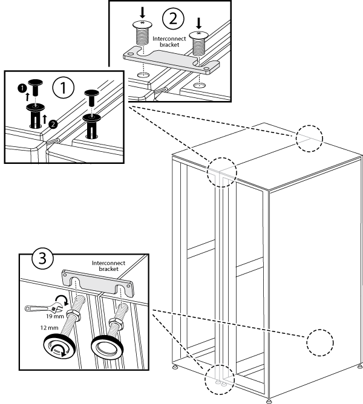
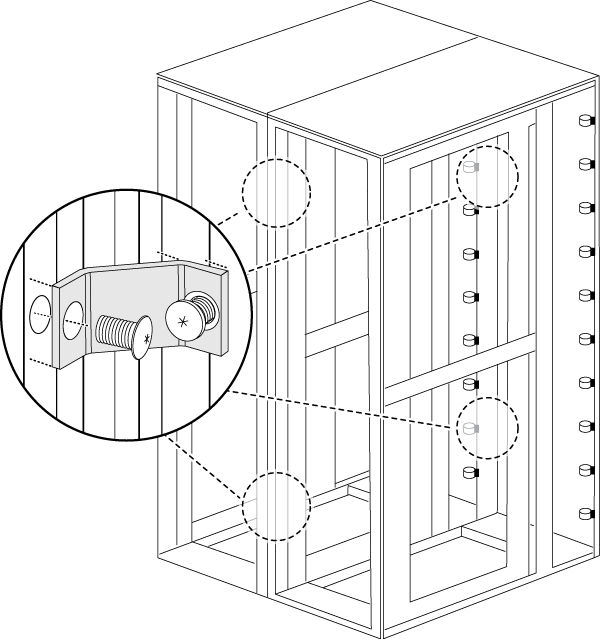

= 캐비닛 상호 연결 키트를 설치합니다
:allow-uri-read: 
:icons: font
:imagesdir: ../media/

[role="lead"]
옵션 캐비닛 상호 연결 키트를 사용하여 시스템 캐비닛을 함께 연결할 수 있습니다. 캐비닛이 분리되어 시스템 케이블이 손상되지 않도록 키트를 설치하는 것이 좋습니다.

. 시스템 캐비닛을 서로 가까이 놓습니다.
+
캐비닛은 다음 그림과 같이 배열해야 하며, 캐비닛은 중앙에 컨트롤러 모듈이 있고 캐비닛은 양쪽에 디스크 쉘프가 추가로 있습니다. 캐비닛의 면은 서로 가까이 있어야 하지만 아직 서로 닿지 않아도 됩니다.

+
image::../media/drw_fcc_cabinet_ordering.png[그림은 주변 텍스트에 설명되어 있습니다.]

. 권장 사항에 따라 측면 패널을 장착한 상태에서 상호 연결 키트를 설치하는 경우 포장을 푸는 동안 분리한 측면 패널을 다시 설치합니다.
+
.. 측면 패널을 들어 올려 시스템 캐비닛 바닥에서 15도 정도 떨어진 다음 시스템 캐비닛 프레임 상단의 립 위에 걸어 놓습니다.
.. 측면 패널을 캐비닛 프레임 쪽으로 부드럽게 밀어 넣은 다음 키로 제자리에 고정합니다.
.. 나머지 측면 패널에 대해 이러한 하위 단계를 반복합니다.

. 측면 패널을 제거한 상태에서 상호 연결 키트를 설치하는 경우 캐비닛이 만나는 모서리에 힌지가 있는 전면 도어를 분리합니다.
+
.. 탈거 중인 프론트 도어를 잠금 해제하고 여십시오.
.. 다음 그림을 참조하여 조명이 들어오는 베젤의 전원을 분리합니다.
+
image::../media/drw_sys_cab_remove_brimstone_back_banel.png[표시등이 켜지는 베젤의 전원을 분리하는 방법]

+
|===

 a| 
image:../media/legend_icon_01.png["설명선 번호 1"]

 a| 
조명이 들어오는 베젤 회로 보드 및 케이블

 a| 
image:../media/legend_icon_02.png["설명선 번호 2"]

 a| 
후면 패널 및 손잡이 나사

|===
.. 다음 그림을 참조하여 프론트 도어를 탈거하십시오.
+
image::../media/drw_sys_cab_front_door_daiginjo.png[전면 도어를 분리하는 방법]

+
|===

 a| 
image:../media/legend_icon_01.png["설명선 번호 1"]

 a| 
도어 접지 케이블

 a| 
image:../media/legend_icon_02.png["설명선 번호 2"]

 a| 
도어 상단 힌지

 a| 
image:../media/legend_icon_03.png["설명선 번호 3"]

 a| 
힌지 핀

|===
+
분리된 도어가 실수로 손상되지 않도록 안전한 곳에 두십시오.

. 캐비닛이 만나는 모서리에 힌지가 있는 후면 도어를 분리합니다.
+
.. 분리할 후면 도어를 잠금 해제하고 엽니다.
.. 상단 힌지 핀이 힌지 바닥에 닿을 때까지 들어 올립니다.
.. 도어 상단을 시스템 캐비닛 프레임에서 조심스럽게 떼어냅니다.
.. 하단 힌지에서 도어를 들어 올린 다음 도어를 한쪽에 둡니다.

. 시스템 캐비닛을 완전히 함께 이동한 다음 시스템 캐비닛 아래쪽에 있는 4개의 수평 조정 받침대를 조정하여 정렬 및 수평을 조정합니다.
. 상호 연결 브래킷을 설치합니다.
+
** 시스템 캐비닛 측면 패널이 장착된 상호 연결 브래킷을 설치하는 경우 다음 그림을 참조하십시오. 

+
|===

 a| 
image:../media/legend_icon_01.png["설명선 번호 1"]

 a| 
시스템 캐비닛 상단의 플라스틱 압인 리벳

 a| 
image:../media/legend_icon_02.png["설명선 번호 2"]

 a| 
상단 상호 연결 브래킷

 a| 
image:../media/legend_icon_03.png["설명선 번호 3"]

 a| 
하단 상호 연결 브래킷

|===
+
** 시스템 캐비닛 측면 패널을 분리한 상태에서 상호 연결 브래킷을 설치하는 경우 다음 그림을 참조하십시오. 

. 나머지 시스템 캐비닛에 대해서도 이 과정을 반복합니다.
. 모든 상호 연결 브래킷 나사를 조입니다.

