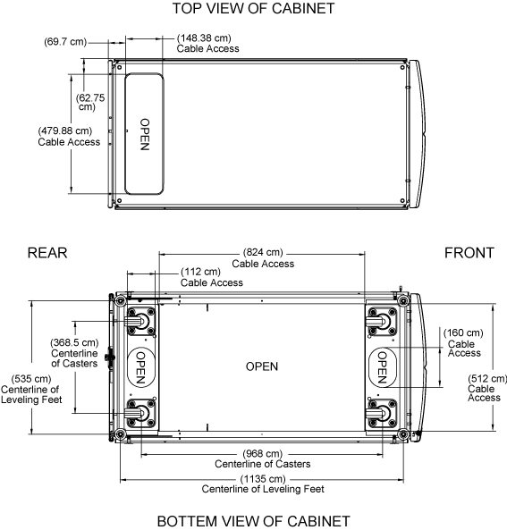

= 공간 요구 사항 및 시스템 캐비닛 치수
:allow-uri-read: 
:icons: font
:imagesdir: ../media/

[role="lead"]
시스템 캐비닛의 포장을 풀 때 시스템 캐비닛을 포장재에서 제거할 공간이 충분한지 확인해야 합니다. 또한 시스템 캐비닛의 의도된 위치가 캐비닛을 제 위치로 이동할 수 있을 만큼 충분히 큰지 확인하십시오.

== 시스템 캐비닛의 포장을 푸는 데 필요한 공간

다음 표에는 시스템 캐비닛의 포장을 풀고 설치하는 데 필요한 공간이 정의되어 있습니다.

[cols="1,2"]
|===
| 치수 | 미국 

| 미터  a| 
선적 램프 길이

 a| 
80in.
 a| 
203.2cm

 a| 
캐비닛 이동성을 위한 램프 외 여유 공간
 a| 
72in.

 a| 
182.9cm
 a| 
선적 팔레트 깊이

 a| 
59인치
 a| 
149.9cm

 a| 
선적 팔레트 폭
 a| 
42인치

 a| 
106.6cm
 a| 
운송 팔레트 및 포장 높이

 a| 
86인치
 a| 
218.4cm

 a| 
총 랙 공간, 42U
 a| 
73.5in.

 a| 
186.7cm
 a| 
레일 부하 용량

 a| 
모든 현재 시스템을 지원합니다
 a| 
모든 현재 시스템을 지원합니다

 a| 
비적재 중량
 a| 
최대 181kg(400lbs

 a| 
최대 181kg
 a| 
완전히 적재된 선적 중량

 a| 
최대 1,800lbs
 a| 
최대 816.5kg

 a| 
완전 적재된 정적 중량
 a| 
최대 2,700lbs

 a| 
최대 1,224.7kg
 a| 
프론트 서비스 간극

 a| 
47.2in.
 a| 
120cm

 a| 
리어 서비스 간극 * 참고: * 리어 도어는 분할됩니다. 실제 최소 리어 간극은 권장 사항의 1/2 정도입니다.
 a| 
30인치

 a| 
76.3cm
 a| 
패널 탈거용 최소 측면 간극

 a| 
24인치
 a| 
61cm

 a| 
최소 상단 여유 공간
 a| 
12인치

|===

== 시스템 캐비닛 외부 치수

다음 그림에서는 시스템 캐비닛의 전면, 후면 및 측면을 보여 줍니다.

image::../media/drw_sys_cab_side_front_dimensions_ozeki.gif[drw sys 운전실 측면 전방 치수 ozeki]

다음 그림은 시스템 캐비닛의 상단 및 하단 뷰를 보여 주고, 데이터 센터 바닥에서 시스템 캐비닛으로 케이블 번들을 실행할 수 있는 구멍을 나타냅니다. 또한 시스템 캐비닛 캐스터 및 수평 조정 받침의 위치도 그림에 나와 있습니다.

주의:

시스템 캐비닛이 데이터 센터 플로어를 통해 떨어지지 않도록 시스템 캐비닛 하단의 케이블 액세스 구멍보다 넓은 바닥 입구 위로 시스템 캐비닛을 굴리지 마십시오.

