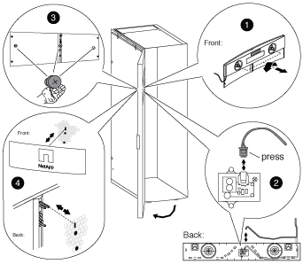

= 조명이 들어오는 배지를 제거하십시오
:icons: font
:imagesdir: ../media/

[role="lead"]
조명이 들어오는 배지를 제거하려면 시스템 캐비닛 전면 도어를 열고 배지의 뒷면에서 전원 코드를 뽑은 다음 시스템 캐비닛 도어에서 배지 구성 요소를 제거해야 합니다.

다음 단계와 함께 다음 그림을 사용하십시오.

. 시스템 캐비닛 전면 도어를 잠금 해제하고 엽니다.
. 도어 안쪽에 있는 배지 백 패널의 조임 나사를 푼 다음 후면 패널을 도어 망에서 조심스럽게 당겨 빼냅니다.
. 플러그에 있는 잠금 클립을 누르고, 소켓에서 코드를 뽑고, 후면 패널에서 케이블을 분리하여 후면 패널에서 전원 코드를 뽑습니다.
+
후면 패널을 한쪽에 둡니다.

. 배지 뒷면에서 나사를 조심스럽게 분리합니다.
+

NOTE: 나비 나사에 있는 스템은 매우 짧습니다. 나사를 놓을 경우 손잡이 나사를 붙잡을 수 있도록 자유 손을 나사 아래에 놓습니다.

. 도어 전면에서 배지를 분리하여 한쪽에 둡니다.

