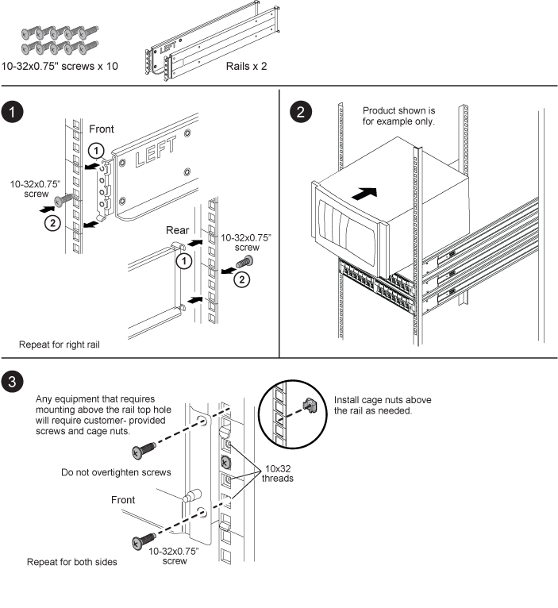

= SuperRail 키트 설치 지침
:icons: font
:imagesdir: ../media/

[role="lead"]
SuperRail은 표준 사각형 구멍 4포스트 랙에 설치하거나 원형 대 사각형 구멍 어댑터 브래킷을 사용하여 표준 원형 구멍 4포스트 랙에 설치할 수 있습니다.

== 사각형 구멍 4포스트 랙에 SuperRail 설치

== 4포스트 원형 랙에 SuperRail 설치

image::../media/drw_superrail_round_hole_four_post_kit_re_release.png[drw 슈퍼레일 원형 구멍 4 포스트 키트 재출시]
