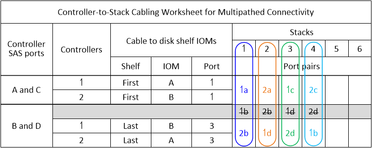
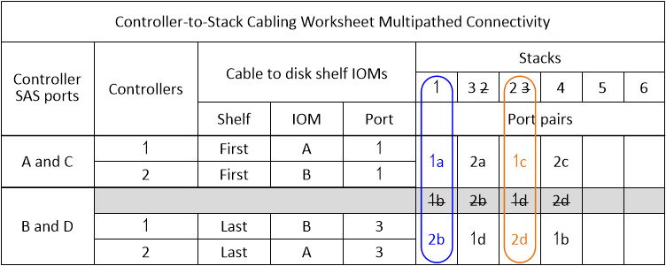
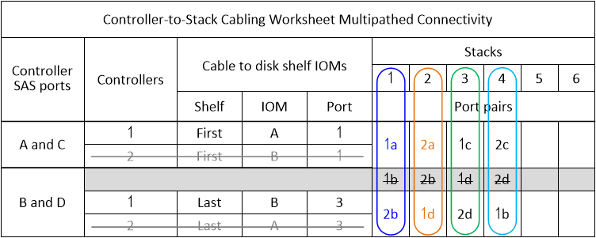

= DS212C, DS224C 또는 DS460C 다중 경로 연결을 위한 케이블링 작업표
:allow-uri-read: 
:icons: font
:imagesdir: ../media/

[role="lead"]
케이블링 워크시트를 사용하여 HA 쌍 또는 단일 컨트롤러 구성에서 다중 경로 연결을 달성하기 위해 컨트롤러를 디스크 쉘프 스택에 케이블로 연결하는 데 사용할 수 있는 컨트롤러 SAS 포트 쌍을 정의할 수 있습니다. 또한 완성된 워크시트를 사용하여 구성에 대한 다중 경로 연결 케이블링을 직접 수행할 수 있습니다.

.시작하기 전에
내부 스토리지가 있는 플랫폼이 있는 경우 다음 워크시트를 사용하십시오.

link:install-cabling-worksheets-examples-fas2600.html["컨트롤러-스택 케이블링 워크시트 및 내부 스토리지가 있는 플랫폼의 케이블 연결 예"]

.이 작업에 대해
* 이 절차 및 워크시트 템플릿은 하나 이상의 스택을 사용한 다중 경로 HA 또는 다중 경로 구성을 위한 다중 경로 연결 케이블에 적용할 수 있습니다.
+
완성된 워크시트는 다중 경로 HA 및 다중 경로 구성을 위해 제공됩니다.

+
워크시트 예제에서는 4중 포트 SAS HBA 2개와 IOM12, IOM12B 또는 IOM12C 모듈이 장착된 디스크 쉘프 스택 2개로 구성된 구성을 사용합니다.

* 워크시트 서식 파일을 사용하면 최대 6개의 스택을 사용할 수 있으므로 필요한 경우 열을 더 추가해야 합니다.
* 필요한 경우 를 참조할 수 있습니다 link:install-cabling-rules.html["SAS 케이블 연결 규칙 및 개념"] 지원되는 구성에 대한 자세한 내용은 컨트롤러 슬롯 번호 지정 규칙, 쉘프-쉘프 연결 및 컨트롤러-쉘프 연결(포트 쌍 사용 포함)을 참조하십시오.
* 필요한 경우 워크시트를 작성한 후 을 참조할 수 있습니다 link:install-cabling-worksheets-how-to-read-multipath.html["다중 경로 연결을 위해 컨트롤러 대 스택 연결에 케이블을 연결하기 위해 워크시트를 읽는 방법"]

image::../media/drw_worksheet_mpha_template.gif[MPHA 컨트롤러 - 스택 케이블 연결 워크시트 템플릿]

.단계
. 회색 상자 위의 상자에 시스템의 모든 SAS A 포트 및 시스템의 모든 SAS C 포트를 슬롯(0, 1, 2, 3 등)의 순서로 나열합니다.
+
예: 1a, 2a, 1c, 2c

. 회색 상자에 시스템의 모든 SAS B 포트 및 시스템의 모든 SAS D 포트를 슬롯(0, 1, 2, 3 등)의 순서로 나열합니다.
+
예: 1b, 2b, 1d, 2D

. 회색 상자 아래의 상자에서 목록의 첫 번째 포트가 목록의 끝으로 이동하도록 D 및 B 포트 목록을 다시 작성합니다.
+
예: 2b, 1d, 2D, 1b

. 각 스택에 대한 포트 쌍을 동그라미(지정)합니다.
+
시스템의 스택에 케이블을 연결하는 데 모든 포트 쌍을 사용하는 경우, 워크시트에 포트 쌍이 정의되어 나열된 순서대로 포트 쌍을 순환합니다.

+
예를 들어 8개의 SAS 포트와 4개의 스택이 있는 다중 경로 HA 구성에서 포트 쌍 1a/2b는 스택 1에 케이블로 연결되고, 포트 쌍 2a/1d는 스택 2에 연결되고, 포트 쌍 1c/2D는 stack3에 케이블로 연결되고, 포트 쌍 2c/1b는 스택 4에 케이블로 연결됩니다.

+

+
시스템의 스택에 케이블을 연결하는 데 모든 포트 쌍이 필요하지 않은 경우에는 포트 쌍을 건너뜁니다(다른 모든 포트 쌍 사용).

+
예를 들어, 8개의 SAS 포트와 2개의 스택이 있는 다중 경로 HA 구성에서 포트 쌍 1a/2b는 스택 1에 케이블로 연결되고 포트 쌍 1c/2D는 스택 2에 케이블로 연결됩니다. 나중에 두 개의 추가 스택이 핫 애드 될 경우, 포트 쌍 2a/1d는 스택 3에 케이블로 연결되고 포트 쌍 2c/1b는 스택 4에 케이블로 연결됩니다.

+

NOTE: 시스템의 스택에 케이블을 연결하는 것보다 많은 포트 쌍이 있는 경우, 시스템의 SAS 포트를 최적화하기 위해 포트 쌍을 건너뛰는 것이 가장 좋습니다. SAS 포트를 최적화하여 시스템 성능을 최적화합니다.

+

+
완성된 워크시트를 사용하여 시스템에 케이블을 연결할 수 있습니다.

. 단일 컨트롤러(다중 경로) 구성이 있는 경우 컨트롤러 2에 대한 정보를 교차 표시합니다.
+

+
완성된 워크시트를 사용하여 시스템에 케이블을 연결할 수 있습니다.

