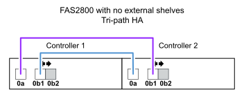

= IOM12/IOM12B 모듈이 포함된 내부 저장 선반 플랫폼의 컨트롤러-스택 케이블링 워크시트 및 케이블 연결 예
:allow-uri-read: 
:icons: font
:imagesdir: ../media/

[role="lead"]
완성된 컨트롤러-스택 케이블링 워크시트 및 케이블 연결 예를 사용하여 내부 스토리지가 있는 플랫폼을 케이블로 연결할 수 있습니다.

NOTE: 이 정보는 FAS25XX 플랫폼에는 적용되지 않습니다.

* 필요한 경우 을 참조할 수 있습니다 link:install-cabling-rules.html["SAS 케이블 연결 규칙 및 개념"] 지원되는 구성, 쉘프-쉘프 연결 및 컨트롤러-쉘프 연결에 대한 자세한 내용은 를 참조하십시오.
* 케이블 연결 예는 컨트롤러 0b/0b1 포트 연결과 컨트롤러 0a 포트 연결을 구별하기 위해 컨트롤러-스택 케이블을 실선 또는 점선으로 표시합니다.
+
image::../media/drw_fas2600_controller_to_stack_cable_type_key_IEOPS-947.svg[drw fas2600 컨트롤러-스택 케이블 유형 키 IEOPS 947]

* 케이블 연결 예는 IOM A(도메인 A) 및 IOM B(도메인 B)를 통해 연결을 구별하기 위해 컨트롤러-스택 연결 및 쉘프-쉘프 연결을 두 가지 색상으로 보여 줍니다.
+
image::../media/drw_fas2600_cable_color_key.png[drw fas2600 케이블 색상 키]

== 외부 쉘프가 없는 다중 경로 HA 구성의 FAS2800 플랫폼

다음 예에서는 다중 경로 HA 연결을 위한 케이블이 필요하지 않은 것을 보여 줍니다.

image::../media/drw_fas2800_noshelf_mpha_IEOPS-954.svg[drw fas2800 귀걸이형 Mpha IEOPS 954]

== 외부 쉘프가 없는 삼중 경로 HA 구성의 FAS2800 플랫폼

다음 케이블 연결 예는 3개 경로 연결을 위해 두 컨트롤러 간의 필수 케이블 연결을 보여줍니다.

== 단일 다중 쉘프 스택을 사용하는 삼중 경로 HA 구성의 FAS2800 플랫폼

다음 워크시트 및 케이블 연결 예에서는 포트 쌍 0a/0b1을 사용합니다.

image::../media/drw_fas2800_worksheet_IEOPS-948.svg[drw fas2800 워크시트 IEOPS 948]

image::../media/drw_fas2800_withshelves_tpha_IEOPS-949.svg[drw fas2800, tpha IEOPS 949 포함]

== 다중 경로 HA 구성에서 내부 스토리지를 갖춘 플랫폼 및 다중 쉘프 스택 1개

다음 워크시트 및 케이블 연결 예에서는 포트 쌍 0a/0b를 사용합니다.

NOTE: 이 섹션은 FAS2800 또는 FAS25XX 시스템에는 적용되지 않습니다.

image::../media/drw_fas2600_mpha_worksheet_IEOPS-1255.svg[drw fas2600 mpha 워크시트 IEOPS 1255]

image::../media/drw_fas2600_mpha_IEOPS-1256.svg[drw fas2600 mpha IEOPS 1256]

== FAS2600 시리즈 다중 쉘프 스택 1개 포함 다중 경로 구성

다음 워크시트 및 케이블 연결 예에서는 포트 쌍 0a/0b를 사용합니다.

이 예제에서 컨트롤러는 섀시의 슬롯 A에 설치됩니다. 컨트롤러가 섀시의 슬롯 A에 있는 경우 내부 스토리지 포트(0b)가 도메인 A(IOM A)에 있으므로 포트 0b는 스택의 도메인 A(IOM A)에 연결해야 합니다.

image::../media/drw_fas2600_mp_slot_a_worksheet.png[drw fas2600 MP 슬롯 A 워크시트]

image::../media/drw_fas2600_mp_slot_a.png[drw fas2600 MP 슬롯 A]

이 예제에서 컨트롤러는 섀시의 슬롯 B에 설치됩니다. 컨트롤러가 섀시의 슬롯 B에 있는 경우 내부 스토리지 포트(0b)가 도메인 B(IOM B)에 있으므로 포트 0b는 스택의 도메인 B(IOM B)에 연결해야 합니다.

image::../media/drw_fas2600_mp_slot_b_worksheet.png[drw fas2600 MP 슬롯 b 워크시트]

image::../media/drw_fas2600_mp_slot_b.png[drw fas2600 MP 슬롯 b]
