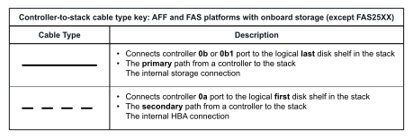
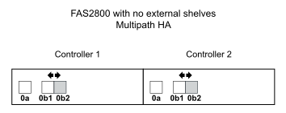
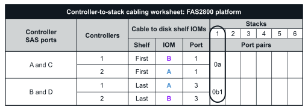
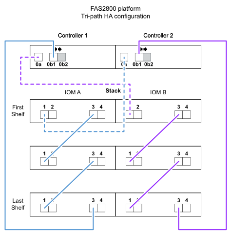
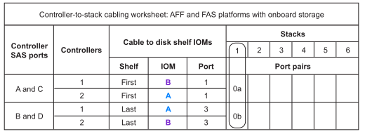

= 내부 스토리지 플랫폼이 있는 DS212C, DS224C 또는 DS460C 쉘프용 케이블링 작업표
:allow-uri-read: 
:icons: font
:imagesdir: ../media/

[role="lead"]
완성된 컨트롤러-스택 케이블링 워크시트와 케이블링 예제를 사용하여 내부 스토리지가 있는 플랫폼을 케이블링할 수 있습니다. 이는 IOM12, IOM12B 또는 IOM12C 모듈이 있는 쉘프에 적용됩니다.

* 필요한 경우 을 참조할 수 있습니다 link:install-cabling-rules.html["SAS 케이블 연결 규칙 및 개념"] 지원되는 구성, 쉘프-쉘프 연결 및 컨트롤러-쉘프 연결에 대한 자세한 내용은 를 참조하십시오.
* 케이블 연결 예는 컨트롤러 0b/0b1 포트 연결과 컨트롤러 0a 포트 연결을 구별하기 위해 컨트롤러-스택 케이블을 실선 또는 점선으로 표시합니다.
+

* 케이블 연결 예는 IOM A(도메인 A) 및 IOM B(도메인 B)를 통해 연결을 구별하기 위해 컨트롤러-스택 연결 및 쉘프-쉘프 연결을 두 가지 색상으로 보여 줍니다.
+
image::../media/drw_fas2600_cable_color_key.png[온보드 저장 장치가 있는 플랫폼용 케이블 색상 키]

== 외부 쉘프가 없는 다중 경로 HA 구성의 FAS2820 플랫폼

다음 예에서는 다중 경로 HA 연결을 위한 케이블이 필요하지 않은 것을 보여 줍니다.

== 외부 쉘프가 없는 삼중 경로 HA 구성의 FAS2820 플랫폼

다음 케이블 연결 예는 3개 경로 연결을 위해 두 컨트롤러 간의 필수 케이블 연결을 보여줍니다.

image::../media/drw_fas2800_noshelf_tpha_IEOPS-955.svg[Fas2800 Tri Path HA 케이블 연결의 예: 외부 쉘프 없음]

== 단일 다중 쉘프 스택을 사용하는 삼중 경로 HA 구성의 FAS2820 플랫폼

다음 워크시트 및 케이블 연결 예에서는 포트 쌍 0a/0b1을 사용합니다.

== 다중 경로 HA 구성에서 내부 스토리지를 갖춘 플랫폼 및 다중 쉘프 스택 1개

다음 워크시트 및 케이블 연결 예에서는 포트 쌍 0a/0b를 사용합니다.

NOTE: 이 섹션은 FAS2820 시스템에는 적용되지 않습니다.

image::../media/drw_fas2600_mpha_IEOPS-1256.svg[내부 스토리지가 있는 플랫폼을 위한 다중 경로 HA 케이블링 예]
