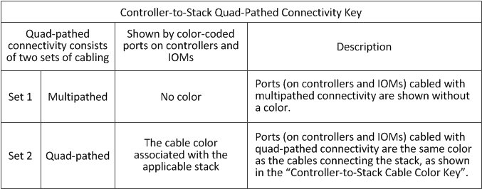

= 2개의 4중 포트 SAS HBA를 사용하는 4중 경로 HA 구성의 컨트롤러-스택 케이블 연결 워크시트 및 케이블 연결 예 - IOM12/IOM12B 모듈을 포함하는 쉘프
:allow-uri-read: 
:icons: font
:imagesdir: ../media/

[role="lead"]
완성된 컨트롤러-스택 케이블 연결 워크시트와 케이블 연결 예를 사용하여 2개의 4중 포트 SAS HBA가 있는 4중 경로 HA 구성을 케이블로 연결할 수 있습니다.

* 필요한 경우 을 참조할 수 있습니다 link:install-cabling-rules.html["SAS 케이블 연결 규칙"] 지원되는 구성에 대한 자세한 내용은 컨트롤러 슬롯 번호 지정 규칙, 쉘프-쉘프 연결 및 컨트롤러-쉘프 연결(포트 쌍 사용 포함)을 참조하십시오.
* 필요한 경우 을 참조할 수 있습니다 link:install-cabling-worksheets-how-to-read-quadpath.html["4중 경로 연결을 위해 컨트롤러-스택 간 연결을 케이블로 연결하기 위해 워크시트를 읽는 방법"].
* 케이블 연결 예는 컨트롤러 A 및 C 포트 연결과 컨트롤러 B 및 D 포트 연결을 구별하기 위해 컨트롤러-스택 케이블을 실선 또는 점선으로 표시합니다.
+
image::../media/drw_controller_to_stack_cable_type_key.gif[컨트롤러-스택 케이블링을 위한 케이블 유형 키]

* 케이블 연결 예시와 워크시트의 해당 포트 쌍은 HA 쌍의 각 스택에 대한 연결을 구별하기 위해 색상으로 구분되어 있습니다.
+
image::../media/drw_controller_to_stack_cable_color_key_non2600.gif[케이블 연결 워크시트에 대한 색상 키입니다]

* 케이블 연결 예는 HA 쌍 또는 단일 컨트롤러 구성의 각 스택에 대해 4중 경로 방식의 연결을 달성하는 데 필요한 2개의 다중 경로 케이블 세트를 시각적으로 구별합니다.
+
첫 번째 다중 경로 케이블 세트를 "다중 경로"라고 합니다. 두 번째 다중 경로 케이블 세트를 ""4중 경로""라고 합니다. 두 번째 케이블 세트는 "4중 경로"라고 합니다. 이 케이블 세트를 완료하면 4중 경로 방식의 연결이 가능하기 때문입니다.

+

* 워크시트 예는 다중 경로 케이블 연결 또는 4중 경로 케이블 연결에서 해당 스택까지 지정된 포트 쌍을 보여줍니다.
+
다중 경로 케이블링용으로 지정된 각 포트 쌍은 케이블로 연결된 스택과 연결된 타원형으로 둘러싸여 있습니다. 4중 케이블 연결에 지정된 각 포트 쌍은 케이블이 연결된 스택과 연결된 직사각형으로 둘러싸입니다.

== 2개의 4중 포트 SAS HBA와 2개의 다중 쉘프 스택이 있는 4중 경로 HA입니다

다음 워크시트 및 케이블 연결 예에서는 스택 1의 포트 쌍 1a/2b(다중 경로) 및 2a/1d(4중 경로)와 stack2의 포트 쌍 1c/2D(다중 경로) 및 2c/1b(4중 경로)를 사용합니다.

image::../media/drw_worksheet_qpha_slots_1_and_2_two_4porthbas_two_stacks_nau.gif[4중 경로 HA를 위한 케이블 연결 워크시트]

image::../media/drw_qpha_slots_1_and_2_two_4porthbas_two_stacks_nau.gif[2개의 4중 포트 SAS HBA와 2개의 다중 쉘프 스택이 있는 4중 경로 HA]
