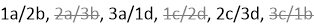

= SAS 케이블 연결 규칙 - IOM12 모듈 선반
:icons: font
:imagesdir: ../media/

[role="lead"]
SAS 케이블 연결 규칙, 컨트롤러 슬롯 번호 지정 규칙, 쉘프-쉘프 연결 규칙, 컨트롤러-스택 연결 규칙, 해당하는 경우 미니 SAS HD SAS 광 케이블 규칙 등의 SAS 케이블 연결 규칙을 적용하여 IOM12 모듈을 포함하는 디스크 쉘프를 HA 쌍 및 단일 컨트롤러 구성(지원되는 플랫폼용)으로 케이블로 연결할 수 있습니다.

NOTE: 이 가이드에 설명된 컨트롤러 슬롯 번호 지정 규칙, 쉘프-쉘프 연결 규칙 및 컨트롤러-스택 연결 규칙과 관련된 SAS 케이블 연결 규칙은 IOM12, IOM6, IOM3 모듈 등 모든 SAS 디스크 쉘프에 적용되는 동일한 규칙입니다. 그러나 이 가이드의 정보는 IOM12 모듈을 사용하는 디스크 쉘프의 고유한 특성 및 지원되는 구성에서 사용됩니다.

이 가이드에 설명된 구성 규칙 및 미니 SAS HD SAS 광 케이블 규칙과 관련된 SAS 케이블 연결 규칙은 IOM12 모듈을 사용하는 디스크 쉘프에만 적용됩니다.

이 가이드에 설명된 SAS 케이블 연결 규칙은 온보드 SAS 포트와 호스트 버스 어댑터 SAS 포트 간의 SAS 케이블 연결 균형을 조정하여 고가용성 스토리지 컨트롤러 구성을 제공하고 다음 목표를 충족합니다.

* 모든 SAS 제품 및 구성에 대해 쉽게 이해할 수 있는 단일 범용 알고리즘을 제공합니다
* BOM을 생성할 때 공장 및 현장에서 동일한 물리적 케이블을 생성합니다
* 구성 검사 소프트웨어 및 도구를 통해 확인할 수 있습니다
* 복원력을 극대화함으로써 가용성을 유지하고 컨트롤러 테이크오버 의존도를 최소화합니다

당신은 규칙에서 벗어나는 것을 피해야 합니다. 편차는 신뢰성, 보편성 및 공통성을 감소시킬 수 있습니다.

== 구성 규칙

[role="lead"]
IOM12 모듈이 포함된 디스크 쉘프는 특정 유형의 HA Pair 및 단일 컨트롤러 구성에서 지원됩니다.

* HA Pair 구성은 다중 경로 HA 또는 4중 경로 HA 구성으로 케이블로 연결되어야 하며, 단, 다음과 같은 예외가 있습니다.
+
** AFF A200, AFF A220, FAS2600 시리즈 및 FAS2700HA 쌍 구성(외부 디스크 쉘프 포함)을 단일 경로 HA 구성으로 연결하여 외부 SAS 테이프 백업 장치에 대한 연결을 지원할 수 있습니다.
** AFF A200, AFF A220, FAS2600 시리즈 및 FAS2700HA 쌍 구성은 4중 경로 HA 연결을 지원하지 않습니다.

* 단일 컨트롤러 구성은 다중 경로 또는 4중 경로 구성으로 케이블로 연결되어야 하며, 단, 다음과 같은 예외가 있습니다.
+
** FAS2600 시리즈 단일 컨트롤러 구성(외부 디스크 쉘프 포함)을 단일 경로 구성으로 케이블로 연결할 수 있습니다.
+
내부 스토리지가 단일 경로 연결을 사용하므로 ONTAP에서는 혼합 경로가 감지된다는 경고가 가끔 발생합니다. 이러한 경고를 방지하려면 외부 디스크 쉘프에 대한 단일 경로 연결을 사용할 수 있습니다. 또한 외부 SAS 테이프 백업 장치를 사용할 때 단일 경로 연결을 사용할 수 있습니다.

** FAS2600 시리즈 단일 컨트롤러 구성은 4중 경로 연결을 지원하지 않습니다.

== 컨트롤러 슬롯 번호 지정 규칙

[role="lead"]
지원되는 모든 HA 쌍 및 단일 컨트롤러 구성에 케이블 연결 규칙을 적용하기 위해 컨트롤러 슬롯 번호 지정 규칙을 사용합니다.

* 모든 HA 쌍 및 단일 컨트롤러 구성에 대해 다음 사항이 적용됩니다.
+
** 물리적 PCI 슬롯의 SAS HBA는 컨트롤러의 슬롯에 있는 물리적 레이블에 관계없이 PCI 슬롯 1, 2, 3 등을 점유하는 것으로 정의됩니다.
+
예를 들어 SAS HBA가 물리적 PCI 슬롯 3, 5 및 7을 사용하는 경우 SAS 케이블 연결 규칙을 적용하기 위해 슬롯 1, 2 및 3으로 지정됩니다.

** 온보드 SAS HBA는 컨트롤러에 레이블이 지정된 것과 마찬가지로 PCI 슬롯 0을 점유하는 것으로 정의됩니다.
** 각 슬롯의 각 포트는 컨트롤러에 표시되어 있는 것처럼 정의됩니다. 예를 들어 포트 2개가 있는 슬롯 0을 0a 및 0b라고 합니다. 포트가 4개인 슬롯 1을 1a, 1b, 1c 및 1d라고 합니다.
+
이 문서에서는 슬롯 및 슬롯 포트를 다음과 같이 설명합니다.

+
image::../media/slot0_rules.png[슬로싱 규칙]

== Shelf-Shelf 연결 규칙

[role="lead"]
디스크 쉘프 스택에 디스크 쉘프가 3개 이상 있는 경우, 해당 ''Standard' 또는 ''double-wide'' 쉘프 케이블을 사용하여 각 SAS 도메인(IOM A 및 IOM B)을 통해 상호 연결됩니다. "표준" 또는 "이중 폭" 선반선반케이블을 사용하는 것은 사용하는 구성에 따라 다릅니다.

=== 표준 쉘프-쉘프 연결

* 표준 쉘프-쉘프 연결은 다중 경로 HA, 다중 경로, 단일 경로 HA 및 단일 경로 구성에 사용됩니다.
* IOM3 및 IOM6 모듈을 사용하는 기존 SAS 스토리지 구성에서는 표준 쉘프-쉘프 연결을 사용합니다. 즉, 각 도메인의 디스크 쉘프 간에 하나의 케이블 연결이 필요합니다. -- 도메인 A(IOM A) 및 도메인 B(IOM B).
* 모범 사례는 IOM 포트 3 및 1을 표준 쉘프-쉘프 연결에 사용하는 것입니다.
+
논리적 첫 번째 쉘프에서 스택의 마지막 논리 쉘프에 이르기까지 IOM 포트 3을 도메인 A와 도메인 B의 다음 쉘프 IOM 포트 1에 연결합니다

image::../media/drw_shelf_to_shelf_standard.gif[선반-선반 규격]

=== 2배 폭 쉘프-쉘프 연결

* 2중 경로(4중 경로 HA 및 4중 경로) 구성에서는 쉘프-쉘프 연결을 사용합니다.
* 이중 쉘프-쉘프 연결을 위해서는 각 도메인의 디스크 쉘프-IOM A(도메인 A)와 IOM B(도메인 B) 간에 2개의 케이블 연결이 필요합니다.
+
첫 번째 케이블 연결은 IOM 포트 3 및 1을 사용하여 표준 쉘프-쉘프 연결로 케이블이 연결되고, 두 번째 케이블 연결은 IOM 포트 4 및 2를 사용하여 이중 쉘프-쉘프 연결로 케이블이 연결됩니다.

+
논리적 첫 번째 쉘프에서 스택의 마지막 논리 쉘프에 이르기까지 IOM 포트 3을 도메인 A와 도메인 B의 다음 쉘프 IOM 포트 1에 연결합니다 논리적 첫 번째 쉘프에서 스택의 마지막 논리 쉘프에 이르기까지 IOM 포트 4를 도메인 A의 다음 쉘프 IOM 포트 2에 연결한 다음 도메인 B에 연결합니다 (이중 와이드 연결로 케이블이 연결된 IOM 포트는 파란색으로 표시됩니다.)

image::../media/drw_shelf_to_shelf_double_wide.gif[두 배 너비 선반으로 줄 수 있는 drw 선반]

== 컨트롤러-스택 연결 규칙

[role="lead"]
SAS 디스크 쉘프가 소프트웨어 기반 디스크 소유권을 사용하고 컨트롤러 포트 A/C 및 B/D를 스택에 연결하는 방법, 컨트롤러 포트 A/C 및 B/D를 사용하는 것을 이해함으로써 각 컨트롤러에서 HA 쌍 또는 단일 컨트롤러 구성으로 각 스택에 대한 SAS 연결을 올바르게 연결할 수 있습니다. 컨트롤러 포트 A/C 및 B/D를 포트 쌍으로 구성하는 방법 및 AFF A200, AFF A220, FAS2600 시리즈 및 FAS2700 시스템 포트 0b 및 0a를 스택에 연결하는 방법

=== SAS 디스크 쉘프 소프트웨어 기반 디스크 소유 규칙

SAS 디스크 쉘프는 하드웨어 기반 디스크 소유권이 아니라 소프트웨어 기반 디스크 소유권을 사용합니다. 즉, 디스크 드라이브 소유권은 스토리지 시스템의 물리적 접속의 토폴로지에 의해 결정되지 않고 디스크 드라이브에 저장됩니다(하드웨어 기반 디스크 소유인 경우). 특히, 디스크 드라이브 소유권은 컨트롤러-스택 간 연결에 케이블을 연결하는 방법이 아닌 ONTAP(자동 또는 CLI 명령)에 의해 할당됩니다.

SAS 디스크 쉘프는 하드웨어 기반 디스크 소유권 스키마를 사용하여 케이블로 연결해서는 안 됩니다.

=== 컨트롤러 A 및 C 포트 연결 규칙(비 AFF A200, AFF A220, FAS2600 시리즈 및 FAS2700 구성에 해당)

* A 및 C 포트는 항상 스택의 기본 경로입니다.
* A와 C 포트는 항상 스택의 논리적 첫 번째 디스크 쉘프에 연결합니다.
* A 및 C 포트는 항상 디스크 쉘프 IOM 포트 1 및 2에 연결합니다.
+
IOM 포트 2는 4중 경로 HA 및 4중 경로 구성에만 사용됩니다.

* 컨트롤러 1 A 및 C 포트는 항상 IOM A(도메인 A)에 연결합니다.
* 컨트롤러 2 A 및 C 포트는 항상 IOM B(도메인 B)에 연결합니다.

다음 그림에서는 1개의 4중 포트 HBA와 2개의 디스크 쉘프 스택을 사용하여 다중 경로 HA 구성에서 컨트롤러 포트 A와 C를 연결하는 방법을 보여 줍니다. 스택 1에 대한 연결은 파란색으로 표시됩니다. 스택 2에 대한 연결은 주황색으로 표시됩니다.

image::../media/drw_controller_to_stack_rules_ports_a_and_c_example.gif[규칙 포트 A 및 c를 스택하는 drw 컨트롤러 예]

=== 컨트롤러 B 및 D 포트 연결 규칙(비 AFF A200, AFF A220, FAS2600 시리즈 및 FAS2700 구성에 해당)

* B 및 D 포트는 항상 스택에 대한 보조 경로입니다.
* B 및 D 포트는 항상 스택의 마지막 논리 디스크 쉘프에 연결합니다.
* B 및 D 포트는 항상 디스크 쉘프 IOM 포트 3 및 4에 연결합니다.
+
IOM 포트 4는 4중 경로 HA 및 4중 경로 구성에만 사용됩니다.

* 컨트롤러 1 B 및 D 포트는 항상 IOM B(도메인 B)에 연결합니다.
* 컨트롤러 2 B 및 D 포트는 항상 IOM A(도메인 A)에 연결합니다.
* B 및 D 포트는 PCI 슬롯의 순서를 하나씩 오프셋하여 스택에 연결되어 첫 번째 슬롯의 첫 번째 포트가 마지막으로 케이블로 연결됩니다.

다음 그림에서는 1개의 4중 포트 HBA와 2개의 디스크 쉘프 스택을 사용하여 다중 경로 HA 구성에서 컨트롤러 포트 B와 D를 연결하는 방법을 보여 줍니다. 스택 1에 대한 연결은 파란색으로 표시됩니다. 스택 2에 대한 연결은 주황색으로 표시됩니다.

image::../media/drw_controller_to_stack_rules_ports_b_and_d_example.gif[규칙 포트 b 및 d를 스택하는 drw 컨트롤러 예]

=== 포트 쌍 연결 규칙(비 AFF A200, AFF A220, FAS2600 시리즈 및 FAS2700 구성에 해당)

컨트롤러 SAS 포트 A, B, C 및 D는 모든 SAS 포트를 활용하는 방법을 통해 포트 쌍으로 구성되며, HA Pair 및 단일 컨트롤러 구성의 컨트롤러-스택 연결을 케이블로 연결할 때 시스템 복원력과 일관성을 제공합니다.

* 포트 쌍은 컨트롤러 A 또는 C SAS 포트와 컨트롤러 B 또는 D SAS 포트로 구성됩니다.
+
A 및 C SAS 포트는 스택의 논리적 첫 번째 쉘프에 연결됩니다. B 및 D SAS 포트는 스택의 마지막 논리 쉘프에 연결됩니다.

* 포트 쌍은 시스템의 각 컨트롤러에 있는 모든 SAS 포트를 사용합니다.
+
물리적 PCI 슬롯 [슬롯 1-N]의 HBA와 컨트롤러 [슬롯 0]의 모든 SAS 포트를 포트 쌍으로 통합하여 시스템 복원력을 높입니다. SAS 포트를 제외하지 마십시오.

* 포트 쌍은 다음과 같이 식별되고 구성됩니다.
+
.. 포트와 C 포트를 차례로 슬롯(0,1, 2, 3 등)에 나열합니다.
+
예: 1a, 2a, 3a, 1c, 2c, 3c

.. B 포트와 D 포트를 차례로 슬롯(0,1, 2, 3 등)에 나열합니다.
+
예: 1b, 2b, 3b, 1d, 2d, 3D

.. 목록의 첫 번째 포트가 목록의 끝으로 이동하도록 D 및 B 포트 목록을 다시 작성합니다.
+
예를 들면 다음과 같습니다. image:../media/drw_gen_sas_cable_step2.png[""]

+
둘 이상의 SAS 포트 슬롯을 사용할 수 있을 때 여러 슬롯(물리적 PCI 슬롯 및 온보드 슬롯)에서 하나의 포트 쌍을 기준으로 슬롯의 순서를 오프셋하여 하나의 SAS HBA에 스택이 케이블로 연결되지 않도록 합니다.

.. A 및 C 포트(1단계에서 나열)를 D 및 B 포트(2단계에서 나열)에 나열된 순서대로 페어링합니다.
+
예: 1a/2b, 2a/3b, 3a/1d, 1c/2D, 2c/3D, 3c/1b.

+

NOTE: HA 쌍의 경우, 첫 번째 컨트롤러에서 식별한 포트 쌍 목록이 두 번째 컨트롤러에도 적용됩니다.

* 시스템에 케이블을 연결할 때 포트 쌍을 확인한 순서대로 사용하거나 포트 쌍을 건너뛸 수 있습니다.
+
** 시스템의 스택에 케이블을 연결하기 위해 모든 포트 쌍이 필요한 경우 포트 쌍을 식별(나열)한 순서대로 사용합니다.
+
예를 들어, 시스템에 대해 6개의 포트 쌍을 식별했고 다중 경로로서 케이블을 위한 6개의 스택이 있는 경우, 포트 쌍을 나열한 순서대로 케이블 연결합니다.

+
1a/2b, 2a/3b, 3a/1d, 1c/2D, 2c/3D, 3c/1b

** 시스템의 스택에 케이블을 연결하는 데 모든 포트 쌍이 필요하지 않은 경우 포트 쌍을 건너뜁니다(다른 모든 포트 쌍 사용).
+
예를 들어, 시스템에 대해 6개의 포트 쌍을 식별했고 다중 경로를 케이블로 연결할 3개의 스택이 있는 경우, 목록에서 다른 모든 포트 쌍을 케이블로 연결합니다.

+

+

NOTE: 시스템의 스택에 케이블을 연결하는 것보다 많은 포트 쌍이 있는 경우, 시스템의 SAS 포트를 최적화하기 위해 포트 쌍을 건너뛰는 것이 가장 좋습니다. SAS 포트를 최적화하여 시스템 성능을 최적화합니다.

컨트롤러-스택 케이블링 워크시트는 HA 쌍 또는 단일 컨트롤러 구성에 대한 컨트롤러-스택 연결을 케이블로 연결할 수 있도록 포트 쌍을 확인하고 구성하는 데 사용되는 편리한 도구입니다.

link:install-cabling-worksheet-template-multipath.html["다중 경로 연결을 위한 컨트롤러-스택 케이블링 워크시트 템플릿"]

link:install-cabling-worksheet-template-quadpath.html["4중 경로 연결을 위한 컨트롤러-스택 케이블링 워크시트 템플릿"]

=== 외부 디스크 쉘프에 대한 AFF A200, AFF A220, FAS2600 시리즈 및 FAS2700 컨트롤러 0b 및 0a 포트 연결 규칙

각 컨트롤러는 내부 스토리지(포트 0b)와 스택 간에 동일한 도메인 연결을 유지해야 하므로 AFF A200, AFF A220, FAS2600 시리즈 및 FAS2700 시스템에는 고유한 연결 규칙 세트가 있습니다. 즉, 컨트롤러가 섀시(컨트롤러 1)의 슬롯 A에 있으면 도메인 A(IOM A)에 있으므로 포트 0b는 스택의 IOM A에 연결해야 합니다. 컨트롤러가 섀시(컨트롤러 2)의 슬롯 B에 있는 경우 컨트롤러는 도메인 B(IOM B)에 있으므로 포트 0b는 스택의 IOM B에 연결해야 합니다.

NOTE: 0b 포트를 올바른 도메인(교차 연결 도메인)에 연결하지 않으면 시스템을 복원 문제에 노출시켜 무중단 절차를 안전하게 수행하지 못하게 합니다.

* 컨트롤러 0b 포트(내부 스토리지 포트):
+
** 컨트롤러 1 0b 포트는 항상 IOM A(도메인 A)에 연결합니다.
** 컨트롤러 2 0b 포트는 항상 IOM B(도메인 B)에 연결합니다.
** 포트 0b는 항상 기본 경로입니다.
** 포트 0b는 항상 스택의 마지막 논리 디스크 쉘프에 연결됩니다.
** 포트 0b는 항상 디스크 쉘프 IOM 포트 3에 연결합니다.

* 컨트롤러 0a 포트(내부 HBA 포트):
+
** 컨트롤러 1 0a 포트는 항상 IOM B(도메인 B)에 연결합니다.
** 컨트롤러 2 0a 포트는 항상 IOM A(도메인 A)에 연결합니다.
** 포트 0a는 항상 보조 경로입니다.
** 포트 0a는 항상 스택의 논리적 첫 번째 디스크 쉘프에 연결합니다.
** 포트 0a는 항상 디스크 쉘프 IOM 포트 1에 연결합니다.

다음 그림에서는 AFF A200, AFF A220, FAS2600 시리즈 및 FAS2700 다중 경로 HA 구성을 위한 내부 스토리지 포트(0b) 도메인 연결을 보여 줍니다.

image::../media/drw_fas2600_mpha_domain_example.png[drw fas2600 mpha 도메인의 예]

== 미니 SAS HD SAS 광 케이블 규칙

[role="lead"]
미니 SAS HD-LC HD-LC 커넥터가 있는 미니 SAS HD-to-mini-SAS HD 커넥터와 다중 모드(OM4) 브레이크아웃 케이블이 있는 멀티모드 액티브 광 케이블(AOC) 케이블)을 사용하여 IOM12 모듈이 있는 디스크 선반이 있는 특정 구성에서 장거리 SAS 연결을 달성할 수 있습니다.

* 사용 중인 플랫폼 및 버전의 ONTAP는 미니 SAS HD-LC 커넥터가 있는 멀티모드 액티브 광 케이블(AOC) 케이블 및 미니 SAS HD-미니 SAS HD 커넥터 및 멀티모드(OM4) 브레이크아웃 케이블(미니 SAS HD-LC 커넥터 포함)의 미니 SAS HD SAS 광 케이블 사용을 지원해야 합니다.
+
https://hwu.netapp.com["NetApp Hardware Universe를 참조하십시오"]

* SAS 광 멀티모드 AOC 케이블(미니 SAS HD-미니 SAS HD 커넥터 포함)은 컨트롤러-스택 및 쉘프-쉘프 연결에 사용할 수 있으며 최대 50m 길이로 사용할 수 있습니다.
* SAS 광 멀티모드(OM4) 브레이크아웃 케이블과 미니 SAS HD-LC 커넥터(패치 패널용)를 함께 사용하는 경우 다음 규칙이 적용됩니다.
+
** 컨트롤러-스택 및 쉘프-쉘프 연결에는 이러한 케이블을 사용할 수 있습니다.
+
쉘프-쉘프 연결에 다중 모드 브레이크아웃 케이블을 사용하는 경우 디스크 쉘프 스택 내에서 한 번만 사용할 수 있습니다. 다중 모드 AOC 케이블을 사용하여 나머지 셸프 간 연결을 연결해야 합니다.

+
4중 경로 HA 및 4중 경로 구성의 경우, 2개 디스크 쉘프 간의 쉘프-쉘프 이중 전체 연결에 다중 모드 브레이크아웃 케이블을 사용하는 경우 동일하게 쌍을 이루는 브레이크아웃 케이블을 사용하는 것이 가장 좋습니다.

** LC 브레이크아웃 커넥터 8개(4쌍)를 모두 패치 패널에 연결해야 합니다.
** 패치 패널 및 패널 간 케이블을 제공해야 합니다.
+
패널 간 케이블은 브레이크아웃 케이블(OM4 멀티모드)과 동일한 모드여야 합니다.

** 한 경로에 최대 한 쌍의 패치 패널을 사용할 수 있습니다.
** 다중 모드 케이블의 포인트 투 포인트(미니 SAS HD-미니 SAS HD) 경로는 100m를 초과할 수 없습니다.
+
이 경로에는 브레이크아웃 케이블, 패치 패널 및 패널 간 케이블 세트가 포함됩니다.

** 전체 엔드 투 엔드 경로(컨트롤러에서 마지막 쉘프까지 지점 간 경로의 합계)는 300m를 초과할 수 없습니다.
+
전체 경로에는 브레이크아웃 케이블, 패치 패널 및 패널 간 케이블 세트가 포함됩니다.

* SAS 케이블은 SAS 구리, SAS 광 또는 혼합일 수 있습니다.
+
SAS 구리 케이블과 SAS 광 케이블을 함께 사용하는 경우 다음 규칙이 적용됩니다.

+
** 스택의 쉘프-쉘프 연결은 모든 SAS 구리 케이블 또는 모든 SAS 광 케이블이어야 합니다.
** 쉘프-쉘프 연결이 SAS 광 케이블인 경우, 해당 스택에 대한 컨트롤러-스택 연결도 SAS 광 케이블이어야 합니다.
** 쉘프-쉘프 연결이 SAS 구리 케이블인 경우, 해당 스택에 대한 컨트롤러-스택 연결에는 SAS 광 케이블 또는 SAS 구리 케이블이 포함될 수 있습니다.

