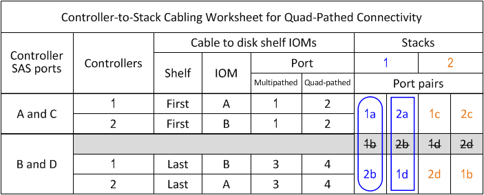

= IOM1/IOM12B2 모듈을 사용하는 4중 경로 연결 쉘프용 컨트롤러-스택 케이블링 워크시트 템플릿
:allow-uri-read: 
:icons: font
:imagesdir: ../media/

[role="lead"]
워크시트 템플릿을 완료하면 컨트롤러를 IOM12/IOM12B 모듈이 포함된 디스크 쉘프 스택에 연결하는 데 사용할 수 있는 컨트롤러 SAS 포트 쌍을 정의하여 HA 쌍 또는 단일 컨트롤러 구성에서 4중 경로 방식으로 연결할 수 있습니다. 또한 완성된 워크시트를 사용하여 4중 경로 연결을 구성하는 방법을 단계별로 안내해 줄 수 있습니다.

.할 수 있습니다
* 이 절차 및 워크시트 템플릿은 하나 이상의 스택으로 4중 경로 HA 또는 4중 경로 구성을 위한 4중 경로 연결 케이블에 연결할 수 있습니다.
+
4중 경로 HA 및 4중 경로 구성을 위해 작성된 워크시트의 예가 제공됩니다.

+
워크시트 예에는 2개의 4중 포트 SAS HBA와 IOM12/IOM12B 모듈이 포함된 2개의 디스크 쉘프 스택이 사용됩니다.

* 워크시트 서식 파일을 사용하면 최대 두 개의 스택을 사용할 수 있으므로 필요한 경우 열을 더 추가해야 합니다.
* 컨트롤러-스택 연결을 위한 4중 경로 연결은 2개의 다중 경로 케이블 세트로 구성됩니다. 첫 번째 케이블 세트를 "다중 경로"라고 하며 두 번째 케이블 세트를 "4중 경로"라고 합니다.
+
두 번째 케이블링 세트는 "4중 경로"라고 합니다. 왜냐하면 이 케이블링 세트를 완료하면 HA 쌍 또는 단일 컨트롤러 구성에서 컨트롤러에서 스택까지 4중 경로 연결된 연결이 가능하기 때문입니다.

* 디스크 쉘프 IOM 포트 1과 3은 항상 다중 경로 케이블 연결에 사용되고 IOM 포트 2와 4는 항상 워크시트 열 머리글에서 지정하는 대로 4중 경로 케이블 연결에 사용됩니다.
* 워크시트 예에서 포트 쌍은 다중 경로 케이블 연결이나 4중 경로 케이블 연결을 위해 해당 스택에 지정됩니다.
+
다중 경로 케이블링용으로 지정된 각 포트 쌍은 케이블로 연결된 스택과 연결된 타원형으로 둘러싸여 있습니다. 4중 케이블 연결에 지정된 각 포트 쌍은 케이블이 연결된 스택과 연결된 직사각형으로 둘러싸입니다. 스택 1은 파란색과 연결되며 스택 2는 주황색과 연결됩니다.

* 필요한 경우 을 참조할 수 있습니다 link:install-cabling-rules.html["SAS 케이블 연결 규칙 및 개념"] 컨트롤러 슬롯 번호 지정 규칙, 쉘프-쉘프 연결 및 컨트롤러-쉘프 연결(포트 쌍 사용 포함)에 대한 자세한 내용은 를 참조하십시오.
* 필요한 경우 워크시트를 작성한 후 을 참조할 수 있습니다 link:install-cabling-worksheets-how-to-read-quadpath.html["4중 경로 연결을 위해 컨트롤러-스택 간 연결을 케이블로 연결하기 위해 워크시트를 읽는 방법"].

image::../media/drw_worksheet_quad_pathed_template_nau.gif[drw 워크시트 4분할 경로 템플릿 nau]

.단계
. 회색 상자 위의 상자에 시스템의 모든 SAS A 포트 및 시스템의 모든 SAS C 포트를 슬롯(0, 1, 2, 3 등)의 순서로 나열합니다.
+
예: 1a, 2a, 1c, 2c

. 회색 상자에 시스템의 모든 SAS B 포트 및 시스템의 모든 SAS D 포트를 슬롯(0, 1, 2, 3 등)의 순서로 나열합니다.
+
예: 1b, 2b, 1d, 2D

. 회색 상자 아래의 상자에서 목록의 첫 번째 포트가 목록의 끝으로 이동하도록 D 및 B 포트 목록을 다시 작성합니다.
+
예: 2b, 1d, 2D, 1b

. 첫 번째 포트 쌍 세트 주위에 타원을 그리고 두 번째 포트 쌍 세트 주위에 사각형을 그려 스택 1에 연결할 두 포트 쌍 세트를 식별합니다.
+
각 컨트롤러에서 HA 쌍 또는 단일 컨트롤러 구성의 스택 1로 4중 경로 연결된 연결을 달성하기 위해 두 케이블 연결 세트가 필요합니다.

+
다음 예에서는 다중 경로 케이블 연결에 포트 쌍 1a/2b를 사용하고 스택 1에 대한 4중 경로 케이블 연결의 경우 포트 쌍 2a/1d를 사용합니다.

+

. 첫 번째 포트 쌍 세트 주위에 타원을 그리고 두 번째 포트 쌍 세트 주위에 사각형을 그려 스택 2에 연결할 두 포트 쌍 세트를 식별합니다.
+
각 컨트롤러에서 HA 쌍 또는 단일 컨트롤러 구성의 스택 1로 4중 경로 연결된 연결을 달성하기 위해 두 케이블 연결 세트가 필요합니다.

+
다음 예에서는 다중 경로 케이블 연결에 포트 쌍 1c/2D를 사용하고 스택 2에 대한 4중 경로 케이블 연결에는 포트 쌍 2c/1b를 사용합니다.

+
image::../media/drw_worksheet_qpha_slots_1_and_2_two_4porthbas_two_stacks_nau.gif[drw 워크시트 qpha 슬롯 1 및 2 2개의 4portbas 2개의 스택 nau]

. 4중 경로(단일 컨트롤러) 구성이 있는 경우 컨트롤러 2에 대한 정보를 교차 합니다. 컨트롤러 1 정보만 사용하여 컨트롤러-스택 연결을 케이블로 연결할 수 있습니다.
+
다음 예제는 컨트롤러 2에 대한 정보가 십자 표시되었음을 보여줍니다.

+
image::../media/drw_worksheet_qp_slots_1_and_2_two_4porthbas_two_stacks_nau.gif[drw 워크시트 Qp 슬롯 1 및 2 2개의 4portbas 2개의 스택 nau]

