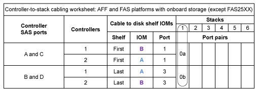
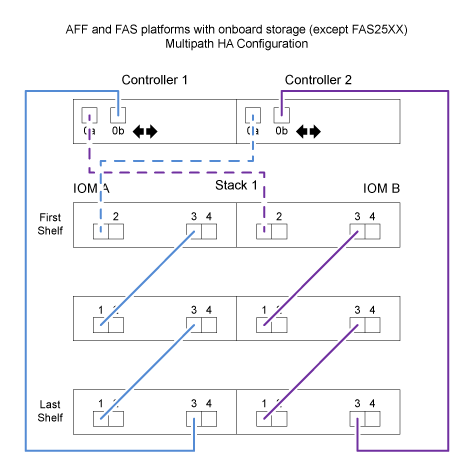
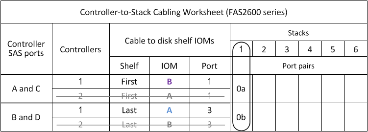

= 컨트롤러-스택 케이블링 워크시트 및 일반적인 AFF A200, AFF A220, FAS2600 시리즈 및 FAS2700 구성에 대한 케이블 연결 예 - IOM12 모듈이 포함된 쉘프
:allow-uri-read: 
:icons: font
:imagesdir: ../media/

[role="lead"]
작성된 컨트롤러-스택 케이블링 워크시트 및 케이블링 예를 사용하여 공통 AFF A200, AFF A220, FAS2600 시리즈 및 FAS2700 구성을 케이블로 연결할 수 있습니다.

* 필요한 경우 을 참조할 수 있습니다 link:install-cabling-rules.html["SAS 케이블 연결 규칙"] 지원되는 구성, 쉘프-쉘프 연결 및 컨트롤러-쉘프 연결(AFF A200, AFF A220, FAS2600 시리즈 및 FAS2700 포트 0b와 동일한 도메인 연결 포함)에 대한 자세한 내용은 다음을 참조하십시오.
* 케이블 연결 예는 컨트롤러 0b 포트 연결과 컨트롤러 0a 포트 연결을 구별하기 위해 컨트롤러-스택 케이블을 실선 또는 점선으로 표시합니다.
+
image::../media/drw_fas2600_controller_to_stack_cable_type_key.png[drw fas2600 컨트롤러 - 스택 케이블 유형 키]

* 케이블 연결 예는 IOM A(도메인 A) 및 IOM B(도메인 B)를 통해 연결을 구별하기 위해 컨트롤러-스택 연결 및 쉘프-쉘프 연결을 두 가지 색상으로 보여 줍니다.
+
image::../media/drw_fas2600_cable_color_key.png[drw fas2600 케이블 색상 키]

== AFF A200, AFF A220, FAS2600 시리즈 및 FAS2700 다중 경로 HA 구성, 하나의 다중 쉘프 스택

다음 워크시트 및 케이블 연결 예에서는 포트 쌍 0a/0b를 사용합니다.

== FAS2600 시리즈 다중 쉘프 스택 1개 포함 다중 경로 구성

다음 워크시트 및 케이블 연결 예에서는 포트 쌍 0a/0b를 사용합니다.

이 예제에서 컨트롤러는 섀시의 슬롯 A에 설치됩니다. 컨트롤러가 섀시의 슬롯 A에 있는 경우 내부 스토리지 포트(0b)가 도메인 A(IOM A)에 있으므로 포트 0b는 스택의 도메인 A(IOM A)에 연결해야 합니다.

image::../media/drw_fas2600_mp_slot_a.png[drw fas2600 MP 슬롯 A]

이 예제에서 컨트롤러는 섀시의 슬롯 B에 설치됩니다. 컨트롤러가 섀시의 슬롯 B에 있는 경우 내부 스토리지 포트(0b)가 도메인 B(IOM B)에 있으므로 포트 0b는 스택의 도메인 B(IOM B)에 연결해야 합니다.

image::../media/drw_fas2600_mp_slot_b_worksheet.png[drw fas2600 MP 슬롯 b 워크시트]

image::../media/drw_fas2600_mp_slot_b.png[drw fas2600 MP 슬롯 b]
