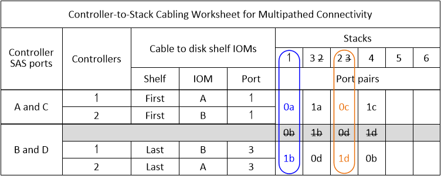

= 일반적인 다중 경로 HA 구성을 위한 컨트롤러-스택 케이블 연결 워크시트 및 케이블 연결 예 - IOM12/IOM12B 모듈이 장착된 쉘프
:allow-uri-read: 
:icons: font
:imagesdir: ../media/

[role="lead"]
컨트롤러-스택 케이블링 워크시트와 케이블 연결 예를 사용하여 HA 쌍을 다중 경로 HA 구성으로 연결할 수 있습니다.

* 필요한 경우 을 참조할 수 있습니다 link:install-cabling-rules.html["SAS 케이블 연결 규칙"] 지원되는 구성에 대한 자세한 내용은 컨트롤러 슬롯 번호 지정 규칙, 쉘프-쉘프 연결 및 컨트롤러-쉘프 연결(포트 쌍 사용 포함)을 참조하십시오.
* 필요한 경우 을 참조할 수 있습니다 link:install-cabling-worksheets-how-to-read-multipath.html["다중 경로 연결을 위해 컨트롤러 대 스택 연결에 케이블을 연결하기 위해 워크시트를 읽는 방법"].
* 케이블 연결 예는 컨트롤러 A 및 C 포트 연결과 컨트롤러 B 및 D 포트 연결을 구별하기 위해 컨트롤러-스택 케이블을 실선 또는 점선으로 표시합니다.
+
image::../media/drw_controller_to_stack_cable_type_key.gif[drw 컨트롤러 - 스택 케이블 유형 키]

* 케이블 연결 예시와 워크시트의 해당 포트 쌍은 HA 쌍의 각 스택에 대한 연결을 구별하기 위해 색상으로 구분되어 있습니다.
+
image::../media/drw_controller_to_stack_cable_color_key_non2600_4stackcolors.gif[케이블 색상 키(26,4stackcolor가 아닌)를 스택하는 drw 컨트롤러]

* 워크시트 및 케이블 연결 예는 워크시트에 나열된 순서대로 케이블 연결 포트 쌍을 보여 줍니다.

== 4중 포트 SAS HBA를 사용하는 다중 경로 HA 구성을 위한 컨트롤러-스택 케이블링 워크시트 및 케이블링 예

[role="lead"]
완성된 컨트롤러-스택 케이블링 워크시트 및 케이블 연결 예를 사용하여 4중 포트 SAS HBA가 포함된 일반적인 다중 경로 HA 구성을 케이블로 연결할 수 있습니다. 이러한 컨트롤러에는 온보드 SAS 포트가 없습니다.

=== 4중 포트 SAS HBA 1개와 단일 쉘프 스택 1개가 포함된 다중 경로 HA

다음 워크시트 및 케이블 연결 예에서는 포트 쌍 1a/1d를 사용합니다.

image::../media/drw_worksheet_mpha_slot_1_one_4porthba_one_singleshelf_stack.gif[drw 워크시트 mpha 슬롯 1 단일 4portthba 단일 singleshelf 스택]

image::../media/drw_mpha_slot_1_one_4porthba_one_singleshelf_stack.gif[drw mpha 슬롯 1 4portthba 단일 singleshelf 스택 1개]

=== 4중 포트 SAS HBA 1개와 단일 쉘프 스택 2개가 포함된 다중 경로 HA

다음 워크시트 및 케이블 연결 예에서는 포트 쌍 1a/1d 및 1c/1b를 사용합니다.

image::../media/drw_worksheet_mpha_slot_1_one_4porthba_two_singleshelf_stacks.gif[drw 워크시트 mpha 슬롯 1 하나의 4portthba 두 개의 singleshelf 스택]

image::../media/drw_mpha_slot_1_one_4porthba_two_singleshelf_stacks.gif[drw mpha 슬롯 1 하나의 4portthba 두 개의 singleshelf 스택]

=== 2개의 4중 포트 SAS HBA와 2개의 다중 쉘프 스택을 사용하는 다중 경로 HA

이 구성에서는 1a/2b, 2a/1d, 1c/2D 및 2c/1b의 4포트 쌍을 사용할 수 있습니다. 포트 쌍이 식별되는 순서(워크시트에 나열됨)에 따라 케이블을 연결하거나 다른 모든 포트 쌍을 케이블 연결할 수 있습니다(포트 쌍 건너뛰기).

NOTE: 시스템의 스택에 케이블을 연결하는 것보다 많은 포트 쌍이 있는 경우, 시스템의 SAS 포트를 최적화하기 위해 포트 쌍을 건너뛰는 것이 가장 좋습니다. SAS 포트를 최적화하여 시스템 성능을 최적화합니다.

다음 워크시트 및 케이블 연결 예에서는 워크시트에 나열된 순서대로 사용되는 포트 쌍을 보여줍니다. 1a/2b, 2a/1d, 1c/2D 및 2c/1b.

image::../media/drw_worksheet_mpha_slots_1_and_2_two_4porthbas_two_stacks.gif[drw 워크시트 mpha 슬롯 1 및 2 2개의 4portbas 두 개의 스택]

image::../media/drw_mpha_slots_1_and_2_4porthbas_4_stacks.gif[drw mpha 슬롯 1 및 2 4portbas 4 스택]

다음 워크시트 및 케이블 연결 예는 목록의 다른 포트 쌍을 사용하기 위해 건너뛰는 포트 쌍을 보여줍니다. 1a/2b 및 1c/2d.

NOTE: 나중에 세 번째 스택이 추가되면 건너뛴 포트 쌍을 사용합니다.

image::../media/drw_worksheet_mpha_slots_1_and_2_two_4porthbas_two_stacks_skipped.gif[drw 워크시트 mpha 슬롯 1 및 2개의 4portbas 스택 두 개를 건너뛰었습니다]

image::../media/drw_mpha_slots_1_and_2_two_4porthbas_two_stacks_skipped.gif[drw mpha 슬롯 1 및 2 2개의 4portbas 두 개의 스택을 건너뛰었습니다]

== 4개의 온보드 SAS 포트를 사용하는 다중 경로 HA 구성을 위한 컨트롤러-스택 케이블링 워크시트 및 케이블링 예

[role="lead"]
완성된 컨트롤러-스택 케이블링 워크시트 및 케이블 연결 예를 사용하여 4개의 온보드 SAS 포트가 있는 일반적인 다중 경로 HA 구성을 케이블로 연결할 수 있습니다.

=== 4개의 온보드 SAS 포트와 1개의 단일 쉘프 스택을 갖춘 다중 경로 HA

다음 워크시트 및 케이블 연결 예에서는 포트 쌍 0a/0d를 사용합니다.

image::../media/drw_worksheet_mpha_slot_0_4ports_one_singleshelf_stack.gif[drw 워크시트 mpha 슬롯 0 4포트 단일 단일 단일 스택]

image::../media/drw_mpha_slot_0_4ports_one_singleshelf_stack.gif[drw mpha 슬롯 0 4포트 단일 singleshelf 스택]

=== 4개의 온보드 SAS 포트와 2개의 단일 쉘프 스택을 지원하는 다중 경로 HA

다음 워크시트 및 케이블 연결 예에서는 포트 쌍 0a/0d 및 0c/0b를 사용합니다.

image::../media/drw_worksheet_mpha_slot_0_4ports_two_singleshelf_stacks.gif[drw 워크시트 mpha 슬롯 0 4포트 2개의 singleshelf 스택]

image::../media/drw_mpha_slot_0_4ports_two_singleshelf_stacks.gif[drw mpha 슬롯 0 4포트 2개의 singleshelf 스택]

=== 4개의 온보드 SAS 포트, 4중 포트 SAS HBA 및 2개의 다중 쉘프 스택이 있는 다중 경로 HA

이 구성에는 0a/1b, 1a/0d, 0c/1d, 1c/0b의 4포트 쌍이 제공됩니다. 포트 쌍이 식별되는 순서(워크시트에 나열됨)에 따라 케이블을 연결하거나 다른 모든 포트 쌍을 케이블 연결할 수 있습니다(포트 쌍 건너뛰기).

NOTE: 시스템의 스택에 케이블을 연결하는 것보다 많은 포트 쌍이 있는 경우, 시스템의 SAS 포트를 최적화하기 위해 포트 쌍을 건너뛰는 것이 가장 좋습니다. SAS 포트를 최적화하여 시스템 성능을 최적화합니다.

다음 워크시트 및 케이블 연결 예에서는 워크시트에 표시된 포트 쌍(0a/1b, 1a/0d, 0c/1d 및 1c/0b)에 따라 사용되는 포트 쌍을 보여줍니다.

image::../media/drw_worksheet_mpha_slots_0_and_1_8ports_4stacks.gif[drw 워크시트 mpha 슬롯 0 및 1 8포트 4스택]

image::../media/drw_mpha_slots_0_and_1_8ports_4_stacks.gif[drw mpha 슬롯 0 및 1 8포트 4 스택]

다음 워크시트 및 케이블 연결 예에서는 0a/1b 및 0c/1d의 목록에서 다른 모든 포트를 사용하도록 건너뛴 포트 쌍을 보여줍니다.

NOTE: 나중에 세 번째 스택이 추가되면 건너뛴 포트 쌍을 사용합니다.

image::../media/drw_mpha_slots_0_and_1_8ports_two_stacks_skipped.gif[drw mpha 슬롯 0 및 1 8포트 2개의 스택을 건너뛰었습니다]
