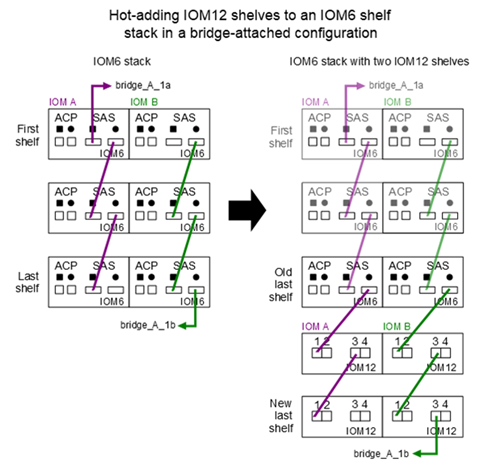

= IOM6 쉘프 스택에 IOM12/IOM12B 쉘프를 핫 추가합니다
:allow-uri-read: 
:icons: font
:imagesdir: ../media/

[role="lead"]
추가 스토리지가 필요할 경우 IOM12/IOM12B 쉘프(IOM12/IOM12B 모듈이 포함된 SAS 쉘프)를 IOM6 쉘프(IOM6 모듈이 포함된 SAS 쉘프) 스택에 추가하여 스택을 혼합할 수 있습니다.

== 핫 애드 요구 사항

[role="lead"]
HA 쌍, 단일 컨트롤러 또는 확장 MetroCluster 구성(시스템)은 IOM6 쉘프 스택에 IOM12/IOM12B 쉘프를 핫 추가하기 전에 특정 요구사항을 충족해야 합니다.

NOTE: 브리지 연결 MetroCluster 구성에 대해서는 를 참조하십시오 <<Requirements for a hot-add in bridge-attached MetroCluster configurations>>.

* ONTAP 시스템 및 버전은 동일한 스택(혼합 스택)에서 IOM6 쉘프와 IOM12/IOM12B 쉘프의 혼합 구성을 지원해야 합니다.
+
다음 방법 중 하나를 사용하여 지원을 확인할 수 있습니다.

+
** 두 컨트롤러의 관리 프롬프트에 ''run local sysconfig'' 명령을 입력합니다.
+
SAS2/SAS3 혼합 스택 지원 필드가 출력에 나타나지 않거나 값이 없는 경우 시스템은 혼합 스택을 지원하지 않습니다.

+
SAS2/SAS3 혼합 스택 지원 필드(예: 모두 또는 브리지 연결)에 다른 항목이 표시되는 경우 시스템은 혼합 스택을 지원합니다.

** Hardware Universe로 이동하여 플랫폼 정보로 이동합니다.
+
https://hwu.netapp.com["NetApp Hardware Universe를 참조하십시오"]

* MetroCluster 구성에 쉘프를 추가하는 경우, 구성이 MetroCluster 설치 및 구성 가이드의 모든 요구사항을 충족해야 합니다.
+
http://docs.netapp.com/ontap-9/topic/com.netapp.doc.dot-mcc-inst-cnfg-ip/home.html["MetroCluster IP 설치 및 구성 가이드"]

+
http://docs.netapp.com/ontap-9/topic/com.netapp.doc.dot-mcc-inst-cnfg-stretch/home.html["ONTAP 9 스트레치 MetroCluster 설치 및 구성 가이드"]

+
http://docs.netapp.com/ontap-9/topic/com.netapp.doc.dot-mcc-inst-cnfg-fabric/home.html["ONTAP 9 패브릭 연결 MetroCluster 설치 및 구성 가이드"]

* IOM6 쉘프 스택은 IOM12 쉘프를 핫 추가하고, SAS 구리 케이블(모든 쉘프-쉘프 및 컨트롤러-스택 연결)으로 케이블을 연결해야 합니다.
+
SAS 광 케이블은 혼합 스택에서 지원되지 않습니다.

+

NOTE: IOM6 쉘프 스택을 SAS 광 케이블로 연결한 경우, IOM12 쉘프를 핫 추가할 수 없습니다. NetApp 세일즈 담당자에게 문의하십시오.

* 핫 추가할 IOM12 쉘프에 설치할 수 있는 드라이브 수가 지원되는 최대 드라이브 수보다 작아야 합니다.
+
IOM12/IOM12B 쉘프를 핫 추가한 후에는 시스템에서 지원되는 최대 드라이브 수를 초과할 수 없습니다.

+
https://hwu.netapp.com["NetApp Hardware Universe를 참조하십시오"]

* 시스템에 SAS 케이블 연결 오류 메시지가 없습니다.
+
오류 메시지에서 제공하는 수정 조치를 사용하여 케이블 연결 오류를 수정해야 합니다.

+
https://mysupport.netapp.com/site/tools/tool-eula/activeiq-configadvisor["NetApp 다운로드: Config Advisor"]

* IOM12/IOM12B 셸프와 적절한 수의 SAS 구리 케이블 유형을 주문하고 받아야 합니다.
+
IOM12 쉘프는 미니 SAS HD 커넥터를 사용합니다. IOM6 쉘프는 QSFP 커넥터를 사용합니다.

== 브리지 연결 MetroCluster 구성의 핫 애드 요구 사항

[role="lead"]
MetroCluster 구성에서 ATTO FiberBridge 쌍 을 사용하여 연결된 IOM6 쉘프 스택에 IOM12/IOM12B 쉘프를 핫 추가하는 경우, 시스템은 특정 요구사항을 충족해야 합니다.

* 현재 구성에서 브리지 SAS 포트를 사용할 수 있는 경우 IOM12 쉘프를 별도의 스택으로 추가해야 합니다.
+
스택에 IOM12/IOM12B 및 IOM6 모듈을 혼합하기 전에 모든 브리지 포트를 사용하십시오.

* ONTAP 시스템 및 버전은 동일한 스택(혼합 스택)에서 IOM6 쉘프와 IOM12/IOM12B 쉘프의 혼합 구성을 지원해야 합니다.
+
다음 방법 중 하나를 사용하여 지원을 확인할 수 있습니다.

+
** 두 컨트롤러의 관리 프롬프트에 ''run local sysconfig'' 명령을 입력합니다.
+
SAS2/SAS3 혼합 스택 지원 필드가 출력에 나타나지 않거나 값이 없는 경우 시스템은 혼합 스택을 지원하지 않습니다.

+
SAS2/SAS3 혼합 스택 지원 필드(예: 모두 또는 브리지 연결)에 다른 항목이 표시되는 경우 시스템은 혼합 스택을 지원합니다.

** Hardware Universe로 이동하여 플랫폼 정보로 이동합니다.
+
https://hwu.netapp.com["NetApp Hardware Universe를 참조하십시오"]

* 구성은 MetroCluster 설치 및 구성 가이드의 모든 요구 사항을 충족해야 합니다.
+
https://docs.netapp.com/us-en/ontap-metrocluster/install-stretch/index.html["확장 MetroCluster 구성 설치 및 구성"]

+
https://docs.netapp.com/us-en/ontap-metrocluster/install-fc/index.html["패브릭 연결 MetroCluster 구성 설치 및 구성"]

* IOM12/IOM12B 쉘프를 핫 추가하고 있는 IOM6 쉘프 스택은 SAS 구리 케이블(모든 쉘프-쉘프 및 컨트롤러-스택 연결)으로 케이블이 연결되어야 합니다.
+
SAS 광 케이블은 혼합 스택에서 지원되지 않습니다.

+

NOTE: IOM6 쉘프 스택을 SAS 광 케이블로 연결한 경우, IOM12/IOM12B 쉘프를 핫 추가할 수 없습니다. NetApp 세일즈 담당자에게 문의하십시오.

* 구성에 브리지 포트에 대해 지원되는 최대 드라이브 수보다 작아야 합니다.
* IOM12/IOM12B 셸프와 적절한 수의 SAS 구리 케이블 유형을 주문하고 받아야 합니다.
+
IOM12/IOM12B 쉘프는 미니 SAS HD 커넥터를 사용합니다. IOM6 쉘프는 QSFP 커넥터를 사용합니다.

* 브리지는 펌웨어 버전 3.16/4.16 이상을 실행해야 합니다.

== 핫 애드 고려 사항

[role="lead"]
IOM6 쉘프 스택에 IOM12/IOM12B 쉘프를 핫 추가하기 전에 이 절차에 대한 측면과 모범 사례를 숙지해야 합니다.

=== 일반 고려 사항

* 시스템에 케이블을 연결하기 전에 핫 추가할 IOM12/IOM12B 셸프에 펌웨어 버전 0260 이상을 실행하는 것이 좋습니다.
+
지원되는 버전의 쉘프 펌웨어를 사용하면 핫 추가된 쉘프를 스택에 잘못 연결한 경우 스토리지 스택 액세스 문제를 방지할 수 있습니다.

+
IOM12/IOM12B 쉘프 펌웨어를 쉘프에 다운로드한 후, 두 컨트롤러 중 하나의 콘솔에 있는 'storage shelf show-module' 명령을 입력하여 펌웨어 버전이 0260 이상인지 확인합니다.

* 무중단 스택 통합은 지원되지 않습니다.
+
이 절차를 사용하여 시스템 전원을 켜고 데이터를 제공하는 동안(I/O가 진행 중) 동일한 시스템의 다른 스택에서 핫 제거된 디스크 쉘프를 핫 추가할 수는 없습니다.

* 이 절차를 사용하여 해당 쉘프에서 핫 제거한 디스크 쉘프를 동일한 MetroCluster 시스템 내에서 핫 추가할 수 있습니다.
* IOM6 모듈이 포함된 쉘프 스택에 IOM12 모듈이 포함된 쉘프를 핫 애드할 경우, 전체 스택의 성능이 6Gbps에서 작동합니다(최저 공통 속도로 실행됨).
+
핫 애드 쉘프가 IOM3 또는 IOM6 모듈에서 IOM12 모듈로 업그레이드된 쉘프인 경우, 스택은 12Gbps에서 작동합니다. 그러나 쉘프 후면판 및 디스크 기능은 디스크 성능을 3Gbps 또는 6Gbps로 제한할 수 있습니다.

* 핫 추가 쉘프를 케이블로 연결한 후 ONTAP에서 쉘프를 인식합니다.
+
** 드라이브 소유권은 자동 드라이브 할당이 활성화된 경우 할당됩니다.
** 필요한 경우 쉘프(IOM) 펌웨어 및 드라이브 펌웨어를 자동으로 업데이트해야 합니다.
+

NOTE: 펌웨어 업데이트는 최대 30분 정도 걸릴 수 있습니다.

=== 모범 사례 고려 사항

* * 모범 사례: * 모범 사례는 쉘프를 핫 추가하기 전에 현재 버전의 쉘프(IOM) 펌웨어 및 드라이브 펌웨어를 시스템에 추가하는 것입니다.
+
https://mysupport.netapp.com/site/downloads/firmware/disk-shelf-firmware["NetApp 다운로드: 디스크 쉘프 펌웨어"]

+
https://mysupport.netapp.com/site/downloads/firmware/disk-drive-firmware["NetApp 다운로드: 디스크 드라이브 펌웨어"]

NOTE: 펌웨어를 쉘프와 해당 구성요소를 지원하지 않는 버전으로 되돌리지 마십시오.

* * 모범 사례:* 가장 좋은 방법은 쉘프를 핫 추가하기 전에 최신 버전의 디스크 검증 패키지(DQP)를 설치하는 것입니다.
+
현재 버전의 DQP를 설치하면 시스템이 새로 인증된 드라이브를 인식하고 사용할 수 있습니다. 이렇게 하면 드라이브가 인식되지 않으므로 최신 드라이브 정보가 없는 경우 및 드라이브 파티셔닝 예방에 대한 시스템 이벤트 메시지가 표시되지 않습니다. 또한 DQP는 최신 버전이 아닌 드라이브 펌웨어에 대해서도 알려줍니다.

+
https://mysupport.netapp.com/NOW/download/tools/diskqual/["NetApp 다운로드: 디스크 검증 패키지"]

* * 모범 사례: * 가장 좋은 방법은 쉘프를 핫 추가하기 전과 후에 Active IQ Config Advisor를 실행하는 것입니다.
+
쉘프를 핫 추가하기 전에 Active IQ Config Advisor을 실행하면 기존 SAS 연결의 스냅샷을 제공하고, 쉘프(IOM) 펌웨어 버전을 확인하고, 시스템에서 이미 사용 중인 쉘프 ID를 확인할 수 있습니다. 쉘프를 핫 추가한 후 Active IQ Config Advisor를 실행하면 쉘프가 올바로 연결되었는지, 쉘프 ID가 시스템 내에서 고유한지 확인할 수 있습니다.

+
https://mysupport.netapp.com/site/tools/tool-eula/activeiq-configadvisor["NetApp 다운로드: Config Advisor"]

* * 모범 사례: * 가장 좋은 방법은 시스템에서 대역 내 ACP(IBACP)를 실행하는 것입니다.
+
** IBAP가 실행 중인 시스템의 경우, 핫 애드 IOM12 셸프에서 IBACP가 자동으로 활성화됩니다.
** 아웃오브밴드 ACP가 활성화된 시스템의 경우 IOM12 쉘프에서 ACP 기능을 사용할 수 없습니다.
+
IBACP로 마이그레이션하고 대역외 ACP 케이블 연결을 제거해야 합니다.

** 시스템에서 IBACP를 실행하지 않고 시스템이 IBACP의 요구 사항을 충족하는 경우, IOM12 쉘프를 핫 추가하기 전에 시스템을 IBACP로 마이그레이션할 수 있습니다.
+
https://kb.netapp.com/Advice_and_Troubleshooting/Data_Storage_Systems/FAS_Systems/In-Band_ACP_Setup_and_Support["IBACP로 마이그레이션하기 위한 지침"]

+

NOTE: 마이그레이션 지침은 IBACP에 대한 시스템 요구 사항을 제공합니다.

== 핫 애드인에 대해 드라이브 소유권을 수동으로 할당할 준비를 합니다

[role="lead"]
핫 추가할 IOM12 쉘프에 드라이브 소유권을 수동으로 할당하는 경우 자동 드라이브 할당을 사용하도록 설정한 경우 이를 비활성화해야 합니다.

시스템 요구 사항을 충족해야 합니다.

<<Requirements for a hot-add>>

<<Requirements for a hot-add in bridge-attached MetroCluster configurations>>

HA 쌍이 있는 경우, 쉘프에 있는 드라이브가 두 컨트롤러 모듈이 모두 소유하는 경우 드라이브 소유권을 수동으로 할당해야 합니다.

.단계
. 자동 드라이브 할당이 설정되었는지 'Storage disk option show'를 확인합니다
+
HA 쌍이 있는 경우 두 컨트롤러 모듈 중 하나에서 명령을 입력할 수 있습니다.

+
자동 드라이브 할당이 활성화된 경우 각 컨트롤러 모듈에 대해 "자동 할당" 열에 출력이 "켜짐"으로 표시됩니다.

. 자동 드라이브 할당이 설정된 경우 'storage disk option modify -node_node_name_-autostassign off'를 비활성화합니다
+
HA 쌍 또는 2노드 MetroCluster 구성이 있는 경우 두 컨트롤러 모듈 모두에서 자동 드라이브 할당을 비활성화해야 합니다.

== 핫 애드용 쉘프를 설치합니다

[role="lead"]
핫 추가할 각 쉘프에 쉘프를 설치하고, 전원 코드를 연결하고, 쉘프의 전원을 켠 다음, 쉘프 ID를 설정합니다.

. 키트와 함께 제공된 설치 안내물을 사용하여 디스크 쉘프와 함께 제공된 랙 마운트 키트(2-포스트 또는 4-포스트 랙 설치용)를 설치합니다.
+
[NOTE]
====
여러 디스크 쉘프를 설치하는 경우, 최적의 안정성을 위해 하단에서 랙 상단까지 설치해야 합니다.

====
+
[CAUTION]
====
디스크 쉘프를 Telco 유형 랙에 플랜지 설치하지 마십시오. 디스크 쉘프의 무게는 자체 중량 때문에 랙에서 붕괴될 수 있습니다.

====
. 키트와 함께 제공된 설치 안내물을 사용하여 디스크 쉘프를 지원 브래킷 및 랙에 설치하고 고정합니다.
+
디스크 쉘프를 쉽고 빠르게 조작하려면 전원 공급 장치 및 I/O 모듈(IOM)을 제거하십시오.

+
DS460C 디스크 쉘프의 경우, 드라이브는 별도로 패키징되어 쉘프를 가볍게 만들지만 빈 DS460C 쉘프의 무게는 약 60kg(132lb)이므로 쉘프를 이동할 때는 다음과 같이 주의해야 합니다.

+

CAUTION: 기계화된 리프트를 사용하거나 리프트 핸들을 사용하여 빈 DS460C 쉘프를 안전하게 이동하는 4명을 사용하는 것이 좋습니다.

+
DS460C 배송에는 4개의 착탈식 리프트 핸들(각 측면에 2개)이 포함되어 있습니다. 리프트 핸들을 사용하려면 손잡이 탭을 선반 측면에 있는 슬롯에 삽입하고 딸깍 소리가 날 때까지 위로 밀어 올려서 설치합니다. 그런 다음 디스크 쉘프를 레일 위로 밀어 넣을 때 엄지 래치를 사용하여 한 번에 하나의 핸들 세트를 분리합니다. 다음 그림에서는 리프트 핸들을 부착하는 방법을 보여 줍니다.

+
image::../media/drw_ds460c_handles.gif[drw ds460c 핸들]

. 디스크 쉘프를 랙에 설치하기 전에 분리한 전원 공급 장치 및 IOM을 모두 다시 설치합니다.
. DS460C 디스크 쉘프를 설치하는 경우 드라이브 드로어에 드라이브를 설치하고, 그렇지 않으면 다음 단계로 이동합니다.
+
[NOTE]
====
정전기 방전을 방지하려면 항상 보관 인클로저 섀시의 도색되지 않은 표면에 접지된 ESD 손목 접지대를 착용하십시오.

손목 스트랩을 사용할 수 없는 경우 디스크 드라이브를 다루기 전에 스토리지 인클로저 섀시의 색칠되지 않은 표면을 만지십시오.

====
+
부분적으로 채워진 쉘프를 구입한 경우, 즉 쉘프에 지원하는 드라이브 수가 60개 미만인 경우 각 드로어에 다음을 따라 드라이브를 설치합니다.

+
** 처음 4개의 드라이브를 전면 슬롯(0, 3, 6, 9)에 설치합니다.
+

NOTE: * 장비 오작동 위험: * 공기 흐름이 원활하도록 하고 과열을 방지하려면 항상 처음 4개의 드라이브를 전면 슬롯(0, 3, 6, 9)에 설치하십시오.

** 나머지 드라이브의 경우 각 드로어에 균등하게 분배합니다.

다음 그림에서는 쉘프 내의 각 드라이브 드로어에서 드라이브 번호가 0에서 11로 지정되는 방식을 보여 줍니다.

image::../media/dwg_trafford_drawer_with_hdds_callouts.gif[HDD 속성 표시기가 있는 DWG Trafford 서랍]

. 선반의 상단 서랍을 엽니다.
. ESD 가방에서 드라이브를 꺼냅니다.
. 드라이브의 캠 핸들을 수직으로 올립니다.
. 드라이브 캐리어의 양쪽에 있는 두 개의 돌출된 단추를 드라이브 드로어의 드라이브 채널에서 일치하는 틈에 맞춥니다.
+
image::../media/28_dwg_e2860_de460c_drive_cru.gif[28 DWG e2860 de460c 드라이브 CRU]

+
[cols="10,90"]
|===

| image:../media/legend_icon_01.png[""] | 드라이브 캐리어 오른쪽에 있는 위로 단추 
|===
. 드라이브를 수직으로 내린 다음 드라이브가 주황색 분리 래치 아래에 고정될 때까지 캠 핸들을 아래로 돌립니다.
. 드로어의 각 드라이브에 대해 이전 하위 단계를 반복합니다.
+
각 드로어의 슬롯 0, 3, 6, 9에 드라이브가 포함되어 있는지 확인해야 합니다.

. 드라이브 드로어를 조심스럽게 케이스에 다시 밀어 넣습니다.
+
|===

 a| 
image:../media/2860_dwg_e2860_de460c_gentle_close.gif[""]

 a| 

CAUTION: * 데이터 액세스 손실 가능성: * 서랍을 닫지 마십시오. 드로어가 흔들리거나 스토리지 어레이가 손상되지 않도록 드로어를 천천히 밀어 넣습니다.

|===
. 양쪽 레버를 중앙으로 밀어 드라이브 드로어를 닫습니다.
. 디스크 쉘프의 각 드로어에 대해 이 단계를 반복합니다.
. 전면 베젤을 부착합니다.
+
.. 디스크 쉘프를 여러 개 추가하는 경우, 설치하려는 각 디스크 쉘프에 대해 이전 단계를 반복합니다.
.. 각 디스크 쉘프의 전원 공급 장치를 연결합니다.

. 전원 코드를 먼저 디스크 선반에 연결한 다음 전원 코드 고정쇠로 전원 코드를 제자리에 고정하고 복원력을 위해 전원 코드를 다른 전원에 연결합니다.
. 각 디스크 쉘프의 전원 공급 장치를 켜고 디스크 드라이브가 회전할 때까지 기다립니다.
+
.. HA 쌍 또는 단일 컨트롤러 구성 내에서 고유한 ID에 핫 추가할 각 쉘프의 쉘프 ID를 설정합니다.
+
유효한 쉘프 ID는 00부터 99까지입니다. IOM6 쉘프가 더 낮은 번호(1-9)를 사용하고 IOM12 쉘프가 더 높은 번호(10 이상)를 사용하도록 쉘프 ID를 설정하는 것이 좋습니다.

+
온보드 스토리지가 있는 플랫폼 모델을 사용하는 경우 쉘프 ID는 내부 쉘프와 외부 연결 쉘프 전체에서 고유해야 합니다. 내부 쉘프를 0으로 설정하는 것이 좋습니다. MetroCluster IP 구성에서는 외부 쉘프 이름만 적용되므로 쉘프 이름은 고유하지 않아도 됩니다.

. 필요한 경우 Active IQ Config Advisor를 실행하여 이미 사용 중인 쉘프 ID를 확인하십시오.
+
https://mysupport.netapp.com/site/tools/tool-eula/activeiq-configadvisor["NetApp 다운로드: Config Advisor"]

+
또한 'storage shelf show-fields shelf-id' 명령을 실행하여 시스템에 이미 사용 중인(있는 경우 중복) 쉘프 ID 목록을 볼 수 있습니다.

. 왼쪽 끝 캡 뒤의 쉘프 ID 버튼에 액세스합니다.
. 디지털 디스플레이에서 첫 번째 숫자가 깜박일 때까지 주황색 버튼을 길게 눌러 쉘프 ID의 첫 번째 번호를 변경합니다. 이 작업은 최대 3초가 걸릴 수 있습니다.
. 버튼을 눌러 원하는 번호에 도달할 때까지 번호를 계속 진행합니다.
. 두 번째 숫자에 대해 c 및 d 하위 단계를 반복합니다.
. 두 번째 숫자의 깜박임이 멈출 때까지 버튼을 길게 눌러 프로그래밍 모드를 종료합니다. 이 작업은 최대 3초가 걸릴 수 있습니다.
. 쉘프 전원을 껐다가 다시 켜 쉘프 ID가 적용되도록 합니다.
+
두 전원 스위치를 모두 끄고 10초 정도 기다린 다음 전원을 다시 켜서 전원을 껐다 켜야 합니다.

. 핫 추가할 각 쉘프에 대해 b-g 하위 단계를 반복합니다.

== 핫 애드 위한 케이블 선반

[role="lead"]
IOM12/IOM12B 쉘프를 IOM6 쉘프 스택에 연결하는 방법은 IOM12 쉘프가 첫 IOM12/IOM12B 쉘프인지, 즉 스택에 다른 IOM12 쉘프가 있는지 여부에 따라 다릅니다. 또는 기존 혼합 스택에 대한 추가 IOM12/IOM12B 셸프인지 여부입니다. 즉, 스택에 IOM12/IOM12B 쉘프가 이미 존재합니다. 또한 다중 경로 HA, 다중 경로, 단일 경로 HA 또는 단일 경로 연결이 있는지 여부에 따라 달라집니다.

.시작하기 전에
* 시스템 요구 사항을 충족해야 합니다.
+
<<Requirements for a hot-add>>

* 필요한 경우 준비 절차를 완료해야 합니다.
+
<<Prepare to manually assign drive ownership for a hot-add>>

* 쉘프를 설치하고 전원을 켠 다음 쉘프 ID를 설정해야 합니다.
+
<<Install shelves for a hot-add>>

.이 작업에 대해
* 스택 내에서 단일 속도 전환을 유지하기 위해 항상 스택의 마지막 논리적 쉘프에 IOM12/IOM12B 쉘프를 핫 추가합니다.
+
스택의 마지막 논리적 쉘프에 IOM12/IOM12B 쉘프를 핫 추가하면 IOM6 쉘프가 그룹화되어 계속 표시되며, IOM12/IOM12B 쉘프는 함께 그룹화되어 두 쉘프 그룹 간에 단일 속도의 전환이 가능합니다.

+
예를 들면 다음과 같습니다.

+
** HA 2노드의 경우 2개의 IOM6 쉘프와 2개의 IOM12/IOM12B 쉘프가 포함된 스택 내에서 단일 속도의 전환이 다음과 같이 표현됩니다.
+
 Controller <-> IOM6 <-> IOM6 <---> IOM12IOM12B <-> IOM12/IOM12B <-> Controller
** 온보드 IOM12E 스토리지가 있는 HA 쌍에서는 2개의 IOM12 쉘프와 2개의 IOM6 쉘프가 포함된 스택 내에서 단일 속도 전환이 다음과 같이 표현됩니다.
+
 IOM12E 0b <-> IOM12/IOM12B <-> IOM12/IOM12B <---> IOM6 <-> IOM6 <-> IOM12E 0a
+
온보드 스토리지 포트 0b는 내부 스토리지(확장기)의 포트이며 핫Added IOM12/IOM12B 쉘프(스택의 마지막 쉘프)에 연결되므로 IOM12/IOM12B 쉘프 그룹은 함께 유지되고 단일 전환은 스택 및 온보드 IOM12E 스토리지를 통해 유지됩니다.

* 혼합 스택에서는 단일 속도 전환만 지원됩니다. 추가 속도 전환은 사용할 수 없습니다. 예를 들어, 스택 내에 다음과 같이 두 가지 속도의 전환이 있을 수 없습니다.
+
 Controller <-> IOM6 <-> IOM6 <---> IOM12/IOM12B <-> IOM12/IOM12B <---> IOM6 <-> Controller
* 혼합 스택에 IOM6 쉘프를 핫 추가할 수 있습니다. 하지만 스택에서 단일 속도 전환을 유지하려면 IOM6 쉘프(기존 IOM6 쉘프 그룹)를 사용하여 스택의 측면에 핫 추가해야 합니다.
* IOM A 경로의 SAS 포트를 먼저 연결하여 IOM12/IOM12B 쉘프에 케이블을 연결한 다음, 스택 연결에 해당하는 IOM B 경로에 대해 케이블 연결 단계를 반복합니다.
+

NOTE: MetroCluster 구성에서는 IOM B 경로를 사용할 수 없습니다.

* 초기 IOM12/IOM12B 쉘프(논리적 마지막 IOM6 쉘프에 연결하는 쉘프)는 항상 IOM6 쉘프 원 포트(사각 포트가 아님)에 연결됩니다.
* SAS 케이블 커넥터는 SAS 포트에 올바르게 꽂으면 딸깍 소리가 나면서 제자리에 고정됩니다.
+
쉘프의 경우 당김 탭을 아래로 향하게 하여(커넥터 아래쪽에 있음) SAS 케이블 커넥터를 삽입합니다. 컨트롤러의 경우 SAS 포트 방향은 플랫폼 모델에 따라 다를 수 있으므로 SAS 케이블 커넥터의 올바른 방향은 서로 다릅니다.

* FC-to-SAS 브리지를 사용하지 않는 구성에서 IOM12/IOM12B 쉘프를 IOM6 쉘프 스택에 연결하는 방법은 다음 그림을 참조하십시오.
+
이 그림은 다중 경로 HA 연결을 지원하는 스택에만 해당되며, 다중 경로, 단일 경로 HA, 단일 경로 연결 및 확장 MetroCluster 구성을 지원하는 스택에 케이블 연결 개념을 적용할 수 있습니다.

+
image::../media/drw_sas2_sas3_mixed_stack.png[drw SAS2 sas3 혼합 스택]

* 다음 그림은 브리지 연결 MetroCluster 구성에서 IOM6 쉘프 스택에 IOM12/IOM12B 쉘프를 연결하는 방법을 보여 줍니다. 

.단계
. 스택에서 논리적 마지막 쉘프를 물리적으로 식별합니다.
+
플랫폼 모델 및 스택 연결(다중 경로 HA, 다중 경로, 단일 경로 HA 또는 단일 경로)에 따라, 컨트롤러의 SAS 포트 B 및 D에서 컨트롤러-스택 연결 쉘프가 마지막 셸프로, 컨트롤러-스택 연결은 컨트롤러 SAS 포트 A 및 C를 통해 스택의 논리 상단과 연결되기 때문에 컨트롤러에 연결되지 않은 쉘프입니다.

. IOM6 스택에 IOM12/IOM12B 쉘프가 추가되었습니다. 즉, IOM6 쉘프에 다른 IOM12/IOM12B 쉘프가 존재하지 않는 IOM12/IOM12B 쉘프를 추가하려면 해당 하위 단계를 완료하십시오.
+

NOTE: 케이블을 분리한 후 다시 연결하고 다른 케이블을 교체할 때는 70초 이상 기다려야 합니다.

+
그렇지 않으면 3단계로 이동합니다.

+
[cols="2*"]
|===
| IOM6 스택 연결 기능이 다음과 같은 경우에 사용 가능합니다. | 그러면... 

 a| 
다중 경로 HA 또는 다중 경로 또는 컨트롤러를 마지막 논리적 쉘프에 연결하는 단일 경로 HA(스트레치 MetroCluster 구성 포함)
 a| 
.. 마지막 IOM6 쉘프 IOM A 원 포트에서 컨트롤러 또는 브리지로 컨트롤러-스택 케이블을 분리합니다.
+
컨트롤러 포트를 기록해 둡니다.

+
케이블을 한쪽에 둡니다. 더 이상 필요하지 않습니다.

+
그렇지 않으면 하위 단계 e로 이동합니다

.. 마지막 IOM6 쉘프 IOM A 원 포트(하위 단계 A에서 새 IOM12/IOM12B 쉘프 IOM A 포트 1)에 쉘프-쉘프 연결을 케이블로 연결합니다.
+
SAS 구리 QSFP-미니-SAS HD 케이블을 사용합니다.

.. 다른 IOM12/IOM12B 쉘프를 핫 추가할 경우, 방금 연결한 쉘프의 IOM12/IOM12B 쉘프 IOM A 포트 3 및 다음 IOM12/IOM12B 쉘프 IOM A 포트 1 간에 쉘프-쉘프 연결을 케이블로 연결합니다.
+
SAS 구리 미니 SAS HD-미니 SAS HD 케이블을 사용합니다.

+
그렇지 않으면 다음 하위 단계로 이동합니다.

.. 컨트롤러 또는 브리지(하위 단계 A)의 동일한 포트를 최신 IOM12 쉘프 IOM A 포트 3에 케이블로 다시 연결하여 컨트롤러-스택 연결을 설정합니다.
+
컨트롤러의 포트 유형에 적합한 SAS 구리 QSFP-미니 SAS HD 케이블 또는 미니 SAS HD-미니 SAS HD 케이블을 사용하십시오.

.. IOM B에 대해 단계 A에서 d까지 반복합니다
+
그렇지 않으면 4단계로 이동합니다.

 a| 
MetroCluster 구성에서 브리지 연결
 a| 
.. 마지막 IOM6 쉘프 IOM A 순환 포트에서 브리지로 하단 브리지-스택 케이블을 분리합니다.
+
브리지 포트를 기록해 둡니다.

+
케이블을 한쪽에 둡니다. 더 이상 필요하지 않습니다.

+
그렇지 않으면 하위 단계 e로 이동합니다

.. 마지막 IOM6 쉘프 IOM A의 쉘프 연결을 하위 단계 A에서 새로운 IOM12 쉘프 IOM A 포트 1로 케이블로 연결합니다.
+
SAS 구리 QSFP-미니-SAS HD 케이블을 사용합니다.

.. 다른 IOM12/IOM12B 쉘프를 핫 추가할 경우, 방금 연결한 쉘프의 IOM12/IOM12B 쉘프 IOM A 포트 3 및 다음 IOM12/IOM12B 쉘프 IOM A 포트 1 간에 쉘프-쉘프 연결을 케이블로 연결합니다.
+
SAS 구리 미니 SAS HD-미니 SAS HD 케이블을 사용합니다.

+
그렇지 않으면 다음 하위 단계로 이동합니다.

.. 하위 단계 b와 c를 반복하여 IOM B에 대한 쉘프-쉘프 연결을 연결합니다
.. 브리지의 동일한 포트(하위 단계 A)를 최신 IOM12 쉘프 IOM A 포트 3에 케이블로 연결하여 하단 스택과의 연결을 다시 설정합니다.
+
컨트롤러의 포트 유형에 적합한 SAS 구리 QSFP-미니 SAS HD 케이블 또는 미니 SAS HD-미니 SAS HD 케이블을 사용하십시오.

.. 4단계로 이동합니다.

 a| 
컨트롤러가 마지막 논리적 쉘프에 연결되지 않은 단일 경로 HA 또는 단일 경로
 a| 
.. 마지막 IOM6 쉘프 IOM A 원형 포트와 새로운 IOM12/IOM12B 쉘프 IOM A 포트 1 사이의 쉘프-쉘프 연결을 케이블로 연결합니다.
+
SAS 구리 QSFP-미니-SAS HD 케이블을 사용합니다.

.. IOM B에 대해 위의 하위 단계를 반복합니다
.. 다른 IOM12/IOM12B 쉘프를 핫 추가하는 경우, a 및 b 하위 단계를 반복합니다
+
그렇지 않으면 4단계로 이동합니다.

|===
. IOM12/IOM12B 셸프가 추가 IOM12/IOM12B 셸프로 기존 혼합 스택에 있는 경우(즉, 스택에 하나 이상의 IOM12/IOM12B 쉘프가 이미 존재하는 경우) 해당 하위 단계를 완료합니다.
+

NOTE: 케이블을 분리한 후 다시 연결하는 데 70초 이상 기다려야 하며, 케이블을 더 오래 교체할 경우

+
[cols="2*"]
|===
| 혼합 스택 연결이 다음과 같은 경우 | 그러면... 

 a| 
다중 경로 HA 또는 다중 경로 또는 컨트롤러를 마지막으로 논리적 쉘프에 연결하거나 MetroCluster 구성에서 브리지 연결 연결을 지원하는 단일 경로 HA입니다
 a| 
.. 컨트롤러-스택 케이블을 마지막 IOM12/IOM12B 쉘프 IOM A 포트 3에서 마지막 새 IOM12/IOM12B 쉘프의 동일한 포트로 이동합니다.
.. IOM12/IOM12B 쉘프 1개를 핫 추가하는 경우, 이전의 마지막 IOM12/IOM12B 쉘프 IOM A 포트 3 간의 쉘프 연결을 마지막 새 IOM12/IOM12B 쉘프 IOM A 포트 1에 케이블로 연결합니다.
+
SAS 구리 미니 SAS HD-미니 SAS HD 케이블을 사용합니다.

+
그렇지 않으면 다음 하위 단계로 이동합니다.

.. 둘 이상의 IOM12/IOM12B 쉘프를 핫 추가하는 경우, 이전의 마지막 IOM12/IOM12B 쉘프 IOM A 포트 3과 다음 IOM12B 쉘프 IOM A 포트 1 간에 쉘프-쉘프 연결을 케이블로 연결한 다음, 추가 IOM12/IOM12B 쉘프에 대해 이 과정을 반복합니다.
+
SAS 구리 미니 SAS HD-미니 SAS HD 케이블을 추가로 사용합니다.

+
그렇지 않으면 다음 하위 단계로 이동합니다.

.. IOM B에 대해 단계 A에서 c를 반복합니다
+
그렇지 않으면 4단계로 이동합니다.

 a| 
MetroCluster 구성에서 브리지 연결
 a| 
.. 이전의 마지막 IOM12/IOM12B 쉘프에서 하단 브리지-스택 케이블을 최신 IOM12/IOM12B 쉘프의 동일한 포트로 이동합니다.
.. 이전의 마지막 IOM12/IOM12B 쉘프 IOM A 포트 3과 다음 IOM12/IOM12B 쉘프 IOM A 포트 1 사이에 쉘프-쉘프 연결을 케이블로 연결한 다음, 추가 IOM12/IOM12B 쉘프에 대해 이 과정을 반복합니다.
+
SAS 구리 미니 SAS HD-미니 SAS HD 케이블을 사용합니다.

.. 이전의 마지막 IOM12/IOM12B 쉘프 IOM B 포트 3과 다음 IOM12/IOM12B 쉘프 IOM B 포트 1 사이에 쉘프-쉘프 연결을 케이블로 연결한 다음, 추가 IOM12/IOM12B 쉘프에 대해 이 과정을 반복합니다.
.. 4단계로 이동합니다.

 a| 
컨트롤러가 마지막 논리적 쉘프에 연결되지 않은 단일 경로 HA 또는 단일 경로
 a| 
.. 마지막 IOM12/IOM12B 쉘프 IOM A 포트 3과 마지막 새 IOM12/IOM12B 쉘프 IOM A 포트 1 사이의 쉘프-쉘프 연결을 케이블로 연결합니다.
+
SAS 구리 미니 SAS HD-미니 SAS HD 케이블을 사용합니다.

.. IOM B에 대해 위의 하위 단계를 반복합니다
.. 다른 IOM12/IOM12B 쉘프를 핫 추가하는 경우, a 및 b 하위 단계를 반복합니다
+
그렇지 않으면 4단계로 이동합니다.

|===
. SAS 연결이 올바르게 연결되었는지 확인합니다.
+
케이블 연결 오류가 발생하면 제공된 수정 조치를 따르십시오.

+
https://mysupport.netapp.com/site/tools/tool-eula/activeiq-configadvisor["NetApp 다운로드: Config Advisor"]

. 이 절차를 준비하는 과정에서 자동 드라이브 할당을 사용하지 않도록 설정한 경우 드라이브 소유권을 수동으로 할당하고 필요한 경우 자동 드라이브 할당을 다시 활성화해야 합니다.
+
그렇지 않으면 이 절차를 수행합니다.

+
<<Complete the hot-add>>

+

NOTE: 모든 MetroCluster 구성에는 수동 드라이브 할당이 필요합니다.

== 핫 애드 완료

[role="lead"]
IOM6 쉘프 스택에 IOM12/IOM12B 쉘프를 핫 추가하기 위한 준비 과정에서 자동 드라이브 할당을 사용하지 않도록 설정한 경우, 드라이브 소유권을 수동으로 할당하고 필요한 경우 자동 드라이브 할당을 다시 활성화해야 합니다.

시스템에 대한 지침에 따라 이미 쉘프의 케이블을 연결해야 합니다.

<<Cable shelves for a hot-add>>

.단계
. 소유되지 않은 모든 드라이브:'스토리지 디스크 표시 - 컨테이너 유형 지정안함'을 표시합니다
+
HA 쌍이 있는 경우 두 컨트롤러 모듈 중 하나에서 명령을 입력할 수 있습니다.

. 각 드라이브를 'storage disk assign-disk_name_-owner_owner_name_'으로 할당합니다
+
HA 쌍이 있는 경우 두 컨트롤러 모듈 중 하나에서 명령을 입력할 수 있습니다.

+
와일드 카드 문자를 사용하여 한 번에 두 개 이상의 드라이브를 할당할 수 있습니다.

. 필요한 경우 자동 드라이브 할당을 다시 활성화합니다. 'storage disk option modify -node_node_name_-autostassign on'
+
HA 쌍이 있는 경우 두 컨트롤러 모듈 모두에서 자동 드라이브 할당을 다시 활성화해야 합니다.

