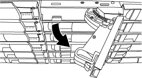

= DS224C 또는 DS212C 디스크 쉘프의 디스크 드라이브를 IOM12/IOM12B 모듈과 핫 스왑합니다
:allow-uri-read: 
:icons: font
:imagesdir: ../media/

[role="lead"]
DS224C 또는 DS212C 디스크 쉘프에서 오류가 발생한 디스크 드라이브를 핫 스왑할 수 있습니다.

.시작하기 전에
* 설치할 디스크 드라이브는 DS224C 또는 DS212C 디스크 쉘프에서 지원되어야 합니다.
+
https://hwu.netapp.com["NetApp Hardware Universe를 참조하십시오"^]

* 시스템의 다른 모든 구성 요소가 올바르게 작동해야 합니다. 그렇지 않은 경우 기술 지원 부서에 문의하십시오.
* 제거할 디스크 드라이브에 오류가 발생해야 합니다.
+
'storage disk show-Broken' 명령을 실행하여 디스크 드라이브 실패를 확인할 수 있습니다. 오류가 발생한 디스크 드라이브가 오류 발생 디스크 드라이브 목록에 나타납니다. 그렇지 않으면 기다렸다가 명령을 다시 실행해야 합니다.

+

NOTE: 디스크 드라이브 유형 및 용량에 따라 디스크 드라이브가 고장난 디스크 드라이브 목록에 표시되기까지 최대 몇 시간이 걸릴 수 있습니다.

* 자체 암호화 디스크(SED)를 교체하는 경우 해당 버전의 ONTAP에 대한 ONTAP 설명서의 SED 교체 지침을 따라야 합니다.
+
ONTAP 설명서의 지침은 SED를 교체하기 전과 후에 수행해야 하는 추가 단계를 설명합니다.

+
https://docs.netapp.com/us-en/ontap/encryption-at-rest/index.html["CLI를 통한 NetApp 암호화 개요"^]

.이 작업에 대해
* 정전기 방전(ESD)을 방지하려면 다음 단계를 수행해야 합니다.
+
** 설치할 준비가 될 때까지 디스크 드라이브를 ESD 가방에 보관하십시오.
** ESD 가방을 손으로 열거나 가위로 잘라냅니다.
+

NOTE: ESD 백에 금속 공구나 칼날을 넣지 마십시오.

** 보관 인클로저 섀시의 도색되지 않은 표면에 접지된 ESD 손목 접지대를 항상 착용하십시오.
+
손목 스트랩을 사용할 수 없는 경우 디스크 드라이브를 다루기 전에 스토리지 인클로저 섀시의 색칠되지 않은 표면을 만지십시오.

* 다음과 같이 디스크 드라이브를 주의하여 취급해야 합니다.
+
** 디스크 드라이브를 분리, 설치 또는 운반할 때는 항상 두 손을 사용하여 무게를 지탱하십시오.
+

NOTE: 디스크 드라이브 캐리어 밑면에 노출된 디스크 드라이브 보드에 손을 올려 놓지 마십시오.

** 쿠션이 있는 표면에 디스크 드라이브를 놓고 디스크 드라이브를 서로 쌓지 마십시오.
** 디스크 드라이브를 다른 표면에 부딪히지 않도록 주의해야 합니다.

* 디스크 드라이브는 자기 장치에서 멀리 떨어져 있어야 합니다.
+

NOTE: 자기장은 디스크 드라이브의 모든 데이터를 파괴하고 디스크 드라이브 회로에 돌이킬 수 없는 손상을 입힐 수 있습니다.

* 디스크 드라이브를 핫 스왑하기 전에 최신 버전의 DQP(Disk Qualification Package)를 설치하는 것이 가장 좋습니다.
+
현재 버전의 DQP를 설치하면 시스템이 새로 검증된 디스크 드라이브를 인식하고 활용할 수 있으므로, 최신 디스크 드라이브 정보가 없는 시스템 이벤트 메시지를 방지할 수 있습니다. 또한 디스크 드라이브를 인식할 수 없으므로 디스크 파티셔닝의 가능성을 방지할 수 있습니다. 또한 DQP는 현재 디스크 드라이브 펌웨어가 아닌 경우 이를 알려줍니다.

+
https://mysupport.netapp.com/site/downloads/firmware/disk-drive-firmware/download/DISKQUAL/ALL/qual_devices.zip["NetApp 다운로드: 디스크 검증 패키지"^]

* 모범 사례는 새 디스크 쉘프, 쉘프 FRU 구성요소 또는 SAS 케이블을 추가하기 전에 현재 버전의 디스크 쉘프(IOM) 펌웨어 및 디스크 드라이브 펌웨어를 시스템에 추가하는 것입니다.
+
펌웨어의 현재 버전은 NetApp Support 사이트에서 확인할 수 있습니다.

+
https://mysupport.netapp.com/site/downloads/firmware/disk-shelf-firmware["NetApp 다운로드: 디스크 쉘프 펌웨어"^]

+
https://mysupport.netapp.com/site/downloads/firmware/disk-drive-firmware["NetApp 다운로드: 디스크 드라이브 펌웨어"^]

* 디스크 드라이브 펌웨어는 최신 버전이 아닌 새 디스크 드라이브에서 중단 없이 자동으로 업데이트됩니다.
+

NOTE: 디스크 드라이브 펌웨어 검사는 2분마다 수행됩니다.

* 필요한 경우 디스크 쉘프의 위치(파란색) LED를 켜서 영향을 받는 디스크 쉘프를 물리적으로 찾을 수 있도록 'Storage shelf location-led modify-shelf-name_shelf_name_-led-status on'을 설정할 수 있습니다
+
디스크 쉘프에는 3개의 위치 LED(운영 디스플레이 패널에 1개, 쉘프 IOM)가 있습니다. 위치 LED가 30분 동안 켜져 있습니다. 같은 명령을 입력해도 끄기 옵션을 사용하여 해제할 수 있습니다.

* 필요한 경우 모니터링 디스크 쉘프 LED 섹션에서 운영자 디스플레이 패널 및 FRU 구성요소의 디스크 쉘프 LED의 의미 및 위치에 대한 정보를 확인할 수 있습니다.

.단계
. 교체 디스크 드라이브에 대해 디스크 소유권을 수동으로 할당하려면 자동 드라이브 할당을 비활성화해야 합니다. 그렇지 않으면 다음 단계로 이동하십시오.
+

NOTE: 스택의 디스크 드라이브가 HA 쌍의 두 컨트롤러에서 소유하는 경우 디스크 소유권을 수동으로 할당해야 합니다.

+

NOTE: 디스크 소유권을 수동으로 할당한 다음 이 절차의 뒷부분에서 자동 드라이브 할당을 다시 활성화합니다.

+
.. 자동 드라이브 할당이 활성화되었는지 확인합니다: ''스토리지 디스크 옵션 표시'
+
HA 쌍이 있는 경우 두 컨트롤러의 콘솔에서 명령을 입력할 수 있습니다.

+
자동 드라이브 할당이 활성화된 경우 ""자동 할당"" 열에 각 컨트롤러에 대해 ""켜짐""이 표시됩니다.

.. 자동 드라이브 할당을 사용하도록 설정한 경우, "스토리지 디스크 옵션 modify -node_node_name_-autostassign off"를 비활성화해야 합니다
+
HA Pair의 두 컨트롤러에서 자동 드라이브 할당을 비활성화해야 합니다.

. 적절하게 접지합니다.
. 새 디스크 드라이브의 포장을 풀고 디스크 쉘프 근처의 평평한 표면에 놓습니다.
+
오류가 발생한 디스크 드라이브를 반환할 때 사용할 수 있도록 모든 포장재를 보관합니다.

+

NOTE: NetApp은 반환된 모든 디스크 드라이브를 ESD 등급 가방에 넣어야 합니다.

. 시스템 콘솔 경고 메시지 및 디스크 드라이브의 주의(황색) 표시등을 통해 장애가 발생한 디스크 드라이브를 물리적으로 식별할 수 있습니다.
+

NOTE: 오류가 발생한 디스크 드라이브의 작동(녹색) LED는 켜져 있을 수 있습니다(계속 켜짐). 이 LED는 디스크 드라이브에 전원이 들어오지만 깜박이지 않아야 합니다. 이는 I/O 작동을 나타냅니다. 오류가 발생한 디스크 드라이브에 I/O 작업이 없습니다.

. 디스크 드라이브 면에서 분리 단추를 누른 다음 캠 핸들을 완전히 열린 위치로 당겨 중간 평면에서 디스크 드라이브를 분리합니다.
+
해제 버튼을 누르면 디스크 드라이브 스프링의 캠 핸들이 부분적으로 열립니다.

+

NOTE: DS212C 디스크 쉘프의 디스크 드라이브는 디스크 드라이브 문자반 왼쪽에 있는 릴리스 단추와 함께 가로로 정렬됩니다. DS224C 디스크 쉘프에 있는 디스크 드라이브는 디스크 드라이브 문자반 상단에 있는 분리 단추와 함께 수직으로 배열됩니다.

+
다음은 DS212C 디스크 쉘프에 있는 디스크 드라이브를 보여 줍니다.

+

+
다음은 DS224C 디스크 쉘프에 있는 디스크 드라이브를 보여 줍니다.

+
image::../media/2240_removing_disk_no_bezel.png[2240 디스크 분리 베젤 없음]

. 디스크 드라이브를 살짝 밀어 디스크가 안전하게 스핀다운될 수 있도록 한 다음 디스크 쉘프에서 디스크 드라이브를 분리합니다.
+
안전하게 스핀다운하려면 HDD가 최대 1분 정도 걸릴 수 있습니다.

+

NOTE: 디스크 드라이브를 취급할 때는 항상 두 손을 사용하여 무게를 지탱하십시오.

. 캠 핸들을 열린 위치에 둔 상태에서 두 손을 사용하여 디스크 드라이브가 멈출 때까지 세게 밀어 교체용 디스크 드라이브를 디스크 선반에 삽입합니다.
+

NOTE: 새 디스크 드라이브를 삽입하기 전에 최소 10초 동안 기다립니다. 이렇게 하면 시스템에서 디스크 드라이브가 제거되었는지 인식할 수 있습니다.

+

NOTE: 디스크 캐리어 밑면에 노출되는 디스크 드라이브 보드에는 손을 놓지 마십시오.

. 디스크 드라이브가 중간 평면에 완전히 장착되고 핸들이 제자리에 고정되도록 캠 핸들을 닫습니다.
+
캠 핸들이 디스크 드라이브 표면에 올바르게 정렬되도록 캠 핸들을 천천히 닫아야 합니다.

. 다른 디스크 드라이브를 교체하는 경우 3-8단계를 반복합니다.
. 디스크 드라이브의 작동(녹색) LED가 켜져 있는지 확인합니다.
+
디스크 드라이브의 작동 LED가 녹색으로 고정되어 있으면 디스크 드라이브에 전원이 공급되고 있는 것입니다. 디스크 드라이브의 작동 LED가 깜박이면 디스크 드라이브에 전원이 공급되고 I/O가 진행 중임을 의미합니다. 디스크 드라이브 펌웨어가 자동으로 업데이트되는 경우 LED가 깜박입니다.

. 1단계에서 자동 드라이브 할당을 해제한 경우 디스크 소유권을 수동으로 할당한 다음 필요한 경우 자동 드라이브 할당을 다시 사용하도록 설정합니다.
+
.. 소유되지 않은 모든 디스크를 표시합니다. 스토리지 디스크 표시 - 컨테이너 유형이 할당되지 않음
.. 각 디스크를 'storage disk assign-disk_name_-owner_owner_name_' 할당한다
+
와일드카드 문자를 사용하여 한 번에 두 개 이상의 디스크를 할당할 수 있습니다.

.. 필요한 경우 자동 드라이브 할당을 다시 활성화합니다. ''스토리지 디스크 옵션 modify -node_node_name_-autostassign on'
+
HA 쌍의 두 컨트롤러에서 자동 드라이브 할당을 다시 사용해야 합니다.

. 키트와 함께 제공된 RMA 지침에 설명된 대로 오류가 발생한 부품을 NetApp에 반환합니다.
+
기술 지원 부서(에 문의하십시오 https://mysupport.netapp.com/site/global/dashboard["NetApp 지원"], 888-463-8277 (북미), 00-800-44-638277 (유럽) 또는 +800-800-80-800 (아시아/태평양) 교체 절차에 대한 추가 지원이 필요한 경우.

