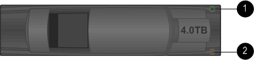

= 디스크 쉘프 LED 모니터링 - IOM12/IOM12B 모듈이 장착된 쉘프
:allow-uri-read: 
:icons: font
:imagesdir: ../media/

[role="lead"]
디스크 쉘프 구성 요소의 상태 및 위치를 이해하면 디스크 쉘프의 상태를 모니터링할 수 있습니다.

== 오퍼레이터 디스플레이 패널 LED

디스크 쉘프 전면 운영자 디스플레이 패널의 LED는 디스크 쉘프가 정상 작동 중인지 또는 하드웨어에 문제가 있는지 여부를 나타냅니다.

다음 표에서는 DS460C, DS224C 및 DS212C 디스크 쉘프에 사용되는 작동 디스플레이 패널의 세 가지 LED에 대해 설명합니다.

[cols="4*"]
|===
| LED 아이콘 | LED 이름입니다 | 상태 | 설명 

 a| 
image::../media/drw_sas_power_icon.svg[전원 아이콘]
 a| 
전원
 a| 
녹색으로 켜져 있습니다
 a| 
하나 이상의 전원 공급 장치가 디스크 쉘프에 전원을 공급하고 있습니다.

.2+| image:../media/drw_sas_fault_icon.svg["주의 아이콘, 폭 = 5px"] .2+| 주의  a| 
주황색으로 고정되어 있습니다
 a| 
디스크 쉘프, 디스크 드라이브, IOM12/IOM12B 모듈 또는 전원 공급 장치 중 하나의 FRU 기능에 오류가 발생했습니다.

이벤트 메시지를 확인하여 필요한 수정 조치를 결정합니다.

 a| 
주황색으로 깜박입니다
 a| 
쉘프 ID가 보류 중입니다.

쉘프 ID가 적용되는 디스크 쉘프의 전원을 껐다가 켭니다.

 a| 
image::../media/drw_sas3_location_icon.svg[위치 아이콘]
 a| 
위치
 a| 
파란색으로 고정되어 있습니다
 a| 
시스템 관리자는 서비스가 필요한 디스크 쉘프를 물리적으로 찾을 수 있도록 이 LED 기능을 활성화했습니다.

이 LED 기능이 활성화되면 작동 디스플레이 패널과 IOM12/IOM12B 모듈의 위치 LED가 켜집니다. 위치 LED는 30분 후에 자동으로 꺼집니다.

|===
디스크 쉘프 모델에 따라 작동 디스플레이 패널은 다르게 보이지만 세 개의 LED는 같은 방식으로 배열됩니다.

다음 그림은 엔드 캡이 있는 DS224C 디스크 쉘프 운영자 디스플레이 패널을 보여줍니다.

image::../media/drw_opd.gif[엔드 캡 작업자 디스플레이]

== IOM12/IOM12B 모듈 LED

IOM12/IOM12B 모듈의 LED는 모듈이 정상적으로 작동하는지 여부, I/O 트래픽을 처리할 준비가 되었는지 여부 및 하드웨어에 문제가 있는지 여부를 나타냅니다.

다음 표에서는 모듈의 기능과 모듈의 각 SAS 포트의 기능에 연결된 IOM12/IOM12B 모듈 LED에 대해 설명합니다.

IOM12/IOM12B 모듈은 DS460C, DS224C 및 DS212C 디스크 선반에 사용됩니다.

[cols="4*"]
|===
| LED 아이콘 | LED 이름입니다 | 상태 | 설명 

 a| 
image::../media/drw_sas_fault_icon.svg[주의 아이콘]
 a| 
주의
 a| 
주황색으로 고정되어 있습니다
 a| 
IOM12/IOM12B 모듈 기능: IOM12/IOM12B 모듈의 기능에 오류가 발생했습니다.

SAS 포트 기능: 4개의 SAS 레인 모두에서 링크를 설정했습니다(어댑터 또는 다른 디스크 쉘프 사용).

이벤트 메시지를 확인하여 필요한 수정 조치를 결정합니다.

 a| 
LNK
 a| 
포트 링크
 a| 
녹색으로 켜져 있습니다
 a| 
4개의 SAS 레인 중 하나 이상이 링크를 설정했습니다(어댑터 또는 다른 디스크 쉘프 사용).

 a| 
image::../media/drw_sas3_location_icon.svg[위치 아이콘]
 a| 
위치
 a| 
파란색으로 고정되어 있습니다
 a| 
시스템 관리자는 오류가 발생한 IOM12/IOM12B 모듈을 사용하여 디스크 쉘프를 물리적으로 찾을 수 있도록 이 LED 기능을 활성화했습니다.

이 LED 기능이 활성화되면 작동 디스플레이 패널과 IOM12/IOM12B 모듈의 위치 LED가 켜집니다. 위치 LED는 30분 후에 자동으로 꺼집니다.

|===
다음 그림은 IOM12 모듈에 대한 것입니다.

image::../media/drw_iom12.gif[IOM12 모듈]

IOM12B 모듈은 파란색 스트라이프와 "IOM12B" 레이블로 구별됩니다.

image::../media/iom12b.png[IOM12B 모듈]

== 전원 공급 장치 LED

전원 공급 장치의 LED는 전원 공급 장치가 정상적으로 작동하는지 또는 하드웨어 문제가 있는지 여부를 나타냅니다.

다음 표에서는 DS460C, DS224C 및 DS212C 디스크 쉘프에서 사용되는 전원 공급 장치의 LED 두 개를 설명합니다.

[cols="4*"]
|===
| LED 아이콘 | LED 이름입니다 | 상태 | 설명 

.2+| image:../media/drw_sas_power_icon.svg["전원 아이콘, 폭 = 20px"] .2+| 전원  a| 
녹색으로 켜져 있습니다
 a| 
전원 공급 장치가 올바르게 작동하고 있습니다.

 a| 
꺼짐
 a| 
전원 공급 장치에 문제가 있거나, AC 스위치가 꺼져 있거나, AC 전원 코드가 제대로 설치되지 않았거나, 전기가 전원 공급 장치에 제대로 공급되지 않습니다.

이벤트 메시지를 확인하여 필요한 수정 조치를 결정합니다.

 a| 
image::../media/drw_sas_fault_icon.svg[주의 아이콘]
 a| 
주의
 a| 
주황색으로 고정되어 있습니다
 a| 
전원 공급 장치의 기능에 오류가 발생했습니다.

이벤트 메시지를 확인하여 필요한 수정 조치를 결정합니다.

|===
디스크 쉘프 모델에 따라 전원 공급 장치가 달라질 수 있으며 두 LED의 위치를 딕테이하게 됩니다.

다음 그림은 DS460C 디스크 쉘프에 사용되는 전원 공급 장치에 대한 것입니다.

두 개의 LED 아이콘은 레이블 및 LED의 역할을 하며, 이는 아이콘 자체가 켜지며 인접한 LED는 없습니다.

image::../media/28_dwg_e2860_de460c_psu.gif[전원 공급 장치 LED]

다음 그림은 DS224C 또는 DS212C 디스크 쉘프에 사용되는 전원 공급 장치에 대한 것입니다.

image::../media/drw_powersupply_913w_vsd.gif[전원 공급 장치 LED]

== DS460C 디스크 쉘프의 팬 LED

DS460C 팬의 LED는 팬이 정상적으로 작동하는지 또는 하드웨어 문제가 있는지 여부를 나타냅니다.

다음 표에서는 DS460C 디스크 쉘프에서 사용되는 팬의 LED에 대해 설명합니다.

[cols="4*"]
|===
| 항목 | LED 이름입니다 | 상태 | 설명 

 a| 
image:../media/icon_round_1.png["설명선 번호 1"]
 a| 
주의
 a| 
주황색으로 고정되어 있습니다
 a| 
팬 기능에 오류가 발생했습니다.

이벤트 메시지를 확인하여 필요한 수정 조치를 결정합니다.

|===
image::../media/28_dwg_e2860_de460c_single_fan_canister_with_led_callout.gif[팬 주의 LED]

== 디스크 드라이브 LED

디스크 드라이브의 LED는 정상 작동 중인지 또는 하드웨어에 문제가 있는지 여부를 나타냅니다.

=== DS224C 및 DS212C 디스크 쉘프용 디스크 드라이브 LED

다음 표에서는 DS224C 및 DS212C 디스크 쉘프에서 사용되는 디스크 드라이브의 LED 두 개에 대해 설명합니다.

[cols="4*"]
|===
| 속성 표시기 | LED 이름입니다 | 상태 | 설명 

.2+| image:../media/icon_round_1.png["설명선 번호 1"] .2+| 활동입니다  a| 
녹색으로 켜져 있습니다
 a| 
디스크 드라이브에 전원이 공급되고 있습니다.

 a| 
녹색으로 깜박임
 a| 
디스크 드라이브에 전원이 공급되고 I/O 작업이 진행 중입니다.

 a| 
image:../media/icon_round_2.png["설명선 번호 2"]
 a| 
주의
 a| 
주황색으로 고정되어 있습니다
 a| 
디스크 드라이브의 기능에 오류가 발생했습니다.

이벤트 메시지를 확인하여 필요한 수정 조치를 결정합니다.

|===
디스크 쉘프 모델에 따라 디스크 드라이브는 디스크 쉘프에서 수직 또는 수평으로 배열되어 두 LED의 위치를 지정합니다.

다음 그림은 DS224C 디스크 쉘프에 사용되는 디스크 드라이브에 대한 것입니다.

DS224C 디스크 쉘프는 디스크 쉘프에 수직으로 배열된 2.5인치 디스크 드라이브를 사용합니다.

image::../media/drw_diskdrive_ds224c.gif[수직 드라이브 캐리어 LED]

다음 그림은 DS212C 디스크 쉘프에 사용되는 디스크 드라이브에 대한 것입니다.

DS212C 디스크 쉘프는 디스크 쉘프에 수평으로 배열된 캐리어에서 3.5인치 디스크 드라이브 또는 2.5인치 디스크 드라이브를 사용합니다.

=== DS460C 디스크 쉘프용 디스크 드라이브 LED

다음 그림 및 표에서는 드라이브 드로어의 드라이브 활동 LED 및 작동 상태를 설명합니다.

image::../media/2860_dwg_drive_drawer_leds.gif[드라이브 활동 LED]

[cols="4*"]
|===
| 위치 | LED | 상태 표시등 | 설명 

.3+| 1 .3+| 주의: 각 서랍에 대한 서랍 주의  a| 
주황색으로 고정되어 있습니다
 a| 
드라이브 드로어 내의 구성 요소는 운전자의 주의가 필요합니다.

 a| 
꺼짐
 a| 
드로어에 드라이브 또는 기타 구성 요소가 없으면 주의해야 하며 드로어의 드라이브에 활성 위치 확인 작업이 없습니다.

 a| 
주황색으로 깜박입니다
 a| 
드라이브 찾기 작업은 드로어 내의 모든 드라이브에 대해 활성화됩니다.

.3+| 2-13 .3+| 활동: 드라이브 드로어에서 드라이브 0에서 11까지의 드라이브 활동  a| 
녹색
 a| 
전원이 켜져 있고 드라이브가 정상적으로 작동하고 있습니다.

 a| 
녹색으로 깜박임
 a| 
드라이브에 전원이 공급되고 I/O 작업이 진행 중입니다.

 a| 
꺼짐
 a| 
전원이 꺼져 있습니다.

|===
드라이브 드로어가 열려 있으면 각 드라이브 전면에 주의 LED가 표시됩니다.

image::../media/2860_dwg_amber_on_drive.gif[드라이브 주의 LED]

[cols="10,90"]
|===

 a| 
image:../media/icon_round_1.png["설명선 번호 1"]
| 주의 LED가 켜집니다 
|===