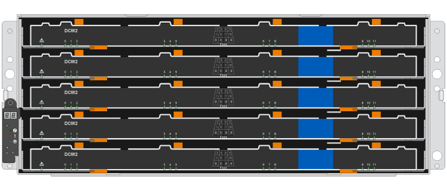
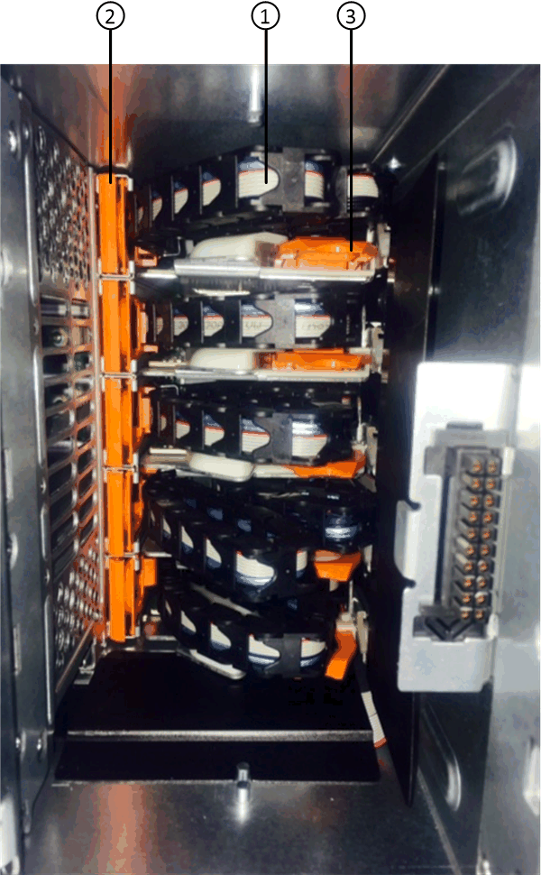
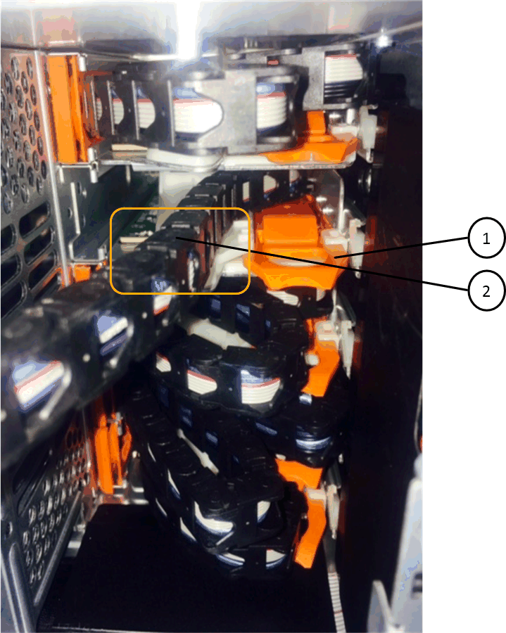

= DS460C 디스크 쉘프 쉘프의 드라이브 서랍을 IOM12/IOM12B 모듈로 교체합니다
:allow-uri-read: 
:icons: font
:imagesdir: ../media/

[role="lead"]
쉘프의 드라이브 서랍을 교체하려면 전체 스토리지 시스템(HA 쌍)을 중지해야 합니다. 따라서 쉘프에 데이터 애그리게이트를 계속 유지할 수 있으며, HA 쌍을 계속 유지하고 실행할 수도 있습니다. 이 경우 디스크 드라이브에 상주하는 데이터 애그리게이트에서 모든 데이터를 오프라인 상태로 이동하고 데이터 애그리게이트를 삭제해야 합니다. 하지만 쉘프에 루트 애그리게이트가 포함되어 있는 경우 HA 쌍을 중지해야 합니다.

.시작하기 전에
이 절차를 수행하려면 다음 항목이 필요합니다.

* 정전기 방지
+

NOTE: * 가능한 하드웨어 손상: * 드라이브 선반의 정전기 방전 손상을 방지하려면 드라이브 쉘프 구성 요소를 취급할 때 적절한 정전기 방지 보호 장치를 사용하십시오.

* 교체용 드라이브 드로어
* 좌측 및 우측 케이블 체인 교체
* 플래시

.이 작업에 대해
* 이 절차는 DCM 드라이브 드로어 및/또는 DCM2 드라이브 드로어가 있는 셸프에 적용됩니다. (쉘프에는 IOM12 모듈 2개 또는 IOM12B 모듈 2개가 있습니다.)
+
DCM 또는 DCM2 드라이브 드로어에 장애가 발생하면 DCM 또는 DCM2 드라이브 드로어를 교체해도 됩니다.

[NOTE]
====
장애가 발생한 드라이브 드로어를 교체할 경우 쉘프에 IOM12 모듈과 DCM2 드라이브 드로어의 수가 조합되어 있게 됩니다. IOM12 모듈에는 DCM2 드라이브 드로어를 지원하는 FW 버전이 필요하므로 IOM12 FW를 0300 이상 버전으로 업그레이드해야 합니다.

드라이브 드로어를 교체하기 전이나 후에 IOM12 FW 업그레이드를 수행할 수 있습니다. 이 절차에서는 드로어 교체 절차를 준비하는 과정에서 FW를 업그레이드합니다.

====
* DCM 드라이브 드로어 및 DCM2 드라이브 드로어는 외관에 따라 구분할 수 있습니다.
+
DCM 드라이브 드로어는 다음과 같습니다.

+
image::../media/28_dwg_e2860_de460c_front_no_callouts.gif[DCM 드라이브 셸프의 전면도]

+
DCM2 드라이브 드로어는 파란색 스트라이프와 "DCM2" 레이블로 구분됩니다.

+

== 드라이브 드로어를 교체할 준비를 합니다

드라이브 드로어를 교체하기 전에 필요한 경우 IOM12 FW를 업데이트하고, HA 쌍을 중지해야 하므로 쉘프에 데이터 애그리게이트를 유지할 수 있으며, HA 쌍을 계속 유지할 수 있는 옵션이 있습니다. 이 경우 디스크 드라이브에 상주하는 데이터 애그리게이트에서 모든 데이터를 오프라인 상태로 이동하고 데이터 애그리게이트를 삭제해야 합니다. 하지만 쉘프에 루트 애그리게이트가 포함되어 있는 경우 HA 쌍을 중지해야 합니다. 마지막으로, 쉘프의 전원을 꺼야 합니다.

.단계
. 장애가 발생한 드라이브 드로어를 교체할 때 쉘프에 IOM12 모듈과 여러 개의 DCM2 드라이브 드로어가 결합되어 있는지 확인합니다.
. 쉘프에 IOM12 모듈과 여러 개의 DCM2 드라이브 드로어가 조합되어 있는 경우 IOM12 FW를 버전 0300 이상으로 업그레이드해야 합니다. 그렇지 않으면 다음 단계로 이동하십시오.
+
펌웨어의 현재 버전은 NetApp Support 사이트에서 확인할 수 있습니다.

+
https://mysupport.netapp.com/site/downloads/firmware/disk-shelf-firmware["NetApp 다운로드: 디스크 쉘프 펌웨어"]

. 쉘프에 HA 쌍 중 하나의 컨트롤러의 루트 애그리게이트가 포함되어 있거나 HA 쌍을 중단(HA Pair를 계속 실행 중인 상태로 유지)하도록 선택한 경우 다음 하위 단계를 완료하고, 그렇지 않은 경우 다음 단계로 이동합니다.
+

NOTE: HA 쌍을 중단하는 경우에도 데이터 애그리게이트는 쉘프에 계속 남아 있을 수 있습니다.

+
.. HA Pair에서 두 컨트롤러를 모두 중지합니다.
.. 스토리지 시스템 콘솔을 확인하여 HA 쌍이 중지되었는지 확인합니다.
.. 쉘프 전원을 끕니다.
.. 섹션으로 이동합니다. <<케이블 체인을 탈거하십시오>>.

. HA Pair를 계속 가동하도록 선택한 경우 다음 하위 단계를 완료하십시오.
+

NOTE: 드로어를 디스크 쉘프의 애그리게이트로 교체하려고 하면 다중 디스크 패닉이 발생할 수 있습니다.

+
.. 디스크 드라이브에 상주하는 데이터 애그리게이트에서 모든 데이터를 이동합니다.
+
데이터에는 볼륨 및 LUN이 포함되며 이에 제한되지 않습니다.

.. 디스크 드라이브를 스페어로 사용할 수 있도록 애그리게이트를 오프로드하고 삭제합니다.
+
두 컨트롤러 중 하나의 클러스터 쉘에서 명령을 입력할 수 있습니다.

+
'Storage aggregate offline-aggregate_aggregate_name_'

+
'Storage aggregate delete-aggregate_aggregate_name_'

.. 디스크 드라이브에 Aggregate가 없는지 확인합니다(스페어).
+
... 두 컨트롤러 중 하나의 클러스터 쉘에서 'storage disk show -shelf_shelf_number_' 명령을 입력합니다
... 출력을 확인하여 drisk 드라이브가 스페어인지 확인합니다.
+
예비부품인 디스크 드라이브는 컨테이너 유형 열에 '사사사사자다'가 표시됩니다.

+

NOTE: 쉘프의 디스크 드라이브에 장애가 발생하면 '컨테이너 유형' 열에 '중단됨'이 표시됩니다.

.. 쉘프 전원을 끕니다.

== 케이블 체인을 탈거하십시오

DS460C 드라이브 쉘프의 각 드라이브 서랍에 대한 왼쪽 및 오른쪽 케이블 체인을 사용하면 서랍을 밀어 넣을 수 있습니다. 드라이브 드로어를 제거하려면 먼저 두 케이블 체인을 모두 제거해야 합니다.

.시작하기 전에
* 을(를) 완료했습니다 <<드라이브 드로어를 교체할 준비를 합니다>> 단계를 수행하여 HA 쌍이 중단되거나 디스크 드라이브에 상주하는 데이터 애그리게이트에서 모든 데이터를 오프라인 상태로 이동하고 해당 데이터 애그리게이트를 오프라인 상태로 삭제하여 디스크 드라이브를 스페어로 설정할 수 있습니다.
* 선반의 전원을 껐습니다.
* 다음 항목을 획득하였습니다.
+
** 정전기 방지
+

NOTE: * 가능한 하드웨어 손상: * 선반의 정전기 방전 손상을 방지하려면 선반 구성 요소를 취급할 때 적절한 정전기 방지 보호 장치를 사용하십시오.

** 플래시

.이 작업에 대해
각 드라이브 서랍에는 왼쪽 및 오른쪽 케이블 체인이 있습니다. 케이블 체인의 금속 끝은 다음과 같이 엔클로저 내부의 해당 수직 및 수평 브래킷에 밀어 넣습니다.

* 왼쪽 및 오른쪽 수직 브래킷은 케이블 체인을 엔클로저의 중앙판에 연결합니다.
* 왼쪽 및 오른쪽 수평 브래킷은 케이블 체인을 개별 드로어에 연결합니다.

.단계
. 정전기 방지 보호 장치를 놓습니다.
. 드라이브 쉘프 후면에서 다음과 같이 우측 팬 모듈을 분리합니다.
+
.. 주황색 탭을 눌러 팬 모듈 손잡이를 분리합니다.
+
이 그림은 왼쪽에 있는 주황색 탭에서 확장 및 해제된 팬 모듈의 핸들을 보여줍니다.

+
image::../media/28_dwg_e2860_de460c_fan_canister_handle_with_callout.gif[확장된 팬 모듈 손잡이]

+
[cols="10,90"]
|===

 a| 
image:../media/icon_round_1.png["설명선 번호 1"]
| 팬 모듈 핸들 
|===
.. 손잡이를 사용하여 팬 모듈을 드라이브 쉘프에서 꺼내고 한쪽에 둡니다.

. 분리할 5개의 케이블 체인 중 어떤 것을 수동으로 결정합니다.
+
이 그림은 팬 모듈이 분리된 상태에서 드라이브 쉘프의 오른쪽을 보여줍니다. 팬 모듈을 분리한 상태에서 각 드로어에 대해 5개의 케이블 체인과 수직 및 수평 커넥터를 볼 수 있습니다. 드라이브 드로어 1에 대한 설명선이 제공됩니다.

+

+
[cols="10,90"]
|===

 a| 
image:../media/icon_round_1.png["설명선 번호 1"]
| 케이블 체인 

 a| 
image:../media/icon_round_2.png["설명선 번호 2"]
 a| 
수직 커넥터(미드플레인에 연결됨)

 a| 
image:../media/icon_round_3.png["설명선 번호 3"]
 a| 
수평 커넥터(드라이브 드로어에 연결됨)

|===
+
상단 케이블 체인은 드라이브 서랍 1에 부착되어 있습니다. 하단 케이블 체인은 드라이브 서랍 5에 부착되어 있습니다.

. 손가락을 사용하여 오른쪽의 케이블 체인을 왼쪽으로 이동합니다.
. 다음 단계에 따라 해당 수직 브래킷에서 오른쪽 케이블 체인을 분리하십시오.
+
.. 손전등을 사용하여 인클로저의 수직 브래킷에 연결된 케이블 체인 끝에 있는 주황색 링을 찾습니다.
+
image::../media/2860_dwg_vertical_ring_for_chain.gif[케이블 체인 끝에 있는 주황색 고리]

+
[cols="10,90"]
|===

 a| 
image:../media/icon_round_1.png["설명선 번호 1"]
| 세로 브래킷의 주황색 링 
|===
.. 주황색 링의 중앙을 살짝 누르고 케이블 왼쪽을 인클로저 밖으로 당겨 수직 커넥터(중앙판에 연결됨)를 분리합니다.
.. 케이블 체인을 분리하려면 손가락을 약 2.5cm(1인치) 정도 사용자 쪽으로 조심스럽게 당기되, 케이블 체인 커넥터는 수직 브래킷 안에 둡니다.

. 다음 단계에 따라 케이블 체인의 다른 쪽 끝을 분리합니다.
+
.. 손전등을 사용하여 인클로저의 수평 브래킷에 부착된 케이블 체인 끝에 있는 주황색 링을 찾습니다.
+
그림은 오른쪽의 수평 커넥터와 케이블 체인이 분리되고 부분적으로 왼쪽에서 당겨진 상태를 보여줍니다.

+

+
[cols="10,90"]
|===

 a| 
image:../media/icon_round_1.png["설명선 번호 1"]
| 가로 브래킷의 주황색 링 

 a| 
image:../media/icon_round_2.png["설명선 번호 2"]
 a| 
케이블 체인

|===
.. 주황색 링에 손가락을 천천히 넣습니다.
+
아래 그림은 수평 브래킷의 주황색 링을 아래로 밀어 인클로저에서 나머지 케이블 체인을 당겨 빼낼 수 있게 해 줍니다.

.. 손가락을 몸 쪽으로 당겨 케이블 체인을 뽑습니다.

. 드라이브 쉘프에서 전체 케이블 체인을 조심스럽게 당깁니다.
. 드라이브 쉘프 후면에서 왼쪽 팬 모듈을 분리합니다.
. 왼쪽 케이블 체인을 세로 브래킷에서 분리하려면 다음 단계를 수행하십시오.
+
.. 손전등을 사용하여 수직 브래킷에 부착된 케이블 체인 끝에 있는 주황색 링을 찾습니다.
.. 주황색 링에 손가락을 넣습니다.
.. 케이블 체인을 분리하려면 손가락을 약 2.5cm(1인치) 정도 사용자 쪽으로 당기되, 케이블 체인 커넥터는 수직 브래킷 안에 둡니다.

. 수평 브래킷에서 좌측 케이블 체인을 분리하고, 전체 케이블 체인을 드라이브 쉘프에서 빼내십시오.

== 드라이브 드로어를 분리합니다

오른쪽 및 왼쪽 케이블 체인을 분리한 후 드라이브 쉘프에서 드라이브 드로어를 제거할 수 있습니다. 드라이브 드로어를 제거하려면 드로어 부분을 밖으로 밀어 빼내고 드라이브를 제거한 다음 드라이브 드로어를 제거해야 합니다.

.시작하기 전에
* 드라이브 드로어의 오른쪽 및 왼쪽 케이블 체인을 제거했습니다.
* 오른쪽 및 왼쪽 팬 모듈을 교체했습니다.

.단계
. 드라이브 쉘프 전면에서 베젤을 분리합니다.
. 양쪽 레버를 당겨 드라이브 드로어의 래치를 풉니다.
. 확장 레버를 사용하여 드라이브 서랍이 멈출 때까지 조심스럽게 빼냅니다. 드라이브 쉘프에서 드라이브 드로어를 완전히 제거하지 마십시오.
. 드라이브 드로어에서 드라이브를 분리합니다.
+
.. 각 드라이브의 중앙 전면에 보이는 주황색 분리 래치를 부드럽게 뒤로 당깁니다. 다음 이미지는 각 드라이브의 주황색 분리 래치를 보여줍니다.
+
image::../media/28_dwg_e2860_drive_latches_top_view.gif[드라이브 분리 래치]

.. 드라이브 핸들을 수직으로 올립니다.
.. 핸들을 사용하여 드라이브 드로어에서 드라이브를 들어 올립니다.
+
image::../media/92_dwg_de6600_install_or_remove_drive.gif[드라이브 설치 또는 분리]

.. 드라이브를 평평하고 정전기가 없는 표면 위에 놓고 자기 장치와 떨어진 곳에 놓습니다.
+

NOTE: * 데이터 액세스 손실 가능성: * 자기장을 사용하면 드라이브의 모든 데이터가 파괴되고 드라이브 회로가 복구할 수 없는 손상을 입을 수 있습니다. 데이터 액세스 손실 및 드라이브 손상을 방지하려면 드라이브가 항상 자기 장치에 닿지 않도록 하십시오.

. 드라이브 드로어를 분리하려면 다음 단계를 수행하십시오.
+
.. 드라이브 드로어의 양쪽에 있는 플라스틱 분리 레버를 찾습니다.
+
image::../media/92_pht_de6600_drive_drawer_release_lever.gif[서랍 분리 레버]

+
[cols="10,90"]
|===

 a| 
image:../media/icon_round_1.png["설명선 번호 1"]
| 드라이브 드로어 분리 레버 
|===
.. 래치를 사용자 쪽으로 당겨 두 분리 레버를 모두 엽니다.
.. 두 분리 레버를 모두 잡은 상태에서 드라이브 드로어를 사용자 쪽으로 당깁니다.
.. 드라이브 쉘프에서 드라이브 드로어를 제거합니다.

== 드라이브 드로어를 설치합니다

드라이브 서랍을 드라이브 쉘프에 설치하는 경우, 서랍을 빈 슬롯에 밀어 넣고 드라이브를 설치한 다음 전면 베젤을 다시 끼워야 합니다.

.시작하기 전에
* 다음 항목을 획득하였습니다.
+
** 교체용 드라이브 드로어
** 플래시

.단계
. 드라이브 선반의 전면에서 손전등을 빈 서랍 슬롯에 비추고 해당 슬롯의 잠금 해제 텀블러를 찾습니다.
+
잠금 텀블러 어셈블리는 한 번에 두 개 이상의 드라이브 드로어를 열 수 없도록 하는 안전 기능입니다.

+
image::../media/92_pht_de6600_lock_out_tumbler_detail.gif[잠금 장치 텀블러 및 드로어 가이드의 위치]

+
[cols="10,90"]
|===

 a| 
image:../media/icon_round_1.png["설명선 번호 1"]
| 락아웃 텀블러 

 a| 
image:../media/icon_round_2.png["설명선 번호 2"]
 a| 
서랍 가이드

|===
. 교체용 드라이브 드로어를 빈 슬롯 앞에 놓고 가운데 약간 오른쪽으로 배치합니다.
+
서랍을 가운데 약간 오른쪽에 배치하면 잠금 장치 텀블러와 서랍 가이드가 올바르게 맞물려 있는지 확인할 수 있습니다.

. 드라이브 드로어를 슬롯에 밀어 넣고 드로어 가이드가 락아웃 텀블러 아래로 미끄러져 들어가는지 확인합니다.
+

NOTE: * 장비 손상 위험: * 서랍 가이드가 락아웃 텀블러 아래로 미끄러지지 않으면 손상이 발생합니다.

. 래치가 완전히 맞물릴 때까지 드라이브 드로어를 조심스럽게 끝까지 밀어 넣습니다.
+

NOTE: * 장비 손상 위험: * 과도한 저항이나 바인딩이 느껴지면 드라이브 드로어 밀기 작업을 중단합니다. 드로어 전면의 분리 레버를 사용하여 드로어를 뒤로 밉니다. 그런 다음 서랍을 슬롯에 다시 넣고 서랍이 자유롭게 들어가는지 확인합니다.

. 드라이브 드로어에 드라이브를 재설치하려면 다음 단계를 수행하십시오.
+
.. 용지함 앞쪽에 있는 두 레버를 당겨 드라이브 드로어의 래치를 풉니다.
.. 확장 레버를 사용하여 드라이브 서랍이 멈출 때까지 조심스럽게 빼냅니다. 드라이브 쉘프에서 드라이브 드로어를 완전히 제거하지 마십시오.
.. 설치할 드라이브에서 핸들을 수직으로 들어 올립니다.
.. 드라이브 양쪽에 있는 두 개의 돌출된 단추를 드로어의 노치에 맞춥니다.
+
이 그림은 드라이브의 우측면도 및 올라간 버튼의 위치를 보여줍니다.

+
image::../media/28_dwg_e2860_de460c_drive_cru.gif[드라이브에서 돌출된 단추 위치]

+
[cols="10,90"]
|===

 a| 
image:../media/icon_round_1.png["설명선 번호 1"]
| 드라이브 오른쪽에 있는 위로 단추 
|===
.. 드라이브를 수직으로 내린 다음 드라이브가 제자리에 끼워질 때까지 드라이브 핸들을 아래로 돌립니다.
+
부분적으로 채워진 쉘프가 있는 경우, 다시 설치할 드라이브 서랍에 지원되는 12개 드라이브 미만의 드라이브가 있는 경우, 처음 4개 드라이브를 전면 슬롯(0, 3, 6 및 9)에 설치하십시오.

+

NOTE: * 장비 오작동 위험: * 공기 흐름이 원활하도록 하고 과열을 방지하려면 항상 처음 4개의 드라이브를 전면 슬롯(0, 3, 6, 9)에 설치하십시오.

+
image::../media/92_dwg_de6600_install_or_remove_drive.gif[드라이브 설치 또는 분리]

.. 이 하위 단계를 반복하여 모든 드라이브를 재설치합니다.

. 드로어를 중앙에서 밀어 드라이브 쉘프로 다시 밀어 넣은 후 두 레버를 닫습니다.
+

NOTE: * 장비 오작동 위험: * 두 레버를 모두 눌러 드라이브 드로어를 완전히 닫아야 합니다. 적절한 공기 흐름을 허용하고 과열을 방지하려면 드라이브 드로어를 완전히 닫아야 합니다.

. 드라이브 쉘프 전면에 베젤을 부착합니다.

== 케이블 체인을 연결합니다

드라이브 드로어를 설치하는 마지막 단계는 교체용 좌측 및 우측 케이블 체인을 드라이브 쉘프에 연결하는 것입니다. 케이블 체인을 연결할 때는 케이블 체인을 분리할 때 사용한 역순으로 케이블을 연결합니다. 체인의 수직 커넥터를 인클로저의 수직 브래킷에 삽입하기 전에 체인의 수평 커넥터를 인클로저의 수평 브래킷에 삽입해야 합니다.

.시작하기 전에
* 드라이브 드로어 및 모든 드라이브를 교체했습니다.
* 왼쪽 및 오른쪽으로 표시된 교체용 케이블 체인 2개가 있습니다(드라이브 드로어 옆의 수평 커넥터에 있음).

image::../media/28_dwg_e2860_de460c_cable_chain_left.gif[좌측 교체용 케이블 체인]

[cols="4*"]
|===
| 속성 표시기 | 케이블 체인 | 커넥터 | 에 연결합니다 

 a| 
image:../media/icon_round_1.png["설명선 번호 1"]
| 왼쪽  a| 
수직
 a| 
미드플레인

 a| 
image:../media/icon_round_2.png["설명선 번호 2"]
 a| 
왼쪽
 a| 
수평
 a| 
드라이브 드로어

|===
image:../media/28_dwg_e2860_de460c_cable_chain_right.gif["우측 교체용 케이블 체인"]

[cols="4*"]
|===
| 속성 표시기 | 케이블 체인 | 커넥터 | 에 연결합니다 

 a| 
image:../media/icon_round_1.png["설명선 번호 1"]
| 맞습니다  a| 
수평
 a| 
드라이브 드로어

 a| 
image:../media/icon_round_2.png["설명선 번호 2"]
 a| 
맞습니다
 a| 
수직
 a| 
미드플레인

|===
.단계
. 왼쪽 케이블 체인을 연결하려면 다음 단계를 수행하십시오.
+
.. 왼쪽 케이블 체인에서 수평 및 수직 커넥터를 찾고 인클로저 내에서 해당 수평 및 수직 브래킷을 찾습니다.
.. 두 케이블 체인 커넥터를 해당 브래킷에 맞춥니다.
.. 케이블 체인의 수평 커넥터를 수평 브래킷의 가이드 레일 아래로 밀어 최대한 밀어 넣습니다.
+
이 그림은 케이스의 두 번째 드라이브 드로어의 왼쪽에 있는 가이드 레일을 보여 줍니다.

+
image::../media/2860_dwg_guide_rail.gif[가이드 레일]

+
[cols="10,90"]
|===

 a| 
image:../media/icon_round_1.png["설명선 번호 1"]
| 가이드 레일 
|===
+
[NOTE]
====
* 장비 오작동의 위험: * 브라켓의 가이드 레일 아래에 커넥터를 밀어 넣으십시오. 커넥터가 가이드 레일 상단에 있으면 시스템이 실행될 때 문제가 발생할 수 있습니다.

====
.. 왼쪽 케이블 체인의 수직 커넥터를 수직 브래킷에 밀어 넣습니다.
.. 케이블 체인의 양쪽 끝을 다시 연결한 후 케이블 체인을 조심스럽게 당겨 두 커넥터가 모두 래치되었는지 확인하십시오.
+
[NOTE]
====
* 장비 오작동 위험: * 커넥터가 래치되지 않은 경우 드로어 작동 중에 케이블 체인이 느슨해질 수 있습니다.

====

. 왼쪽 팬 모듈을 다시 설치합니다.
. 다음 단계에 따라 오른쪽 케이블 체인을 다시 연결합니다.
+
.. 케이블 체인에서 수평 및 수직 커넥터를 찾고 인클로저 내에서 해당 수평 및 수직 브래킷을 찾습니다.
.. 두 케이블 체인 커넥터를 해당 브래킷에 맞춥니다.
.. 케이블 체인의 수평 커넥터를 수평 브래킷의 가이드 레일 아래로 밀어 끝까지 밀어 넣습니다.
+
[NOTE]
====
* 장비 오작동의 위험: * 브라켓의 가이드 레일 아래에 커넥터를 밀어 넣으십시오. 커넥터가 가이드 레일 상단에 있으면 시스템이 실행될 때 문제가 발생할 수 있습니다.

====
.. 오른쪽 케이블 체인의 수직 커넥터를 수직 브래킷에 밀어 넣습니다.
.. 케이블 체인의 양쪽 끝을 다시 연결한 후 케이블 체인을 조심스럽게 당겨 두 커넥터가 모두 래치되었는지 확인합니다.
+
[NOTE]
====
* 장비 오작동 위험: * 커넥터가 래치되지 않은 경우 드로어 작동 중에 케이블 체인이 느슨해질 수 있습니다.

====

. 오른쪽 팬 모듈을 재설치합니다.
. 전원 재적용:
+
.. 드라이브 쉘프의 두 전원 스위치를 켭니다.
.. 두 팬이 모두 켜지는지, 팬 뒷면의 주황색 LED가 꺼져 있는지 확인합니다.

. HA 쌍을 중단했다면, 두 컨트롤러 모두에서 ONTAP를 부팅하십시오. 그렇지 않으면 다음 단계로 이동하십시오.
. 데이터를 쉘프에서 꺼낸 후 데이터 애그리게이트를 삭제한 경우, 쉘프의 스페어 디스크를 사용하여 애그리게이트를 만들거나 확장할 수 있습니다.
+
https://docs.netapp.com/us-en/ontap/disks-aggregates/aggregate-creation-workflow-concept.html["집계 생성 워크플로"]

+
https://docs.netapp.com/us-en/ontap/disks-aggregates/aggregate-expansion-workflow-concept.html["애그리게이트 확장 워크플로우"]

