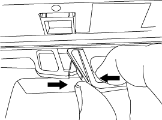

= IOM12/IOM12B 모듈 - 쉘프를 IOM12/IOM12B 모듈로 핫 스왑 또는 교체합니다
:allow-uri-read: 
:icons: font
:imagesdir: ../media/

[role="lead"]
시스템 구성에 따라 쉘프 IOM이 실패할 경우 무중단 쉘프 IOM 핫 스왑을 수행할 수 있는지 또는 중단 없는 쉘프 IOM 교체를 수행할 수 있는지 여부가 결정됩니다.

다른 IOM12/IOM12B 모듈을 포함한 시스템의 다른 모든 구성 요소가 제대로 작동해야 합니다.

.이 작업에 대해
* 이 절차는 IOM12 모듈이 있는 셸프 및 IOM12B 모듈이 있는 셸프에 적용됩니다.
+

NOTE: 이 절차는 쉘프 IOM 핫 스왑 또는 교체와 유사할 경우 적용됩니다. 즉, IOM12 모듈을 다른 IOM12 모듈로 교체하거나 IOM12B 모듈을 다른 IOM12B 모듈로 교체할 수 있습니다. (이 쉘프는 IOM12 모듈 2개를 포함할 수 있으며, 또는 IOM12B 모듈 2개를 포함할 수 있습니다.)

* IOM12 모듈 및 IOM12B 모듈은 다음과 같이 외관에 따라 구별할 수 있습니다.
+
IOM12 모듈은 "IOM12" 레이블로 구분됩니다.

+
image::../media/drw_iom12.gif[drw iom12]

+
IOM12B 모듈은 파란색 스트라이프와 "IOM12B" 레이블로 구별됩니다.

+
image::../media/iom12b.png[iom12b]

* 다중 경로(다중 경로 HA 또는 다중 경로) 및 4중 경로(4중 경로 HA 또는 4중 경로) 구성의 경우 쉘프 IOM을 핫 스왑할 수 있습니다. 즉, 전원이 켜져 있고 데이터를 제공하는 시스템의 쉘프 IOM을 중단 없이 교체할 수 있습니다. -- I/O가 진행 중입니다.
* FAS2600 시리즈 및 FAS2700 시리즈 단일 경로 HA 구성의 경우 전원을 켜고 데이터를 제공하는 시스템의 쉘프 IOM을 대체하기 위해 테이크오버 및 반환 작업을 수행해야 합니다. -- I/O가 진행 중입니다.
* FAS2600 시리즈 단일 경로 구성의 경우 쉘프 IOM을 교체하기 위해 시스템을 중지해야 합니다.
+

NOTE: 단일 경로 연결로 디스크 쉘프의 쉘프 IOM을 핫 스왑하려고 하면 디스크 쉘프의 디스크 드라이브 및 해당 디스크 쉘프의 디스크 드라이브에 모두 액세스할 수 없게 됩니다. 전체 시스템을 다운시킬 수도 있습니다.

* 모범 사례는 새 디스크 쉘프, 쉘프 FRU 구성요소 또는 SAS 케이블을 추가하기 전에 현재 버전의 디스크 쉘프(IOM) 펌웨어 및 디스크 드라이브 펌웨어를 시스템에 추가하는 것입니다.
+
펌웨어의 현재 버전은 NetApp Support 사이트에서 확인할 수 있습니다.

+
https://mysupport.netapp.com/site/downloads/firmware/disk-shelf-firmware["NetApp 다운로드: 디스크 쉘프 펌웨어"]

+
https://mysupport.netapp.com/site/downloads/firmware/disk-drive-firmware["NetApp 다운로드: 디스크 드라이브 펌웨어"]

* IOM(디스크 쉘프) 펌웨어가 최신 버전이 아닌 새 쉘프 IOM에서 중단 없이 자동으로 업데이트됩니다.
+
쉘프 IOM 펌웨어 검사는 10분마다 수행됩니다. IOM 펌웨어 업데이트는 최대 30분이 걸릴 수 있습니다.

* 필요한 경우 디스크 쉘프의 위치(파란색) LED를 켜서 영향을 받는 디스크 쉘프를 물리적으로 찾을 수 있도록 'Storage shelf location-led modify-shelf-name_shelf_name_-led-status on'을 설정할 수 있습니다
+
디스크 쉘프에는 3개의 위치 LED(운영 디스플레이 패널에 1개, 쉘프 IOM)가 있습니다. 위치 LED가 30분 동안 켜져 있습니다. 같은 명령을 입력해도 끄기 옵션을 사용하여 해제할 수 있습니다.

* 필요한 경우 모니터링 디스크 쉘프 LED 섹션에서 운영자 디스플레이 패널 및 FRU 구성요소의 디스크 쉘프 LED의 의미 및 위치에 대한 정보를 확인할 수 있습니다.

.단계
. 적절하게 접지합니다.
. 새 쉘프 IOM의 압축을 풀고 디스크 쉘프 근처의 평평한 표면에 설정합니다.
+
오류가 발생한 쉘프 IOM을 반환할 때 사용할 수 있도록 모든 포장재를 보관합니다.

. 시스템 콘솔 경고 메시지에서 실패한 쉘프 IOM을 물리적으로 식별하고 실패한 쉘프 IOM의 켜짐 주의(주황색) LED를 확인합니다.
. 보유하고 있는 구성 유형에 따라 다음 작업 중 하나를 수행합니다.
+
[cols="2*"]
|===
| 있는 경우... | 그러면... 

 a| 
다중 경로 HA, 다중 경로, 4중 경로 HA 또는 4중 경로 구성
 a| 
다음 단계로 이동합니다.

 a| 
FAS2600 시리즈 및 FAS2700 시리즈 단일 경로 HA 구성
 a| 
.. 타겟 노드(장애가 발생한 쉘프 IOM이 속한 노드)를 확인합니다.
+
IOM A가 컨트롤러 1에 속합니다. IOM B가 컨트롤러 2에 속합니다.

.. 'Storage failover takeover -bynode_partner HA node_'를 타겟 노드로 인계합니다

 a| 
FAS2600 시리즈 단일 경로 구성
 a| 
.. 시스템 콘솔에서 '중지'를 눌러 시스템을 종료합니다
.. 스토리지 시스템 콘솔을 확인하여 시스템이 중단되었는지 확인합니다.

|===
. 제거하려는 쉘프 IOM에서 케이블을 분리합니다.
+
각 케이블이 연결된 쉘프 IOM 포트를 기록해 둡니다.

. 쉘프 IOM 캠 핸들에서 주황색 걸쇠가 분리될 때까지 누른 다음 캠 핸들을 완전히 열어 중간 평면에서 쉘프 IOM을 해제합니다.
+

+
image::../media/drw_iom_open.png[drw IOM이 열려 있습니다]

. 캠 핸들을 사용하여 쉘프 IOM을 디스크 쉘프 밖으로 밀어냅니다.
+
쉘프 IOM을 취급할 때 항상 두 손을 사용하여 중량을 지지하십시오.

. 쉘프 IOM을 제거한 후 새 쉘프 IOM을 설치하기 전에 70초 이상 기다립니다.
+
70초 이상 기다리면 운전자가 쉘프 ID를 올바르게 등록할 수 있습니다.

. 양손으로 새 쉘프 IOM의 캠 핸들을 열린 위치에 놓고 새 쉘프 IOM의 가장자리를 디스크 쉘프의 입구에 맞춘 다음 새 쉘프 IOM을 중간 평면에 맞을 때까지 단단히 누릅니다.
+

NOTE: 쉘프 IOM을 디스크 쉘프에 밀어 넣을 때 과도한 힘을 가하지 마십시오. 커넥터가 손상될 수 있습니다.

. 래치가 잠금 위치에 딸깍 소리를 내며 선반 IOM이 완전히 장착되도록 캠 핸들을 닫습니다.
. 케이블을 다시 연결합니다.
+
SAS 케이블 커넥터는 IOM 포트에 올바르게 맞추면 딸깍 소리가 나면서 제자리에 고정되며 IOM 포트 LNK LED가 녹색으로 켜집니다. SAS 케이블 커넥터를 당김 탭이 아래로 향하게 하여(커넥터 아래쪽에 있음) IOM 포트에 삽입합니다.

. 보유하고 있는 구성 유형에 따라 다음 작업 중 하나를 수행합니다.
+
[cols="2*"]
|===
| 있는 경우... | 그러면... 

 a| 
다중 경로 HA, 다중 경로, 4중 경로 HA 또는 4중 경로 구성
 a| 
다음 단계로 이동합니다.

 a| 
FAS2600 시리즈 및 FAS2700 시리즈 단일 경로 HA 구성
 a| 
타겟 노드 'storage failover back - fromnode PARTNER_HA_NODE'를 반환한다

 a| 
FAS2600 시리즈 단일 경로 구성
 a| 
시스템을 재부팅합니다.

|===
. 쉘프 IOM 포트 링크가 설정되었는지 확인합니다.
+
케이블로 연결한 각 모듈 포트에 대해 4개 이상의 SAS 레인 중 하나 이상이 링크를 설정한 경우(어댑터 또는 다른 디스크 쉘프 포함) LNK(녹색) LED가 켜집니다.

. 키트와 함께 제공된 RMA 지침에 설명된 대로 오류가 발생한 부품을 NetApp에 반환합니다.
+
기술 지원 부서(에 문의하십시오 https://mysupport.netapp.com/site/global/dashboard["NetApp 지원"], 888-463-8277 (북미), 00-800-44-638277 (유럽) 또는 +800-800-80-800 (아시아/태평양) 교체 절차에 대한 추가 지원이 필요한 경우.

